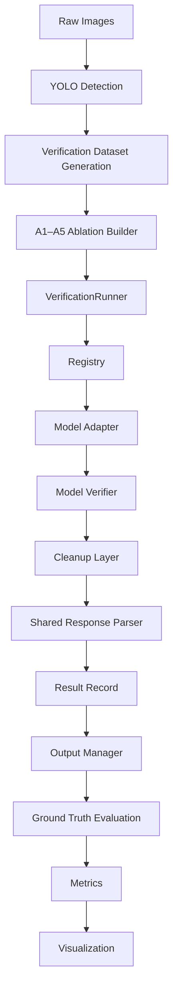

# Wild Palm VLM Verification

**CS Honors Thesis** · Annie Luo · Mentor: Fan Yang · Wake Forest University · 2026

A **model-agnostic Vision-Language Model (VLM) verification framework** for assessing the reliability of wild palm detections in UAV orthomosaic imagery.

This repository **verifies existing YOLO detections** — it does not perform object detection. LabelMe ground truth is used only for **evaluation**, not during inference.

**Architecture freeze:** July 2026 · See [`docs/FRAMEWORK_FREEZE.md`](docs/FRAMEWORK_FREEZE.md)

---

## Project Overview

Large-scale palm monitoring requires reviewing thousands of detector outputs. This project separates detection from verification:

```
YOLO Detection                    Verification Framework                 Evaluation
────────────────                  ──────────────────────                 ──────────
Find candidate boxes       →      Judge each detection            →     Match to GT
Produce confidence scores         Reliable / Uncertain / Unreliable       Compute metrics
```

| Stage | Role | Primary output |
|-------|------|----------------|
| **YOLO detection** | YOLO11x proposes bounding boxes on orthomosaic patches | `outputs/full_inference/predictions_full.json` |
| **Verification** | A VLM reviews each detection with structured prompts | `outputs/verification/<model>/<experiment_id>/A*/sample_*.json` |
| **Evaluation** | Greedy IoU matching + binary metrics | `outputs/evaluation/<model>/<experiment_id>/A*/` |

Official protocols: [`docs/EVALUATION_PROTOCOL.md`](docs/EVALUATION_PROTOCOL.md) · [`docs/ABLATION_STUDY.md`](docs/ABLATION_STUDY.md)

---

## Repository Architecture



Detailed diagrams: [`docs/ARCHITECTURE.md`](docs/ARCHITECTURE.md)

| Stage | Module / script | Responsibility |
|-------|-----------------|----------------|
| Dataset | `scripts/pipeline/generate_verification_dataset.py` | One verification sample per YOLO detection |
| Ablation inputs | `scripts/pipeline/build_ablation_verification_prompts.py` | A1–A5 image variants + prompt files |
| Inference CLI | `scripts/run_verification.py` | Load jobs, create adapter, run runner |
| Runner | `src/verification/runner.py` | Resume, iteration, persistence (model-agnostic) |
| Registry | `src/verification/registry.py` | Map `--model` to adapter factory |
| Adapter | `src/lvm/*_verification_adapter.py` | `verify(job)` — model-specific inference |
| Verifier | `src/lvm/*_verifier.py` | Transformers load + generate |
| Cleanup | `src/lvm/parsers/cleanup.py` | Model-specific text normalization (optional) |
| Parser | `src/lvm/parsers/base.py` | Shared JSON extraction + decision validation |
| Record | `src/verification/records.py` | Canonical `sample_*.json` schema |
| Output | `src/verification/output_manager.py` | JSON files + `results_index.csv` |
| Evaluation | `scripts/evaluate_verification_against_groundtruth.py` | Greedy IoU matching vs LabelMe |
| Metrics | `scripts/compute_verification_metrics.py` | Precision, Recall, F1 (Uncertain excluded) |

---

## Repository Structure

```
wild-palm-lvm-verification/
├── configs/
│   ├── model.yaml                 # Legacy Qwen2.5 fallback (active_model)
│   └── models/                    # Per-model configs (frozen pattern)
│       ├── qwen2_5_vl.yaml
│       ├── llava.yaml
│       ├── gemma4.yaml
│       └── qwen3_vl.yaml
├── scripts/
│   ├── run_verification.py        # Main inference entry point
│   ├── run_ablation_verification.py
│   ├── run_qwen_ablation_experiment.sh
│   ├── evaluate_verification_against_groundtruth.py
│   ├── compute_verification_metrics.py
│   ├── pipeline/                  # Dataset + prompt preparation
│   └── visualization/
├── src/
│   ├── verification/              # Frozen framework (runner, registry, jobs, records)
│   ├── lvm/                       # Model adapters, verifiers, parsers
│   ├── prompts/                   # A1–A5 prompt templates
│   ├── preprocessing/             # Dataset overlays, GT extraction
│   ├── evaluation/                # Greedy GT matching
│   ├── visualization/             # Publication figures
│   ├── config/                    # Model config loader
│   └── paths.py                   # Output path helpers
├── jobs/                          # SLURM submission scripts
├── docs/                          # Protocols, architecture, freeze contract
├── archive/                       # Superseded experiments (not production)
├── outputs/                       # Generated artifacts (gitignored)
└── logs/                          # SLURM logs
```

| Directory | Purpose |
|-----------|---------|
| **`scripts/`** | CLI entry points. Pipeline prep under `scripts/pipeline/`. |
| **`src/`** | Shared library: frozen framework + model adapters. |
| **`jobs/`** | Cluster SLURM jobs and submit wrappers. |
| **`configs/`** | Model checkpoints and generation settings. Use `configs/models/<key>.yaml`. |
| **`docs/`** | Architecture, evaluation protocol, ablation design, model status. |
| **`archive/`** | Historical prototypes; not part of the active pipeline. |
| **`outputs/`** | All experiment artifacts. Layout in [`outputs/README.md`](outputs/README.md). |

---

## Verification Framework

The frozen framework lives in `src/verification/`. Adding a new VLM does **not** modify these components.

### VerificationRunner (`runner.py`)

Orchestrates inference: resume filtering, job iteration, calls `adapter.verify(job)`, persists results via `OutputManager`.

### VerificationJob (`jobs.py`)

```python
VerificationJob(sample_id, image_path, prompt_path)
```

Loaded from `prompt_index.csv` or `index.csv`. Prompts are pre-built on disk — adapters read `.txt` files.

### BaseVerificationAdapter (`base_adapter.py`)

```python
verify(job: VerificationJob) -> VerificationOutcome
```

Adapters implement inference only. Status values: `ok`, `parse_error`, `inference_error`.

### Registry (`registry.py`)

```python
create_adapter(model, **kwargs)  # model = registry key
```

Primary key: `qwen2_5_vl`. Alias: `qwen`.

### OutputManager (`output_manager.py`)

Writes `sample_*.json` and atomically updates `results_index.csv`.

### ResultRecord (`records.py`)

`build_result_record()` produces the canonical JSON schema. Evaluation reads only `decision`.

### Parser (`src/lvm/parsers/`)

```
raw model text → cleanup (model-specific) → JSON parse → decision validation
```

Shared across all models. Shim at `src/lvm/verification_response_parser.py`.

### Configuration (`src/config/model_config.py`)

Per-model YAML in `configs/models/`. Resolution: `--model-path` → config `model_id` → legacy `configs/model.yaml` (Qwen2.5 only).

### Resume (`src/utils/verification_resume.py`)

Logical identity: `(model_key, condition, sample_id)` via directory isolation:

```
outputs/verification/<model_key>/<experiment_id>/<A1..A5>/sample_*.json
```

Pass `--resume` to skip completed samples. Legacy paths under `verification/qwen/` are auto-detected.

Full contract: [`docs/FRAMEWORK_FREEZE.md`](docs/FRAMEWORK_FREEZE.md)

---

## Multi-Model Architecture

| Model | Registry key | Status |
|-------|--------------|--------|
| **Qwen2.5-VL** | `qwen2_5_vl` (alias: `qwen`) | Production baseline |
| **LLaVA** | `llava` | Planned |
| **Gemma 4** | `gemma4` | Planned |
| **Qwen3-VL** | `qwen3_vl` | Planned |

Adding a new model requires only:

1. Verifier — `src/lvm/<model>_verifier.py`
2. Adapter — `src/lvm/<model>_verification_adapter.py`
3. Config — `configs/models/<key>.yaml`
4. Registry entry — `register_adapter()` in `registry.py`

Details: [`docs/SUPPORTED_MODELS.md`](docs/SUPPORTED_MODELS.md)

---

## Ablation Study

Five conditions (A1–A5) test how **input information** affects verification. YOLO detections, dataset, matching, and metrics are fixed. Only VLM inputs change.

| Condition | Image input | Metadata in prompt | Purpose |
|-----------|-------------|-------------------|---------|
| **A1** | Single-detection overlay | None | Visual-only baseline |
| **A2** | Overlay | YOLO confidence | Effect of detector confidence |
| **A3** | Overlay | Confidence + bbox geometry | Effect of geometric metadata |
| **A4** | Dual panel (overlay + crop) | YOLO confidence | Local detail with full context |
| **A5** | Bbox crop only | YOLO confidence | Context vs crop-only (A4 vs A5) |

Inputs: `outputs/verification_ablation_<N>/` · Results: `outputs/verification/<model_key>/<experiment_id>/A1` … `A5`

Design: [`docs/ABLATION_STUDY.md`](docs/ABLATION_STUDY.md)

---

## Evaluation

Ground truth from LabelMe (`label == "palm"`), converted to axis-aligned boxes.

**Matching:** Greedy one-to-one assignment by descending IoU, threshold **0.5** (Pascal VOC / COCO).

**Verification labels:**

| Prediction | Binary role |
|------------|-------------|
| Reliable | Positive |
| Unreliable | Negative |
| Uncertain | **Excluded** from Precision / Recall / F1 |

Metrics: TP, FP, FN, TN, Precision, Recall, F1, Accuracy — computed only on Reliable + Unreliable predictions.

Protocol: [`docs/EVALUATION_PROTOCOL.md`](docs/EVALUATION_PROTOCOL.md)

---

## Reproducibility

| Mechanism | Location |
|-----------|----------|
| **`results_index.csv`** | Per-condition index: `sample_id`, `result_path`, `status` |
| **Resume** | `--resume` skips existing `sample_*.json` in results directory |
| **Output schema** | Frozen in `build_result_record()` — see FRAMEWORK_FREEZE |
| **Model configs** | `configs/models/<registry_key>.yaml` |
| **Experiment dirs** | `outputs/verification/<model_key>/<experiment_id>/A*/` |

Re-running evaluation on the same inference outputs produces identical metrics (deterministic matching).

---

## Running Experiments

### Cluster setup

```bash
conda create -n palm-lvm python=3.11 && conda activate palm-lvm
pip install -r requirements_cluster.txt
python scripts/pipeline/check_cluster_environment.py
sbatch jobs/qwen_download.slurm
```

### Prerequisites

```bash
python scripts/run_full_inference.py
python scripts/pipeline/generate_verification_dataset.py
python scripts/pipeline/build_ablation_verification_prompts.py --sample-count 1000
```

### Single model / single condition

```bash
python scripts/run_verification.py \
  --model qwen2_5_vl \
  --prompt-index outputs/verification_ablation_1000/A1_overlay_only/prompt_index.csv \
  --results-dir outputs/verification/qwen2_5_vl/my_run/A1 \
  --batch-size 4
```

### Full A1–A5 experiment (cluster)

```bash
SAMPLE_SIZE=1000 bash jobs/submit_qwen_ablation.sh
```

Uses `MODEL=qwen2_5_vl` by default. Orchestrator: `scripts/run_qwen_ablation_experiment.sh`.

### Resume interrupted run

```bash
EXPERIMENT_ID=20260708_0020 SAMPLE_SIZE=1000 bash scripts/submit_qwen_A5_resume.sh
```

Automatically detects legacy outputs under `outputs/verification/qwen/` when resuming Qwen2.5 runs.

### Evaluation and metrics

```bash
python scripts/evaluate_verification_against_groundtruth.py \
  --results-dir outputs/verification/qwen2_5_vl/<experiment_id>/A1 \
  --index-csv outputs/verification_dataset/index.csv \
  --output-dir outputs/evaluation/qwen2_5_vl/<experiment_id>/A1 \
  --condition-code A1

python scripts/compute_verification_metrics.py \
  --evaluation-dir outputs/evaluation/qwen2_5_vl/<experiment_id>/A1
```

### Visualization

```bash
python scripts/visualization/visualize_verification.py \
  --model qwen2_5_vl \
  --experiment-id <experiment_id> \
  --sample-count 50
```

Guide: [`docs/visualization.md`](docs/visualization.md)

---

## Future Work

- Implement LLaVA, Gemma 4, and Qwen3-VL adapters (configs and registry slots prepared)
- Cross-model comparison on identical A1–A5 inputs
- Public benchmark release with frozen evaluation protocol

Integration plan: [`docs/MULTI_MODEL_INTEGRATION_PLAN.md`](docs/MULTI_MODEL_INTEGRATION_PLAN.md)

---

## Documentation Index

| Document | Contents |
|----------|----------|
| [`docs/ARCHITECTURE.md`](docs/ARCHITECTURE.md) | System diagrams (Mermaid) |
| [`docs/FRAMEWORK_FREEZE.md`](docs/FRAMEWORK_FREEZE.md) | Frozen APIs and fairness contract |
| [`docs/SUPPORTED_MODELS.md`](docs/SUPPORTED_MODELS.md) | Per-model status |
| [`docs/EVALUATION_PROTOCOL.md`](docs/EVALUATION_PROTOCOL.md) | GT matching and metrics |
| [`docs/ABLATION_STUDY.md`](docs/ABLATION_STUDY.md) | A1–A5 design |
| [`docs/visualization.md`](docs/visualization.md) | Figure generation |

---

## Archive

Superseded prototypes and early experiments: [`archive/`](archive/README.md). Not part of the production pipeline.

---

## Author

**Annie Luo** · CS Honors Thesis · Mentor: **Fan Yang** · Wake Forest University · May 2026
