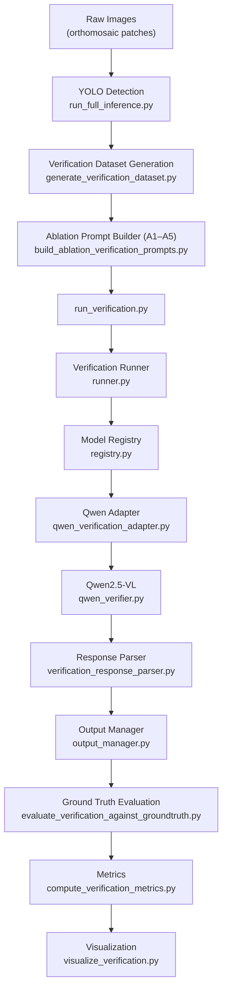

# Wild Palm VLM Verification

**CS Honors Thesis** · Annie Luo · Mentor: Fan Yang · Wake Forest University · 2026

This repository implements a **Vision-Language Model (VLM) verification pipeline** for assessing the reliability of wild palm detections in UAV orthomosaic imagery.

The system does **not** detect palms from scratch. It evaluates whether an **existing YOLO detection** is reliable, uncertain, or unreliable — supporting human reviewers in large-scale ecological monitoring.

---

## 1. Project Overview

Wild palm monitoring over orthomosaic tiles is labor-intensive. This project separates two distinct stages:

```
Detection (YOLO)          Verification (Qwen / future VLMs)
─────────────────         ─────────────────────────────────
Find candidate boxes  →   Judge whether each candidate is reliable
Produce confidence        Produce structured decisions + reasoning
```

| Stage | Role | Output |
|-------|------|--------|
| **Detection** | YOLO11x locates candidate palm bounding boxes on orthomosaic patches | `predictions_full.json` |
| **Verification** | A VLM reviews each candidate detection and assigns a reliability decision | `sample_*.json` per detection |

Verification inputs are derived from YOLO detections (overlay images, metadata, prompts). LabelMe ground truth is used **only for evaluation**, not during inference.

Official evaluation protocol: [`docs/EVALUATION_PROTOCOL.md`](docs/EVALUATION_PROTOCOL.md)

---

## 2. Repository Architecture



### Stage responsibilities

| Stage | Responsibility |
|-------|----------------|
| **Raw Images** | Orthomosaic PNG patches with paired LabelMe JSON (cluster path: `Raw_Patches/`) |
| **YOLO Detection** | Full-dataset inference with YOLO11x; writes COCO-style predictions JSON |
| **Verification Dataset Generation** | Converts each YOLO detection above a confidence threshold into one verification sample (overlay image + metadata + index) |
| **Ablation Prompt Builder** | Builds A1–A5 input variants (image type + prompt metadata) for controlled ablation studies |
| **Verification Runner** | Model-agnostic orchestration: job loading, batching, resume, progress logging |
| **Model Registry** | Maps `--model qwen` (and future adapters) to a factory function |
| **Qwen Adapter** | Implements `BaseVerificationAdapter.verify()` for Qwen2.5-VL batch inference |
| **Qwen2.5-VL** | Hugging Face Transformers inference on GPU |
| **Response Parser** | Parses model JSON into `decision`, `confidence_reasoning`, `visual_reasoning` |
| **Output Manager** | Writes `sample_*.json` and maintains `results_index.csv` |
| **Ground Truth Evaluation** | Greedy IoU matching between YOLO boxes and LabelMe GT; assigns GT polarity per detection |
| **Metrics** | Computes Precision, Recall, F1, Accuracy (excluding Uncertain predictions) |
| **Visualization** | Publication-quality overlay, comparison, ablation, and failure-case figures |

---

## 3. Repository Structure

```
wild-palm-lvm-verification/
├── configs/                     # Model configuration (active + placeholders)
│   ├── model.yaml               # Active Qwen model path
│   ├── qwen.yaml
│   ├── llava.yaml
│   └── internvl.yaml
├── data/
│   └── samples/                 # Local dev tiles (5 PNG + LabelMe JSON)
├── docs/
│   ├── EVALUATION_PROTOCOL.md   # Official evaluation protocol
│   ├── cluster_deployment.md    # Cluster setup guide
│   ├── visualization.md         # Figure generation guide
│   └── …
├── jobs/                        # SLURM submission scripts
│   ├── submit_qwen_ablation.sh  # Submit full A1–A5 experiment
│   ├── run_qwen_ablation.slurm  # GPU batch job
│   └── qwen_download.slurm      # One-time model download
├── scripts/
│   ├── run_verification.py              # Main VLM inference entry point
│   ├── run_ablation_verification.py     # Per-condition ablation wrapper
│   ├── run_qwen_ablation_experiment.sh  # Full experiment orchestrator
│   ├── submit_qwen_A5_resume.sh         # Resume interrupted A5 run
│   ├── run_full_inference.py            # YOLO full-dataset inference
│   ├── evaluate_verification_against_groundtruth.py
│   ├── compute_verification_metrics.py
│   ├── evaluate_detection_matching.py   # YOLO baseline metrics
│   ├── debug_sample_matching.py         # Single-sample GT debug
│   ├── visualize_verification_examples.py
│   ├── pipeline/                        # Dataset and prompt preparation
│   │   ├── generate_verification_dataset.py
│   │   ├── build_verification_prompts.py
│   │   ├── build_ablation_verification_prompts.py
│   │   └── check_cluster_environment.py
│   └── visualization/
│       └── visualize_verification.py    # Publication figure CLI
├── src/
│   ├── paths.py                 # Central path constants
│   ├── config/                  # Model config loader
│   ├── verification/            # Model-agnostic inference framework
│   ├── lvm/                     # Qwen adapter and verifier
│   ├── prompts/                 # Prompt templates (default + A1–A5)
│   ├── preprocessing/           # Dataset, overlays, GT extraction
│   ├── evaluation/              # Greedy GT matching
│   ├── visualization/           # Figure rendering
│   ├── utils/                   # Resume, path/index helpers
│   ├── yolo/                    # Predictions I/O
│   └── models/                  # Placeholder for future adapter registry
├── archive/                     # Superseded experiments and prototypes
├── outputs/                     # Generated artifacts (gitignored)
├── logs/                        # SLURM and run logs
├── requirements.txt             # Local development
└── requirements_cluster.txt     # GPU cluster (Transformers, torch)
```

### Directory roles

| Directory | Role |
|-----------|------|
| **`scripts/`** | CLI entry points for inference, evaluation, metrics, and visualization. Pipeline preparation lives in `scripts/pipeline/`. |
| **`src/`** | Shared library code: verification framework, model adapters, prompts, preprocessing, evaluation, and visualization. |
| **`jobs/`** | SLURM job definitions and submission wrappers for cluster experiments. |
| **`docs/`** | Evaluation protocol, cluster deployment, visualization guide, and design notes. |
| **`archive/`** | Superseded scripts, early prototypes, and deprecated experiments. Not part of the production pipeline. |
| **`outputs/`** | All generated artifacts. See [`outputs/README.md`](outputs/README.md) for layout. |

---

## 4. Verification Framework

The `src/verification/` package provides a **model-agnostic inference layer**. Model-specific code lives in adapters under `src/lvm/` (and eventually `src/models/`).

| Module | Purpose |
|--------|---------|
| **`runner.py`** | `VerificationRunner` orchestrates dataset iteration, resume filtering, batch dispatch, and progress logging. Adapters implement inference only. |
| **`registry.py`** | Registers adapter factories by name (`qwen`, …). `create_adapter(model, **kwargs)` instantiates the correct adapter. |
| **`base_adapter.py`** | Abstract `BaseVerificationAdapter` with `verify(job) → VerificationOutcome`. All VLMs implement this interface. |
| **`output_manager.py`** | Writes per-sample JSON files and atomically updates `results_index.csv`. Handles resume backfill from existing JSON. |
| **`jobs.py`** | Defines `VerificationJob` (sample_id, image_path, prompt_path) and loads jobs from `prompt_index.csv` or `index.csv`. |
| **`records.py`** | Builds the standard result record schema (`decision`, `visual_reasoning`, `parse_error`, …). |

### How model-agnostic inference works

```
run_verification.py
    → create_adapter("qwen", model_name=<path>, …)
    → VerificationRunner(adapter, output_manager)
    → runner.run(jobs, RunnerConfig(resume=…))
        → adapter.verify(job)          # model-specific
        → output_manager.save_json()   # model-independent
        → output_manager.finalize_index()
```

Adding a new VLM requires:

1. Implement `BaseVerificationAdapter` (see `qwen_verification_adapter.py`)
2. Register the factory in `registry.py`
3. Run with `--model <name>`

No changes to the runner, output manager, evaluation, or metrics are needed.

---

## 5. Model Support

| Model | Status | Adapter |
|-------|--------|---------|
| **Qwen2.5-VL-7B-Instruct** | ✅ Supported | `src/lvm/qwen_verification_adapter.py` |
| **LLaVA** | Planned | Placeholder: `configs/llava.yaml` |
| **Qwen3-VL** | Planned | — |
| **InternVL** | Planned | Placeholder: `configs/internvl.yaml` |
| **MiniCPM-V** | Planned | — |

Current default model path is configured in `configs/model.yaml` (`active_model`). Override at runtime with `--model-path`.

---

## 6. Ablation Study

The thesis compares five **input and prompt conditions** (A1–A5) on the same YOLO detections. All conditions share an identical prompt template (role, palm characteristics, decision definitions, JSON schema). Only the image input and metadata sections differ.

| Condition | Image Input | Metadata | Prompt Difference | Purpose |
|-----------|-------------|----------|-------------------|---------|
| **A1** | Single-detection overlay (dimmed background, green bbox) | None | Visual evidence only; explicitly excludes confidence and geometry | Baseline: can the VLM verify from the image alone? |
| **A2** | Same overlay | YOLO confidence | Confidence as auxiliary context only | Does detector confidence help verification? |
| **A3** | Same overlay | Confidence + width, height, area, aspect ratio | Full YOLO geometry as auxiliary context | Does bbox geometry improve verification? |
| **A4** | Dual panel: full overlay + enlarged crop | YOLO confidence | Two-panel image description | Does local crop detail help when full context is available? |
| **A5** | Enlarged bbox crop only (no surrounding context) | YOLO confidence | Crop-only image description | Is full-image context necessary? (A4 vs A5) |

Ablation inputs are written to `outputs/verification_ablation_<N>/` (one folder per condition). Inference results use short codes under `outputs/verification/qwen/<experiment_id>/A1` … `A5`.

---

## 7. Evaluation

Evaluation follows [`docs/EVALUATION_PROTOCOL.md`](docs/EVALUATION_PROTOCOL.md).

### Ground-truth matching

- Ground truth comes from LabelMe JSON (`label == "palm"`), converted to axis-aligned bounding boxes.
- YOLO detections are matched to GT **independently per image** using **greedy one-to-one assignment** sorted by descending IoU.
- A match is accepted when **IoU ≥ 0.5** (Pascal VOC / COCO convention).
- Matched detections are GT **positives**; unmatched detections are GT **negatives**.

Implementation: `src/evaluation/gt_matching.py`

### Verification metrics

The VLM predicts one of: **Reliable**, **Uncertain**, or **Unreliable**.

| Model prediction | Binary evaluation role |
|------------------|------------------------|
| Reliable | Positive |
| Unreliable | Negative |
| Uncertain | **Excluded** from automatic metrics |

Binary metrics (Precision, Recall, F1, Accuracy) are computed only from definitive predictions (Reliable and Unreliable). Uncertain predictions are reported separately as candidates for manual human review.

Metrics are computed by:

```bash
python scripts/evaluate_verification_against_groundtruth.py …
python scripts/compute_verification_metrics.py …
```

---

## 8. Reproducibility

### `results_index.csv`

Every verification run writes a CSV index alongside per-sample JSON:

```
sample_id,result_path,status
sample_000001,sample_000001.json,ok
```

This index is the authoritative record of which samples completed inference.

### Resume mechanism

Pass `--resume` to skip samples already present as `sample_*.json` or listed in `results_index.csv`. The runner prints a resume banner with completed and remaining counts. For interrupted cluster jobs:

```bash
EXPERIMENT_ID=20260708_0020 bash scripts/submit_qwen_A5_resume.sh
```

Resume logic: `src/utils/verification_resume.py`

### Deterministic evaluation

Evaluation scripts use fixed IoU threshold (0.5), deterministic greedy matching, and stable CSV output. Re-running evaluation on the same inference results produces identical metrics.

### Directory structure

Production experiment outputs follow a timestamped layout:

```
outputs/
├── verification/qwen/<experiment_id>/
│   ├── A1/sample_*.json
│   ├── A2/…
│   └── A5/results_index.csv
├── evaluation/qwen/<experiment_id>/
│   ├── A1/A1_evaluation.csv
│   └── A1/A1_metrics.json
└── visualization/<experiment_id>/
    ├── overlay/
    ├── comparison/
    └── failure_cases/
```

### Logging

SLURM jobs write timestamped logs to `logs/slurm/`. The experiment orchestrator prints per-condition elapsed time and a final summary.

---

## 9. Running Experiments

### Environment setup (cluster)

```bash
conda create -n palm-lvm python=3.11
conda activate palm-lvm
pip install -r requirements_cluster.txt
python scripts/pipeline/check_cluster_environment.py
sbatch jobs/qwen_download.slurm   # one-time model download
```

### YOLO detection (prerequisite)

```bash
python scripts/run_full_inference.py
```

### Prepare verification dataset and ablation inputs

```bash
python scripts/pipeline/generate_verification_dataset.py
python scripts/pipeline/build_ablation_verification_prompts.py --sample-count 1000
```

### Single verification run

```bash
python scripts/run_verification.py \
  --model qwen \
  --prompt-index outputs/verification_ablation_1000/A1_overlay_only/prompt_index.csv \
  --results-dir outputs/verification/qwen/my_run/A1 \
  --batch-size 4 \
  --model-config configs/model.yaml
```

### Entire A1–A5 experiment (cluster)

```bash
SAMPLE_SIZE=1000 bash jobs/submit_qwen_ablation.sh
```

This submits `jobs/run_qwen_ablation.slurm`, which calls `scripts/run_qwen_ablation_experiment.sh` to run inference + evaluation + metrics for each condition.

### Resume interrupted A5 run

```bash
EXPERIMENT_ID=20260708_0020 SAMPLE_SIZE=1000 bash scripts/submit_qwen_A5_resume.sh
```

### Evaluation

```bash
python scripts/evaluate_verification_against_groundtruth.py \
  --results-dir outputs/verification/qwen/<experiment_id>/A1 \
  --index-csv outputs/verification_dataset/index.csv \
  --output-dir outputs/evaluation/qwen/<experiment_id>/A1 \
  --condition-code A1
```

### Metrics

```bash
python scripts/compute_verification_metrics.py \
  --evaluation-dir outputs/evaluation/qwen/<experiment_id>/A1
```

### Visualization

```bash
python scripts/visualization/visualize_verification.py \
  --experiment-id <experiment_id>
```

See [`docs/visualization.md`](docs/visualization.md) for figure types and options.

### Detection baseline (optional)

```bash
python scripts/evaluate_detection_matching.py
```

---

## 10. Future Work

- Additional VLM adapters (LLaVA, Qwen3-VL, InternVL, MiniCPM-V)
- Cross-model comparison on identical A1–A5 ablation inputs
- Larger verification datasets beyond the current sample sizes
- Improved prompt engineering and structured reasoning formats
- Public benchmark release and reproducibility package

---

## Archive

Earlier prototypes, superseded ablation designs (LabelMe E1–E5 × P1–P6), and deprecated debug scripts are preserved under [`archive/`](archive/README.md). These are **not** part of the current production pipeline and are kept for historical reference only.

---

## Data Sources

| Source | Location | Role |
|--------|----------|------|
| Raw patches | `/deac/csc/yangGrp/cuij/palm/Raw_Patches/` | Primary thesis dataset (PNG + LabelMe JSON) |
| YOLO weights | Cluster path in `src/paths.py` | YOLO11x `best.pt` |
| Qwen model | `/deac/csc/yangGrp/luoz23/models/Qwen2.5-VL-7B-Instruct` | Local Hugging Face weights |
| Local samples | `data/samples/` | Lightweight local testing (5 tiles) |

---

## Tech Stack

| Component | Tool |
|-----------|------|
| Object detection | YOLO11x (`ultralytics`) |
| VLM | Qwen2.5-VL-7B-Instruct |
| VLM runtime | Hugging Face Transformers + `qwen-vl-utils` |
| Annotations | LabelMe JSON |
| Evaluation | Greedy IoU matching (threshold 0.5) |
| Batch jobs | SLURM (DEAC cluster) |

---

## References

1. Kuckreja et al. (2024). *GeoChat: Grounded Large Vision-Language Model for Remote Sensing.* CVPR 2024.
2. Hu et al. (2023). *Vision-Language Models in Remote Sensing.* arXiv:2305.05726.
3. Syetiawan et al. (2025). *Deep Learning-Based Palm Tree Detection in UAV Imagery with Mask RCNN.* TELKOMNIKA.
4. Mazzia et al. (2021). *Deep-Learning-Based Automated Palm Tree Counting and Geolocation.* Agronomy.
5. Bai et al. (2025). *Qwen2.5-VL Technical Report.* arXiv:2502.13923.

---

## Author

**Annie Luo** · CS Honors Thesis  
Mentor: **Fan Yang**  
Wake Forest University · May 2026

*Human-in-the-loop ecological monitoring using vision-language models for wild palm detection verification in orthomosaic imagery.*
