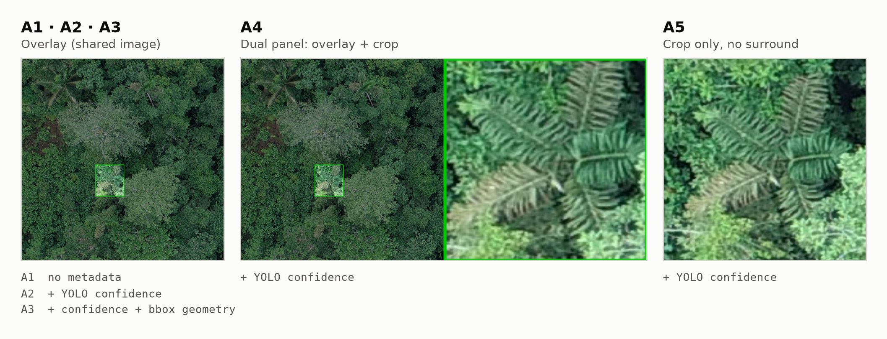
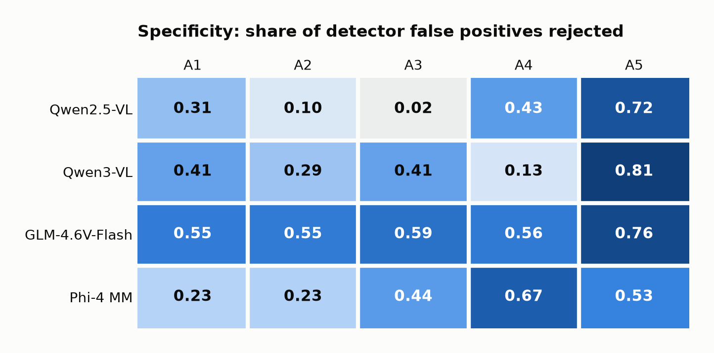
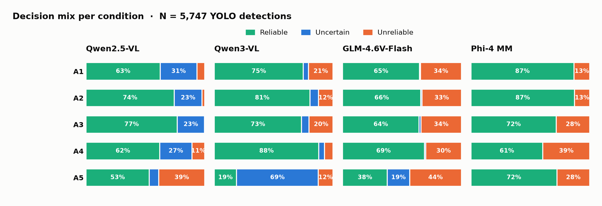
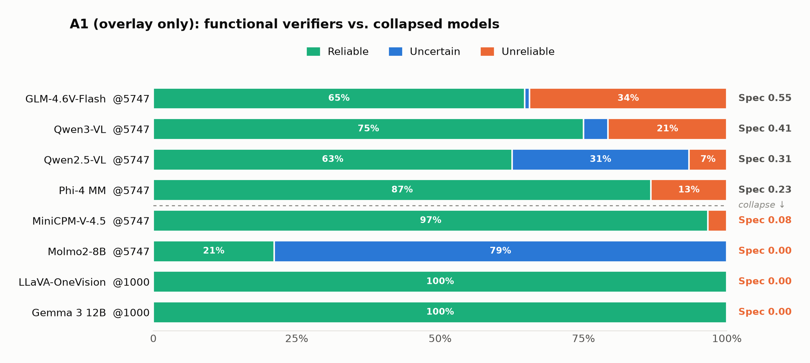
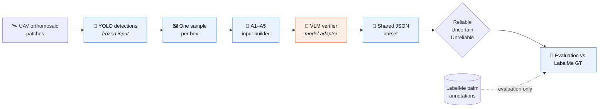

<div align="center">

# 🌴 Wild Palm VLM Verification

**Can a vision-language model check a detector's work?**

Open-weight VLMs as **second-stage verifiers** for YOLO wild-palm detections in UAV orthomosaics,<br/>
evaluated under five controlled visual-context ablations (**A1–A5**).

<sub>CS Honors Thesis · <b>Annie Luo</b> · Mentor: <b>Fan Yang</b> · Wake Forest University · 2026</sub>

<br/>


[**Results**](#-results) · [**How it works**](#-how-it-works) · [**Ablations**](#-the-a1a5-ablations) · [**Models**](#-model-status) · [**Reproduce**](#-reproduce) · [**Docs**](#-documentation)

</div>

<br/>

<picture>
  <source media="(prefers-color-scheme: dark)" srcset="docs/assets/readme/ablation_inputs_dark.png">
  
</picture>

<sub>What the verifier sees. One target box, rendered with this repo's own builders (<code>verification_overlay.py</code>, <code>ablation_verification_images.py</code>) on a bundled sample patch. For this illustration the box comes from a LabelMe <code>palm</code> annotation; in experiments it is always a YOLO detection.</sub>

---

## ✨ At a glance

> [!IMPORTANT]
> This repository **does not detect palms**. YOLO detections are **frozen inputs**. The VLM only **verifies** each box, and LabelMe ground truth is used **for evaluation only**. It is never shown to the model.

Every YOLO box gets one closed-set verdict:

| | Verdict | Meaning |
|:-:|---|---|
| 🟢 | **Reliable** | Accept: this is a palm |
| 🔵 | **Uncertain** | Abstain: leave it for human review |
| 🟠 | **Unreliable** | Reject: likely a detector false positive |

**Research question:** can modern VLMs *reject detector false positives while keeping true palms*, and how does the visual context they receive (**A1–A5**) change that?

### Key findings

1. **Four models finished full A1–A5 at N = 5,747 without collapsing:** Qwen2.5-VL, Qwen3-VL, GLM-4.6V-Flash and Phi-4 Multimodal.
2. **Context changes behavior a lot, even within one model.** Qwen2.5-VL's specificity is **0.02 under A3** and **0.72 under A5**.
3. **Collapse is common.** LLaVA-OneVision and Gemma 3 answered *Reliable* for **100%** of samples. MiniCPM-V-4.5 answered Reliable for 97% of them, and Molmo2-8B abstained on **79%**.
4. **Accuracy and F1 on their own mislead here.** Always answering "Reliable" already scores **0.815** accuracy, and Molmo2 reaches **F1 = 0.96** with **specificity = 0**. We report specificity and the full decision mix alongside them.

---

## 📊 Results

### Full-scale comparison: N = 5,747, all five conditions

<picture>
  <source media="(prefers-color-scheme: dark)" srcset="docs/assets/readme/specificity_dark.png">
  
</picture>

Specificity is the share of detector false positives (GT−) that the verifier rejects. Higher is better, and the always-Reliable baseline scores **0**. Every model reaches its highest specificity on a **crop-based condition (A4 or A5)**, usually at a cost in sensitivity. None has a single best condition for everything: each ablation trades sensitivity against specificity differently.

<picture>
  <source media="(prefers-color-scheme: dark)" srcset="docs/assets/readme/decision_mix_dark.png">
  
</picture>

The four models behave very differently:

- **Qwen2.5-VL** uses all three verdicts.
- **Qwen3-VL** abstains heavily under A5 (crop only).
- **GLM-4.6V-Flash** rejects often, which gives it the most consistent specificity.
- **Phi-4** **never** answers Uncertain and works as a binary verifier.

<details>
<summary><b>Full metrics table: 4 models × 5 conditions</b></summary>

<br/>

Binary metrics exclude *Uncertain* (see [Evaluation](#-evaluation)). BalAcc = (Sens + Spec) / 2, computed from the reported values.

| Model | Cond. | Acc | Prec | Sens | Spec | BalAcc | F1 | R / U / Ur |
|---|:-:|--:|--:|--:|--:|--:|--:|--:|
| **Qwen2.5-VL** | A1 | 0.851 | 0.895 | 0.938 | 0.306 | 0.622 | 0.916 | 3593 / 1775 / 379 |
| | A2 | 0.866 | 0.880 | 0.980 | 0.105 | 0.542 | 0.927 | 4268 / 1344 / 135 |
| | A3 | 0.874 | 0.876 | 0.998 | **0.018** | 0.508 | 0.933 | 4416 / 1313 / 18 |
| | A4 | 0.833 | 0.907 | 0.898 | 0.433 | 0.666 | 0.903 | 3570 / 1557 / 620 |
| | A5 | 0.660 | 0.911 | 0.647 | **0.720** | 0.683 | 0.757 | 3065 / 455 / 2227 |
| **Qwen3-VL** | A1 | 0.752 | 0.864 | 0.827 | 0.414 | 0.621 | 0.845 | 4309 / 246 / 1192 |
| | A2 | 0.792 | 0.856 | 0.900 | 0.286 | 0.593 | 0.877 | 4636 / 401 / 710 |
| | A3 | 0.753 | 0.865 | 0.828 | 0.413 | 0.621 | 0.846 | 4221 / 367 / 1159 |
| | A4 | 0.789 | 0.829 | 0.934 | 0.128 | 0.531 | 0.879 | 5051 / 276 / 420 |
| | A5 | 0.715 | 0.943 | 0.694 | **0.812** | 0.753 | 0.799 | 1081 / 3948 / 718 |
| **GLM-4.6V-Flash** | A1 | 0.671 | 0.873 | 0.698 | 0.549 | 0.624 | 0.776 | 3719 / 50 / 1978 |
| | A2 | 0.685 | 0.877 | 0.714 | 0.555 | 0.634 | 0.787 | 3783 / 57 / 1907 |
| | A3 | 0.688 | 0.887 | 0.709 | 0.591 | 0.650 | 0.788 | 3696 / 100 / 1951 |
| | A4 | 0.719 | 0.884 | 0.754 | 0.559 | 0.657 | 0.814 | 3960 / 64 / 1723 |
| | A5 | 0.545 | 0.920 | 0.505 | **0.761** | 0.633 | 0.652 | 2163 / 1082 / 2502 |
| **Phi-4 Multimodal** | A1 | 0.766 | 0.835 | 0.889 | 0.226 | 0.557 | 0.861 | 4985 / 0 / 762 |
| | A2 | 0.774 | 0.838 | 0.896 | 0.234 | 0.565 | 0.866 | 5012 / 0 / 735 |
| | A3 | 0.696 | 0.855 | 0.754 | 0.437 | 0.596 | 0.802 | 4132 / 0 / 1615 |
| | A4 | 0.670 | 0.900 | 0.669 | **0.673** | 0.671 | 0.768 | 3481 / 0 / 2266 |
| | A5 | 0.734 | 0.879 | 0.781 | 0.527 | 0.654 | 0.827 | 4160 / 0 / 1587 |

Source of truth: [`docs/FULL_SCALE_MODEL_COMPARISON.md`](docs/FULL_SCALE_MODEL_COMPARISON.md) and `outputs/evaluation/<model>/<experiment>/A*/A*_metrics.json`.

</details>

### Many VLMs collapse into a single answer

<picture>
  <source media="(prefers-color-scheme: dark)" srcset="docs/assets/readme/a1_behavior_dark.png">
  
</picture>

| Failure mode | What it looks like | Example (A1) |
|---|---|---|
| **Single-class collapse** | Every answer is *Reliable*. Accuracy equals the class prior and specificity is 0 | LLaVA-OneVision, Gemma 3: 1000 / 0 / 0 at N = 1,000 |
| **Reliable-heavy partial collapse** | Nearly always *Reliable* and rarely rejects anything | MiniCPM-V-4.5: 5557 / 0 / 190, Spec 0.078 |
| **Abstention-heavy partial collapse** | Mostly *Uncertain* and almost never *Unreliable* | Molmo2-8B: 1209 / 4537 / 1, Spec 0 |
| **Structured-output failure** | Replies that don't parse as the required JSON | InternVL3-8B: 13 of 100 unparsable in qualification |

> [!WARNING]
> **Molmo2's F1 of 0.962 is not verification skill.** It is computed on only the **~21%** of samples that received a Reliable or Unreliable verdict, and among those it rejected just **one** box. Always read F1 together with the decision mix, or with decision coverage = (R + Ur) / N, a post-hoc descriptor that the frozen evaluator does not output.

### 🚧 In progress: InternVL3.5-8B

InternVL3-8B failed qualification (87% parse success, Spec 0). The HF-native **InternVL3.5-8B-HF** then **passed** the same balanced-100 gate with 100% parse success, **Spec 0.20** and **BalAcc 0.60**. Both the model version and the inference API changed between the two runs, so the improvement can't be attributed to the version alone. As of **2026-09-24** its full A1–A5 run at N = 5,747 is **still running** (about 1.1k–1.2k of 5,747 samples done for A1–A4, and A5 is queued). No full-scale InternVL3.5 metrics are reported yet.

---

## 🧭 How it works



<sub>🔵 frozen and shared by every model: detections, dataset, A1–A5 inputs, parser, evaluator  ·  🟠 model-specific: adapter, config, registry entry, checkpoint</sub>

Every compared model sees **the same 5,747 boxes, the same prompts, the same parser and the same evaluator**. Only the adapter changes, and it wraps each model's native processor and chat template.

---

## 🧪 The A1–A5 ablations

Five frozen conditions vary **only what the VLM sees**. The boxes, matching rule and metrics stay fixed.

| | Condition | Image input | Extra prompt metadata |
|:-:|---|---|---|
| **A1** | Overlay only | Full patch, dimmed outside the box (×0.55), green target box | — |
| **A2** | Overlay + confidence | Same overlay as A1 | YOLO confidence |
| **A3** | Overlay + confidence + geometry | Same overlay as A1 | Confidence + bbox area, width, height, aspect ratio, center |
| **A4** | Dual panel | Overlay (left) + enlarged box crop (right) | YOLO confidence |
| **A5** | Crop only | Enlarged box crop with 15 px padding, no surround | YOLO confidence |

Design rationale: [`docs/ABLATION_STUDY.md`](docs/ABLATION_STUDY.md) · Prompts: [`src/prompts/ablation_verification_prompts.py`](src/prompts/ablation_verification_prompts.py)

---

## 📏 Evaluation

<table>
<tr>
<td width="50%" valign="top">

**Dataset**

| | |
|---|--:|
| YOLO detections (N) | **5,747** |
| Matched to GT (GT+) | 4,685 |
| Unmatched (GT−) | 1,062 |
| Always-Reliable accuracy | **0.815** |

<sub>The A1 qualification slice (N = 1,000) has a prior of 0.928. Don't compare it directly with full-set numbers.</sub>

</td>
<td width="50%" valign="top">

**Scoring**

| Verdict | Binary role |
|---|---|
| Reliable | positive |
| Unreliable | negative |
| Uncertain | **excluded** |

<sub>TP = GT+ ∧ Reliable · FP = GT− ∧ Reliable · FN = GT+ ∧ Unreliable · TN = GT− ∧ Unreliable. An *Uncertain* verdict is never counted as FN or TN.</sub>

</td>
</tr>
</table>

- **Matching:** within each patch, YOLO boxes are paired with LabelMe `palm` boxes by descending IoU, one-to-one and greedily. A pair counts as a match when **IoU ≥ 0.5**.
- **Metrics:** accuracy, precision, sensitivity (recall), specificity, F1 and balanced accuracy, plus the full R / U / Ur distribution over N.

Full protocol: [`docs/EVALUATION_PROTOCOL.md`](docs/EVALUATION_PROTOCOL.md)

---

## 🤖 Model status

| Model | Registry key | Furthest stage | Status | Behavior |
|---|---|---|:-:|---|
| **Qwen2.5-VL-7B-Instruct** | `qwen2_5_vl` | Full A1–A5 @ 5,747 | ✅ Complete | Uses all three verdicts; A5 is the most conservative |
| **Qwen3-VL-8B-Instruct** | `qwen3_vl` | Full A1–A5 @ 5,747 | ✅ Complete | A5 abstains heavily, with Spec 0.81 |
| **GLM-4.6V-Flash** | `glm_4_6v_flash` | Full A1–A5 @ 5,747 | ✅ Complete | Rejects often; the most stable specificity |
| **Phi-4 Multimodal** | `phi4_multimodal` | Full A1–A5 @ 5,747 | ✅ Complete | Never answers Uncertain (binary verifier) |
| **InternVL3.5-8B-HF** | `internvl3_5_hf` | Full A1–A5 @ 5,747 | 🚧 Running | Passed the balanced-100 gate |
| **MiniCPM-V-4.5** | `minicpm_v4_5` | A1 @ 5,747 | ⚠️ A1 only | Reliable-heavy partial collapse |
| **Molmo2-8B** | `molmo2_8b` | A1 @ 5,747 | ⚠️ A1 only | Abstention-heavy partial collapse |
| **LLaVA-OneVision** | `llava` | A1 @ 1,000 | ❌ Collapsed | 100% Reliable |
| **Gemma 3 12B IT** | `gemma` | A1 @ 1,000 | ❌ Collapsed | 100% Reliable |
| **InternVL3-8B-Instruct** | `internvl3` | Balanced-100 gate | ❌ Failed | Parse failures, Spec 0 |

<sub>A2–A5 were intentionally **not run** for MiniCPM and Molmo2 after their A1 results. <code>configs/models/gemma4.yaml</code> is an unregistered stub and **Gemma 4 has not been evaluated**. Canonical inventory: <a href="docs/EXPERIMENT_STATUS_CANONICAL.md"><code>docs/EXPERIMENT_STATUS_CANONICAL.md</code></a>.</sub>

---

## 🚀 Reproduce

The main launcher is **`scripts/submit_model_ablation.sh`**. It submits one Slurm job per condition through `jobs/run_verification.slurm`, and per-model environments and checkpoints are resolved in `jobs/lib/model_runtime.sh`. It **dry-runs by default**, and nothing is submitted until you pass `--submit`.

```bash
# Preview the sbatch commands (default: dry-run)
./scripts/submit_model_ablation.sh qwen3_vl \
  --conditions A1 --limit 1000 --experiment-id qwen3vl_A1_1000

# Full A1–A5 at N = 5,747
./scripts/submit_model_ablation.sh phi4_multimodal \
  --conditions A1,A2,A3,A4,A5 --limit 5747 --ablation-size 5747 \
  --experiment-id my_phi4_A1A5_5747 --time 24:00:00 \
  --submit
```

<details>
<summary><b>Single condition from the CLI, outputs and resume</b></summary>

```bash
python scripts/run_verification.py \
  --model qwen2_5_vl \
  --prompt-index outputs/verification_ablation_1000/A1_overlay_only/prompt_index.csv \
  --results-dir outputs/verification/qwen2_5_vl/my_run/A1 \
  --batch-size 4 \
  --resume
```

| | Path |
|---|---|
| Predictions | `outputs/verification/<model>/<experiment_id>/A1..A5/sample_*.json` |
| Metrics | `outputs/evaluation/<model>/<experiment_id>/A1..A5/A*_metrics.json` |

- Each job loads the model **once** and runs one condition.
- `--resume` / `RESUME=1` skips samples that are already done.
- Models whose dependency pins conflict (Phi-4, GLM, Qwen3-VL, MiniCPM, Molmo2) run in isolated Python environments.
- The legacy Qwen2.5 production tree is `outputs/verification/qwen/20260708_0020/`.
- Cluster setup: [`docs/cluster_deployment.md`](docs/cluster_deployment.md)

</details>

<details>
<summary><b>Adding a new VLM</b></summary>

<br/>

Never change the A1–A5 semantics, the shared parser or the evaluator to suit one model.

1. Verifier: `src/lvm/<model>_verifier.py`, using the model's **native** processor and chat template
2. Adapter: `src/lvm/<model>_verification_adapter.py`
3. Config: `configs/models/<key>.yaml`
4. Registry: `register_adapter()` in `src/verification/registry.py`
5. Isolated environment, if needed, wired into `jobs/lib/model_runtime.sh`

**Preferred qualification ladder for new models:**

`Stage 0 (≈10 samples)` → `Stage 1 balanced-100 (parse ≥ 95%, Spec ≥ 0.20, BalAcc ≥ 0.55, < 95% single class)` → `A1 @ 1,000 (optional)` → `full A1–A5 @ 5,747`

<sub>Earlier models followed different paths. For example, the Qwen2.5-VL full run predates this gate, and LLaVA and Gemma were diagnosed at A1 @ 1,000.</sub>

</details>

---

## 🗂️ Repository layout

```
wild-palm-lvm-verification/
├── configs/models/          # one YAML per VLM
├── src/
│   ├── preprocessing/       # overlay (dim 0.55) + A4/A5 image builders
│   ├── prompts/             # frozen A1–A5 prompt templates
│   ├── verification/        # runner · registry · records · resume
│   ├── lvm/                 # model adapters/verifiers + shared parser
│   └── evaluation/          # greedy IoU matching
├── scripts/
│   ├── submit_model_ablation.sh
│   ├── run_verification.py
│   ├── evaluate_verification_against_groundtruth.py
│   └── visualization/make_readme_figures.py   # regenerates the figures above
├── jobs/                    # Slurm jobs + model_runtime.sh
├── docs/                    # protocols, results, status
├── data/samples/            # 5 example patches + LabelMe JSON
└── outputs/                 # generated artifacts (not tracked)
```

Architecture and fairness contract: [`docs/ARCHITECTURE.md`](docs/ARCHITECTURE.md) · [`docs/FRAMEWORK_FREEZE.md`](docs/FRAMEWORK_FREEZE.md)

---

## 📚 Documentation

| Document | What's inside |
|---|---|
| [`FULL_SCALE_MODEL_COMPARISON.md`](docs/FULL_SCALE_MODEL_COMPARISON.md) | Advisor-facing A1–A5 tables at N = 5,747 |
| [`EXPERIMENT_STATUS_CANONICAL.md`](docs/EXPERIMENT_STATUS_CANONICAL.md) | Every run, its status and collapse label |
| [`MODEL_SELECTION_AND_COLLAPSE_ANALYSIS.md`](docs/MODEL_SELECTION_AND_COLLAPSE_ANALYSIS.md) | Collapse forensics and model-expansion shortlist |
| [`INTERNVL3_QUALIFICATION.md`](docs/INTERNVL3_QUALIFICATION.md) | Why InternVL3 failed the gate |
| [`EVALUATION_PROTOCOL.md`](docs/EVALUATION_PROTOCOL.md) | GT matching and metric definitions |
| [`ABLATION_STUDY.md`](docs/ABLATION_STUDY.md) | A1–A5 design |
| [`QWEN_FULL_A1_A5_RESULTS.md`](docs/QWEN_FULL_A1_A5_RESULTS.md) | Detailed Qwen2.5-VL write-up |

---

<div align="center">

**Annie Luo** · CS Honors Thesis · Mentor **Fan Yang** · Wake Forest University · 2026

<sub>Released under the <a href="LICENSE">MIT License</a>.</sub>

</div>
