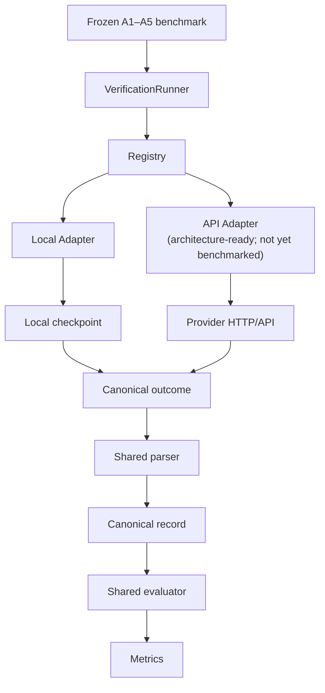

# Wild Palm VLM Verification

**CS Honors Thesis** · Annie Luo · Mentor: Fan Yang · Wake Forest University · 2026

A **model-agnostic Vision-Language Model (VLM) verification framework** for assessing the reliability of wild palm detections in UAV orthomosaic imagery.

This repository **verifies existing YOLO palm detections**. It does **not** perform object detection. LabelMe ground truth is used only for **evaluation**, not during inference.

---

## Scientific objective

YOLO proposes candidate palm detections. A VLM acts as a **second-stage verifier** and classifies each detection as:

| Decision | Meaning |
|----------|---------|
| **Reliable** | Accept as a valid palm detection |
| **Uncertain** | Abstain; defer to human review |
| **Unreliable** | Reject as a false or invalid detection |

**Research question:** Can modern VLMs reject detector false positives while preserving true palm detections, and how does input context (**A1–A5**) affect verification performance?

All compared models use the same **frozen** benchmark: identical detection set, A1–A5 prompt semantics, shared response parser, and shared evaluator.

---

## Pipeline overview

```
YOLO Detection                 VLM Verification                      Evaluation
────────────────               ────────────────                      ──────────
Candidate boxes         →      Reliable / Uncertain / Unreliable  →  Match to LabelMe GT
+ confidence scores            (frozen A1–A5 inputs)                 Compute metrics
```



**Local path (production today):** Frozen A1–A5 → generic runner → registry → model adapter → local checkpoint → model-native preprocessing/generation → shared parser → shared evaluator.

**API path:** Same runner/registry/parser/evaluator contract is reserved in `BaseVerificationAdapter` for a future `backend=api` adapter. **No API models have been benchmarked** in this repository.

---

## Current model status

Status terms: **Complete** · **Qualified** · **Partial** · **Collapsed** · **Integrated / not yet qualified**.

| Model | Approx. scale | Integration | Qualification | Full A1–A5 @5,747 | Behavior / key observation |
|-------|---------------|-------------|---------------|-------------------|----------------------------|
| **Qwen2.5-VL-7B-Instruct** | ~7B | `qwen2_5_vl` | Non-collapse @1000 | **Complete** (A1–A5) | Established baseline; uses all three labels; A5 strongest specificity |
| **Qwen3-VL-8B-Instruct** | ~8B | `qwen3_vl` | **Qualified** (sanity1, smoke20, A1@1000) | Not started | No collapse on A1@1000; Spec 0.51, BalAcc 0.64 |
| **Phi-4-multimodal-instruct** | ~5.6B | `phi4_multimodal` | Non-collapse @1000 | **Complete** | Zero Uncertain on full run; effectively binary Reliable/Unreliable |
| **GLM-4.6V-Flash** | Flash VLM | `glm_4_6v_flash` | Non-collapse @1000 | **Complete** | Non-collapse; conservative A5 tradeoff (high Spec, lower recall) |
| **LLaVA-OneVision** | ~7B | `llava` | A1@1000 only | — | **Collapsed** — 100% Reliable |
| **Gemma 3 12B IT** | ~12B | `gemma` | A1@1000 only | — | **Collapsed** — 100% Reliable |
| **InternVL3-8B** | ~8B | `internvl3` | Stage 0 pass; Stage 1 fail | — | **Partial** — not A1@1000-qualified (parse failures; Spec 0) |
| **MiniCPM-V-4.5** | ~8.7B | `minicpm_v4_5` | Not started | — | **Integrated**; checkpoint present; **no inference submitted** |
| **Molmo2-8B** | ~8B | `molmo2_8b` | Not started | — | **Integrated**; env ready; **checkpoint not downloaded**; no inference |

Registry keys and configs: `configs/models/<key>.yaml`. Aliases are listed in `src/verification/registry.py`.

---

## Current Benchmark Snapshot

**Full dataset (N = 5,747):** GT+ = 4,685 · GT− = 1,062 · always-Reliable accuracy ≈ **0.815**.

**A1 @1,000 qualification slice:** GT+ = 928 · GT− = 72 · always-Reliable accuracy = **0.928**.

Do not compare 1,000-sample metrics to full-set metrics as if they were the same experiment.

### Full-scale A1–A5 @5,747 (headline)

| Model | Status | Headline behavior |
|-------|--------|-------------------|
| **Qwen2.5-VL** | Complete | Three-way decisions; A1 Spec 0.31 / BalAcc 0.62; A5 Spec **0.72** / BalAcc **0.68** (more conservative) |
| **GLM-4.6V-Flash** | Complete | Non-collapse; A1 Spec 0.55 / BalAcc 0.62; A4 F1 0.81; A5 Spec **0.76** |
| **Phi-4 multimodal** | Complete | **0 Uncertain** on all A1–A5; A1 Acc 0.77 / Spec 0.23; A4 Spec **0.67** / BalAcc **0.67** |

Canonical Qwen full metrics: [`docs/QWEN_FULL_A1_A5_RESULTS.md`](docs/QWEN_FULL_A1_A5_RESULTS.md).

### Qualification / subset highlights

| Model | Experiment | Mix (R / U / Ur) | Acc | Spec | BalAcc | Verdict |
|-------|------------|------------------|-----|------|--------|---------|
| **Qwen3-VL** A1@1000 | `qwen3vl_A1_1000` | 724 / 48 / 228 | 0.7616 | 0.5077 | 0.6439 | **Qualified** (no collapse) |
| **Qwen2.5-VL** A1@1000 | `20260706_2214` | 672 / 272 / 56 | 0.90 | 0.24 | 0.59 | Non-collapse baseline |
| **LLaVA** A1@1000 | `20260719_1734` | 1000 / 0 / 0 | 0.928 | **0** | **0.5** | **Collapsed** (= always-Reliable) |
| **Gemma 3** A1@1000 | `20260802_1702` | 1000 / 0 / 0 | 0.928 | **0** | **0.5** | **Collapsed** (= always-Reliable) |

Accuracy and F1 alone are misleading on this imbalanced task. Prefer **specificity** and **balanced accuracy** when judging verification skill.

---

## Ablation study (A1–A5)

Five frozen conditions isolate how **visual context** and **detector metadata** affect VLM verification. YOLO boxes, dataset, matching, parser, and metrics stay fixed; only VLM inputs change.

| Condition | Image input | Metadata in prompt |
|-----------|-------------|--------------------|
| **A1** | Overlay only (dimmed surround + green bbox) | None |
| **A2** | Overlay | YOLO confidence |
| **A3** | Overlay | Confidence + bbox geometry |
| **A4** | Dual panel (overlay + crop) | YOLO confidence |
| **A5** | Crop only | YOLO confidence |

Design: [`docs/ABLATION_STUDY.md`](docs/ABLATION_STUDY.md)

---

## Evaluation

Ground truth: LabelMe annotations with `label == "palm"`, converted to axis-aligned boxes.

**Matching:** Greedy one-to-one assignment by descending IoU; accept if **IoU ≥ 0.5**.

**Binary roles:**

| Prediction | Role |
|------------|------|
| Reliable | Positive |
| Unreliable | Negative |
| Uncertain | **Excluded** from Precision / Recall / F1 / Accuracy / Specificity / Balanced Accuracy |

Reported metrics: TP, TN, FP, FN, Precision, Recall, Specificity, F1, Accuracy, Balanced Accuracy (Spec/BalAcc derived from the same confusion counts; Uncertain rate reported separately over the full sample count).

Protocol: [`docs/EVALUATION_PROTOCOL.md`](docs/EVALUATION_PROTOCOL.md)

---

## Running experiments

Primary launcher: **`scripts/submit_model_ablation.sh`** → **`jobs/run_verification.slurm`**, with per-model env/checkpoint helpers in **`jobs/lib/model_runtime.sh`**.

Defaults to **dry-run** (prints `sbatch` commands; does not submit). Use `--submit` to enqueue.

### A1 qualification / subset

```bash
# Preview (default)
DRY_RUN=1 ./scripts/submit_model_ablation.sh qwen3_vl \
  --conditions A1 --limit 1000 \
  --experiment-id qwen3vl_A1_1000

# Submit
./scripts/submit_model_ablation.sh qwen3_vl \
  --conditions A1 --limit 1000 \
  --experiment-id qwen3vl_A1_1000 \
  --submit
```

### Full A1–A5 @5,747

```bash
./scripts/submit_model_ablation.sh phi4_multimodal \
  --conditions A1,A2,A3,A4,A5 \
  --limit 5747 \
  --ablation-size 5747 \
  --experiment-id 20260921_phi4_A1A5_5747 \
  --time 24:00:00 \
  --submit
```

### Design properties

- **`MODEL=<registry_key>`** selects adapter, config, isolated env (when required), and default checkpoint
- One model loaded **once per Slurm job** (one condition per job)
- Outputs isolated: `outputs/verification/<model>/<experiment_id>/A*/`
- Evaluation written to: `outputs/evaluation/<model>/<experiment_id>/A*/`
- **`--resume` / `RESUME=1`** skips completed samples
- Per-model isolated Python environments where needed (Phi-4, GLM, Qwen3-VL, MiniCPM, Molmo)

### Direct CLI (single condition)

```bash
python scripts/run_verification.py \
  --model qwen2_5_vl \
  --prompt-index outputs/verification_ablation_1000/A1_overlay_only/prompt_index.csv \
  --results-dir outputs/verification/qwen2_5_vl/my_run/A1 \
  --batch-size 4 \
  --resume
```

Legacy Qwen-only orchestrators (`scripts/run_qwen_ablation_experiment.sh`, `jobs/submit_qwen_ablation.sh`) remain for historical Qwen2.5 runs; new models should use `submit_model_ablation.sh`.

---

## Adding a New VLM

Integration contract (do **not** change frozen A1–A5 semantics, shared parser, or evaluator for one model):

1. Model-specific verifier — `src/lvm/<model>_verifier.py`
2. `VerificationAdapter` — `src/lvm/<model>_verification_adapter.py`
3. Config — `configs/models/<key>.yaml`
4. Registry entry — `register_adapter()` in `src/verification/registry.py`
5. Isolated runtime environment (if dependency pins conflict) — wire in `jobs/lib/model_runtime.sh`
6. Static validation (import / load / chat-template wiring)
7. **sanity1** (n=1 smoke)
8. **smoke20** collapse check
9. **A1@1000** qualification (non-collapse gates)
10. **Full A1–A5 @5,747** only after qualification passes

Use the model’s native processor / chat template. Load the checkpoint **once per job**.

---

## Repository structure

```
wild-palm-lvm-verification/
├── configs/
│   ├── model.yaml                 # Legacy Qwen2.5 fallback
│   └── models/                    # Per-model configs
│       ├── qwen2_5_vl.yaml
│       ├── qwen3_vl.yaml
│       ├── phi4_multimodal.yaml
│       ├── glm_4_6v_flash.yaml
│       ├── internvl3.yaml
│       ├── llava.yaml
│       ├── gemma.yaml
│       ├── minicpm_v4_5.yaml
│       └── molmo2_8b.yaml
├── scripts/
│   ├── run_verification.py        # Main inference CLI
│   ├── submit_model_ablation.sh   # Generic Slurm submitter
│   ├── evaluate_verification_against_groundtruth.py
│   ├── compute_verification_metrics.py
│   └── pipeline/                  # Dataset + A1–A5 prompt prep
├── src/
│   ├── verification/              # Runner, registry, jobs, records
│   ├── lvm/                       # Adapters, verifiers, parsers
│   ├── prompts/                   # A1–A5 templates
│   ├── evaluation/                # Greedy GT matching
│   └── config/                    # Model config loader
├── jobs/
│   ├── run_verification.slurm     # Generic per-condition job
│   └── lib/model_runtime.sh       # Env / checkpoint / key helpers
├── docs/                          # Protocols, results, status
├── archive/                       # Superseded experiments
├── outputs/                       # Generated artifacts (gitignored)
└── logs/                          # Slurm logs
```

---

## Framework components

| Component | Location | Role |
|-----------|----------|------|
| Runner | `src/verification/runner.py` | Resume, iteration, persistence |
| Registry | `src/verification/registry.py` | `--model` → adapter factory |
| Adapter | `src/lvm/*_verification_adapter.py` | `verify(job)` only |
| Parser | `src/lvm/parsers/` | Shared JSON + decision validation |
| Records | `src/verification/records.py` | Canonical `sample_*.json` |
| Evaluation | `scripts/evaluate_verification_against_groundtruth.py` | IoU matching vs LabelMe |

Architecture freeze contract: [`docs/FRAMEWORK_FREEZE.md`](docs/FRAMEWORK_FREEZE.md)

---

## Next steps

- Run Qwen3-VL full A1–A5 @5,747 after A1@1000 qualification (already complete)
- Qualify MiniCPM-V-4.5 (sanity1 → smoke20 → A1@1000)
- Download and qualify Molmo2-8B
- Cross-model comparison on the identical full benchmark (Qwen2.5, GLM, Phi-4, then qualified successors)
- Optional larger / API reference models (architecture-ready; not selected for execution yet)
- Publication-quality analysis and visualization

---

## Documentation index

| Document | Contents |
|----------|----------|
| [`docs/EXPERIMENT_STATUS_CANONICAL.md`](docs/EXPERIMENT_STATUS_CANONICAL.md) | Canonical run inventory (may lag newest completed trees) |
| [`docs/QWEN_FULL_A1_A5_RESULTS.md`](docs/QWEN_FULL_A1_A5_RESULTS.md) | Qwen2.5 full A1–A5 @5,747 metrics |
| [`docs/MODEL_SELECTION_AND_COLLAPSE_ANALYSIS.md`](docs/MODEL_SELECTION_AND_COLLAPSE_ANALYSIS.md) | Collapse analysis (LLaVA / Gemma) |
| [`docs/EVALUATION_PROTOCOL.md`](docs/EVALUATION_PROTOCOL.md) | GT matching and metrics |
| [`docs/ABLATION_STUDY.md`](docs/ABLATION_STUDY.md) | A1–A5 design |
| [`docs/ARCHITECTURE.md`](docs/ARCHITECTURE.md) | System diagrams |
| [`docs/FRAMEWORK_FREEZE.md`](docs/FRAMEWORK_FREEZE.md) | Frozen APIs and fairness contract |

---

## Author

**Annie Luo** · CS Honors Thesis · Mentor: **Fan Yang** · Wake Forest University · **2026**
