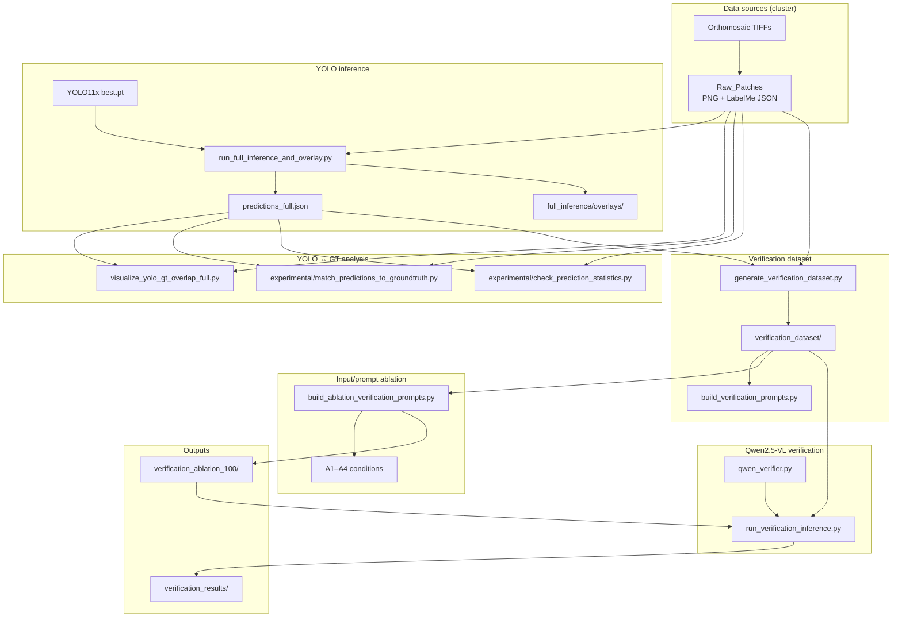

# LVM-Assisted Verification for Wild Palm Detection

**CS Honors Thesis** · Annie Luo · Mentor: Fan Yang · Wake Forest University · 2026

Large Vision Model (LVM)-assisted verification for wild palm detections in orthomosaic imagery. The system sits between a YOLO detector and a human reviewer: it flags uncertain detections and produces structured reliability assessments so experts can focus review where it matters most.

---

## Overview

Wild palm monitoring over large orthomosaic areas is labor-intensive. This project implements a **human-in-the-loop verification pipeline** that combines:

- **LabelMe ground truth** — human palm annotations (bbox, center, endpoints)
- **YOLO11x detection** — trained candidate boxes and confidence scores
- **Overlay visualization** — cropped inputs with geometric cues for the LVM
- **Qwen2.5-VL-7B-Instruct** — structured reliability assessment via Hugging Face Transformers on a GPU cluster

The high-level workflow:

```
Orthomosaic
  → cropped Raw_Patches (PNG tiles)
  → LabelMe annotations (JSON)
  → YOLO detection (predictions JSON)
  → overlay generation (per-palm visual inputs)
  → Qwen2.5-VL verification
  → reliability assessment
```

Rather than replacing reviewers, the system **supports** them by ranking and explaining detections that need attention.

---

## Current Architecture



### Core modules

| Layer | Module | Role |
|-------|--------|------|
| Paths | `paths.py` | Central cluster paths and `outputs/` layout |
| YOLO | `yolo/predictions_io.py` | Load predictions JSON, IoU, NMS, grouping |
| Preprocessing | `json_parser.py` | Load LabelMe JSON |
| Preprocessing | `palm_analyzer.py` | Extract per-palm bbox, center, endpoints, stats |
| Preprocessing | `verification_overlay.py` | Single-detection overlay rendering |
| Preprocessing | `ablation_verification_images.py` | A4 dual-panel ablation images |
| LVM | `qwen_verifier.py` | Qwen2.5-VL inference via Transformers |
| LVM | `qwen_verification_adapter.py` | Verification dataset batch inference |
| LVM | `verification_response_parser.py` | Parse verification JSON responses |
| Prompts | `verification_prompt.py` | Default verification prompts |
| Prompts | `ablation_verification_prompts.py` | A1–A4 ablation prompt variants |
| Config | `configs/model.yaml` | Active model path |

---

## Repository structure

```
wild-palm-lvm-verification/
├── configs/
│   └── model.yaml                 # Qwen model path
├── data/
│   └── samples/                   # Local dev tiles (5 PNG + LabelMe JSON)
├── docs/
│   ├── phase2_plan.md             # Detailed design notes
│   ├── cluster_deployment.md      # Cluster setup guide
│   └── REFACTOR_SUMMARY.md        # Cleanup log (July 2026)
├── jobs/
│   └── qwen_download.slurm
├── scripts/
│   ├── run_full_inference_and_overlay.py
│   ├── generate_verification_dataset.py
│   ├── build_verification_prompts.py
│   ├── build_ablation_verification_prompts.py
│   ├── run_verification_inference.py
│   ├── visualize_yolo_gt_overlap_full.py
│   ├── check_cluster_environment.py
│   └── experimental/              # Supplementary YOLO QA
│       ├── match_predictions_to_groundtruth.py
│       └── check_prediction_statistics.py
├── src/
│   ├── paths.py                   # Shared path constants
│   ├── yolo/predictions_io.py     # YOLO JSON utilities
│   ├── preprocessing/             # LabelMe parsing, palm stats, overlays
│   ├── lvm/                       # Qwen verifier, response parsing
│   └── prompts/                   # Ablation prompt templates
├── archive/                       # Superseded scripts, jobs, data
├── requirements.txt               # Local development
├── requirements_cluster.txt       # GPU cluster (Transformers, torch)
└── outputs/                       # Generated artifacts (gitignored)
    ├── full_inference/            # YOLO predictions + overlays
    ├── yolo_gt_overlap_full/      # GT vs YOLO overlap images
    ├── yolo_analysis/             # GT match + count CSVs
    ├── verification_dataset/      # One Qwen input per YOLO detection
    └── ablation_*                 # LVM ablation artifacts
```

Legacy prototype scripts live under `archive/`. See `archive/README.md` and `docs/REFACTOR_SUMMARY.md`.

---

## Data sources

### Raw_Patches (primary thesis dataset)

On the DEAC cluster:

```
/deac/csc/yangGrp/cuij/palm/Raw_Patches/
```

Each patch is a cropped orthomosaic tile (~912×912 px) with paired files:

| File | Description |
|------|-------------|
| `{id}.png` | Orthomosaic patch image |
| `{id}.json` | LabelMe annotation |

### LabelMe annotations

Each JSON file contains grouped shapes per palm instance (`group_id`):

| Label | Meaning |
|-------|---------|
| `palm` | Rotated bounding box (4 corner points) |
| `center` | Crown center point |
| `end` | Frond endpoint(s) |

`palm_analyzer.py` extracts one `PalmInstance` per group with bbox area, endpoint count, and optional confidence fields.

### Local samples

`data/samples/` holds five tiles for lightweight local testing. This is **not** the full thesis dataset.

### Orthomosaics

Full orthomosaic TIFFs are stored on the cluster and are not committed to this repository. Patches in Raw_Patches are pre-cut from those mosaics.

---

## YOLO inference

Detection uses a trained **YOLO11x** model:

```
/deac/csc/yangGrp/cuij/palm/training/yolonew/results/yolo11x_palm_new/weights/best.pt
```

### Full-dataset inference

```bash
python scripts/run_full_inference_and_overlay.py
```

Runs inference on every `*.png` under Raw_Patches with:

- `conf=0.001`
- `max_det=300`

**Outputs:**

| Path | Content |
|------|---------|
| `outputs/full_inference/predictions_full.json` | COCO-style detections: `image_id`, `category_id`, `bbox` [x,y,w,h], `score` |
| `outputs/full_inference/overlays/{image_id}_overlay.png` | Green boxes + confidence labels |

Requires `ultralytics` (install on cluster as needed).

### Verification dataset (YOLO → Qwen inputs)

```bash
python scripts/generate_verification_dataset.py
```

Converts every YOLO detection above a confidence threshold into one verification sample. Does **not** use LabelMe — only raw patch PNGs and YOLO predictions.

Options: `--predictions`, `--images-root`, `--output-dir`, `--confidence` (default `0.5`).

For each detection the script:

1. Loads the raw patch image
2. Dims the background slightly
3. Draws only the target YOLO bounding box
4. Saves overlay image + metadata JSON

**Outputs:**

| Path | Content |
|------|---------|
| `outputs/verification_dataset/images/sample_XXXXXX.png` | Single-detection overlay |
| `outputs/verification_dataset/metadata/sample_XXXXXX.json` | `sample_id`, `image_name`, `bbox`, `confidence`, geometry fields |
| `outputs/verification_dataset/index.csv` | One row per sample |

Build Qwen prompts from the dataset:

```bash
python scripts/build_verification_prompts.py
```

Writes `outputs/verification_dataset/prompts/sample_XXXXXX.txt` — one text prompt per sample, paired with the overlay image at inference time.

Run Qwen inference (cluster GPU required):

```bash
python scripts/run_verification_inference.py \
  --batch-size 4 \
  --model-config configs/model.yaml
```

Model path comes from `active_model` in config (override with `--model-path`). Writes `outputs/verification_results/sample_XXXXXX.json` per sample.

---

## YOLO overlap visualization and GT analysis

After full inference, use these scripts to validate detector quality against LabelMe ground truth.

### GT vs YOLO overlap (all images)

```bash
python scripts/visualize_yolo_gt_overlap_full.py
```

Reads `outputs/full_inference/predictions_full.json` and Raw_Patches LabelMe JSON. Filters YOLO boxes (`score ≥ 0.5`, NMS IoU 0.5). Draws GT (green) and YOLO (red) in original pixel coordinates.

**Outputs:**

- `outputs/yolo_gt_overlap_full/{image_id}_overlap.png`
- `outputs/yolo_gt_overlap_full/overlap_summary.csv` — per-image IoU stats
- `outputs/yolo_gt_overlap_full/contact_sheet.png` — 5×5 preview grid

### IoU matching (per GT palm)

```bash
python scripts/experimental/match_predictions_to_groundtruth.py
```

Assigns each GT palm to its best YOLO match (IoU ≥ 0.5). Writes `outputs/yolo_analysis/gt_matches.csv`.

### Count summary

```bash
python scripts/experimental/check_prediction_statistics.py
```

Compares GT palm counts vs YOLO prediction counts per image. Writes `outputs/yolo_analysis/prediction_statistics.csv`.

---

## Qwen2.5-VL verification

Verification uses **Qwen2.5-VL-7B-Instruct** loaded locally via Hugging Face Transformers (not a remote API):

```
/deac/csc/yangGrp/luoz23/models/Qwen2.5-VL-7B-Instruct
```

Configured in `configs/model.yaml` (`active_model`).

### Verifier interface

`QwenVerifier.verify_image(image_path, metadata, prompt=...)` sends a cropped overlay image plus a structured prompt and returns parsed JSON fields such as:

- `detection_quality` — reliable / uncertain / unreliable
- `is_palm`, `palm_confidence`
- `bbox_alignment`, `palm_structure`, `occlusion_level`
- `reasoning`

Implementation: `src/lvm/qwen_verifier.py`.

---

## Verification input ablation (100 detections)

Compare different Qwen2.5-VL **inputs and prompts** on the same 100 YOLO detections from `outputs/verification_dataset/`.

### Conditions (A1–A4)

| Condition | Image input | Prompt metadata |
|-----------|-------------|-----------------|
| A1_overlay_only | Existing overlay | Visual only (no confidence, no geometry) |
| A2_overlay_confidence | Existing overlay | YOLO confidence only |
| A3_overlay_confidence_geometry | Existing overlay | Confidence + width, height, area, aspect ratio |
| A4_overlay_crop_confidence | Dual panel (small full + enlarged crop) | YOLO confidence only |

All conditions share palm domain guidance and return JSON:
`decision` (Reliable / Uncertain / Unreliable), `confidence_reasoning`, `visual_reasoning`.

### Build ablation inputs

```bash
python scripts/build_ablation_verification_prompts.py
```

**Outputs:**

| Path | Description |
|------|-------------|
| `outputs/verification_ablation_100/A1_overlay_only/` | Prompts + prompt_index.csv |
| `outputs/verification_ablation_100/A4_overlay_crop_confidence/images/` | Combined A4 images |
| `outputs/verification_ablation_100/ablation_prompt_summary.csv` | Condition summary |

### Run inference per condition

```bash
python scripts/run_verification_inference.py \
  --dataset-dir outputs/verification_ablation_100/A1_overlay_only \
  --results-dir outputs/verification_ablation_results/A1_overlay_only
```

Repeat for A2, A3, A4. The old LabelMe E1–E5 × P1–P6 ablation is archived under `archive/old_labelme_ablation/`.

---
| `outputs/ablation_raw_responses_100/` | Raw model text per condition |

> **Note:** Ablation overlays currently use **LabelMe palm geometry** for bbox/endpoints. YOLO predictions are validated separately via the overlap scripts above. Wiring YOLO boxes into LVM overlay generation is the next integration step.

---

## Cluster execution

### Environment setup

```bash
conda create -n palm-lvm python=3.11
conda activate palm-lvm
pip install -r requirements_cluster.txt
python scripts/check_cluster_environment.py
```

Download the Qwen model (once):

```bash
sbatch jobs/qwen_download.slurm
```

### Submit verification inference

From the project root on the cluster (after building the verification dataset and ablation prompts):

```bash
python scripts/run_verification_inference.py \
  --dataset-dir outputs/verification_ablation_100/A1_overlay_only \
  --results-dir outputs/verification_ablation_results/A1_overlay_only \
  --batch-size 4
```

See `docs/cluster_deployment.md` for additional cluster notes.

---

## Tech stack

| Component | Tool |
|-----------|------|
| Object detection | YOLO11x (`ultralytics`, custom `best.pt`) |
| LVM | Qwen2.5-VL-7B-Instruct |
| LVM runtime | Hugging Face Transformers + `qwen-vl-utils` |
| Image I/O | OpenCV, Pillow, Matplotlib (overlap viz) |
| Annotations | LabelMe JSON |
| Evaluation | IoU matching, ablation summaries |
| Batch jobs | SLURM (DEAC cluster) |

---

## Quick start (cluster)

```bash
git clone <repo-url>
cd wild-palm-lvm-verification

# Cluster environment
pip install -r requirements_cluster.txt
python scripts/check_cluster_environment.py

# Optional: YOLO full inference + GT overlap check
python scripts/run_full_inference_and_overlay.py
python scripts/visualize_yolo_gt_overlap_full.py

# Main experiment
sbatch jobs/qwen_ablation_100.slurm
```

For local development (CPU, no GPU), use `requirements.txt` and the small sample tiles under `data/samples/`. Full Qwen inference requires a GPU.

---

## Dataset summary

| Subset | Images | Palm instances | Notes |
|--------|--------|----------------|-------|
| Core dataset | 1,500 | 1,952 | Multi-class bboxes |
| New subset (Raw_Patches) | 880 | 5,850 | Center + endpoint annotations |
| Local samples | 5 | — | Dev tiles in `data/samples/` |

---

## References

1. Kuckreja et al. (2024). *GeoChat: Grounded Large Vision-Language Model for Remote Sensing.* CVPR 2024.
2. Hu et al. (2023). *Vision-Language Models in Remote Sensing.* arXiv:2305.05726.
3. Syetiawan et al. (2025). *Deep Learning-Based Palm Tree Detection in UAV Imagery with Mask RCNN.* TELKOMNIKA.
4. Mazzia et al. (2021). *Deep-Learning-Based Automated Palm Tree Counting and Geolocation.* Agronomy.
5. Bai et al. (2025). *Qwen2.5-VL Technical Report.* arXiv:2502.13923.

---

## Author

**Annie Luo** · CS Honors Thesis  
Mentor: **Fan Yang**  
Wake Forest University · May 2026

---

*Human-in-the-loop ecological monitoring using large vision models for wild palm verification in orthomosaic imagery.*
