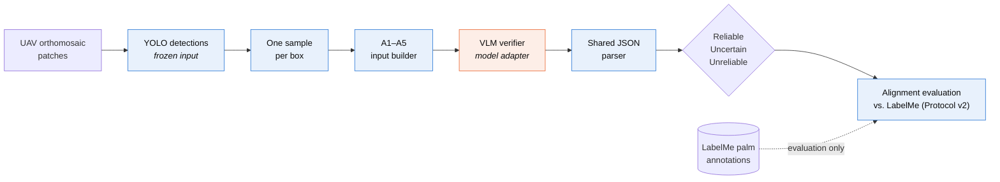

<div align="center">

# Wild Palm VLM Verification

**Can a vision-language model check a detector's work?**

Open-weight VLMs as **second-stage verifiers** for YOLO wild-palm detections in UAV orthomosaics,<br/>
evaluated under five controlled visual-context ablations (**A1–A5**).

<sub>CS Honors Thesis · <b>Annie Luo</b> · Mentor: <b>Fan Yang</b> · Wake Forest University · 2026</sub>

<br/>


[**Findings**](#key-findings) · [**Results**](#results) · [**Models**](#model-status) · [**Method**](#method) · [**Evaluation**](#evaluation) · [**Reproduce**](#reproduce) · [**Docs**](#documentation)

</div>

<br/>

<picture>
  <source media="(prefers-color-scheme: dark)" srcset="docs/assets/readme/ablation_inputs_dark.png">
  
</picture>

<sub>What the verifier sees. One target box, rendered with this repo's own builders (<code>verification_overlay.py</code>, <code>ablation_verification_images.py</code>) on a bundled sample patch. <b>Illustration only:</b> this target box is a LabelMe <code>palm</code> annotation, because no YOLO candidate is tracked in this repository; in every experiment the target is a frozen YOLO detection. <!-- TODO: regenerate with a real YOLO candidate (see YOLO_CANDIDATE in scripts/visualization/make_readme_figures.py). --></sub>

---

## Overview

> [!IMPORTANT]
> This repository **does not detect palms**. YOLO detections are **frozen inputs**. The VLM only **verifies** each box, and LabelMe ground truth is used **for evaluation only**. It is never shown to the model.

Every YOLO box gets one closed-set verdict:

| Verdict | Role | Meaning |
|---|---|---|
| **Reliable** | accept | The highlighted box clearly contains a valid wild palm |
| **Uncertain** | abstain | Evidence is ambiguous; defer to human review |
| **Unreliable** | reject | The highlighted object is not a palm **or** the detection is clearly incorrect |

<sub>Verdict meanings paraphrase the frozen prompt (<a href="src/prompts/ablation_verification_prompts.py"><code>ablation_verification_prompts.py</code></a>). <i>Unreliable</i> covers both "not a palm" and "the detection is clearly incorrect", so it is not a pure non-palm verdict.</sub>

**Research question:** how do different visual input conditions (**A1–A5**) affect VLM verification behavior on a fixed cohort of 5,747 YOLO wild-palm detections?

> [!IMPORTANT]
> **Three layers, three different constructs.**
> 1. **Primary — A1–A5 VLM behavior.** How each model's Reliable / Uncertain / Unreliable decisions, coverage and consistency change across input conditions. This needs no ground truth.
> 2. **Secondary — Protocol-v2 LabelMe annotation alignment.** Whether decisions agree with LabelMe matching (greedy one-to-one, IoU ≥ 0.5): 5,109 detections are **LabelMe-matched** (GT+), 638 are **LabelMe-unmatched** (GT−). All TP/TN/FP/FN, specificity and balanced-accuracy numbers in this README are alignment metrics.
> 3. **Audit — human semantic validity.** A human reviewed all 638 LabelMe-unmatched detections: **619 palm, 19 ambiguous, 0 non-palm**. LabelMe-unmatched therefore does **not** mean non-palm, and alignment specificity is **not** a measure of rejecting non-palms. See [`docs/SEMANTIC_VALIDITY_AUDIT.md`](docs/SEMANTIC_VALIDITY_AUDIT.md).
>
> This project does not claim that the primary analysis measures semantic correctness.

> [!NOTE]
> **All results use Evaluation Protocol v2** (2026-09-27). Protocol v1 matched the LabelMe label `palm` case-sensitively and silently dropped 486 boxes labelled `Palm`. v2 normalizes the label (`label.strip().lower() == "palm"`); nothing else changed, and no inference was rerun. Numbers in older copies of this README are Protocol v1. See [Protocol v1 → v2](#protocol-v1--v2-correction).

### Key findings

1. **Four models use all of the decision space, and A4/A5 produce their highest Unreliable rates on LabelMe-unmatched detections.** Qwen2.5-VL, Qwen3-VL, GLM-4.6V-Flash and Phi-4 reach their highest Protocol-v2 alignment specificity on A4 or A5 (0.90, 0.95, 0.91 and 0.86) and their highest alignment balanced accuracy there too (0.77, 0.81, 0.72, 0.76). The same conditions usually also raise Unreliable decisions on LabelMe-matched detections (lower alignment sensitivity). Because 619 of the 638 LabelMe-unmatched detections were human-reviewed as palms, this is a statement about agreement with LabelMe alignment, not about rejecting non-palms.
2. **Context changes behavior a lot, even within one model.** Qwen2.5-VL's alignment specificity is **0.04 under A3** and **0.90 under A5**. Qwen3-VL abstains on 4% of boxes under A1 and 69% under A5.
3. **Many VLMs collapse toward one answer.** LLaVA-OneVision and Gemma 3 answered *Reliable* for 100% of A1@1000 samples; MiniCPM-V-4.5 and Gemma 4 are Reliable-heavy (91.5–97.4%), with accuracy at the class prior. Molmo2-8B abstains on 79% of boxes and rejects one. InternVL3.5-8B-HF is **abstention-heavy; moderate alignment specificity on A1 and A3 at low coverage, with near-zero alignment specificity on A2, A4, and A5.**
4. **Accuracy and F1 alone mislead here.** Always answering Reliable already scores alignment accuracy **0.889** and F1 **0.941**. InternVL3.5 and Molmo2 post the highest F1 values in the study (up to 0.989) largely because their many Uncertain answers are excluded and they almost never reject. We report alignment specificity, balanced accuracy and the full decision mix alongside them.

<sub>Outcome labels such as "useful verifier" (below) are historical descriptors of the decision mix under Protocol-v2 alignment: a model that uses Unreliable substantively and is not dominated by one class. They are not claims of semantic verification accuracy.</sub>

---

## Results

### Protocol-v2 alignment specificity at full scale: N = 5,747, all five conditions

<picture>
  <source media="(prefers-color-scheme: dark)" srcset="docs/assets/readme/specificity_dark.png">
  
</picture>

**Protocol-v2 alignment specificity** = TN / (TN + FP) = the share of *decided* (non-Uncertain) LabelMe-unmatched detections that the model classifies Unreliable; the always-Reliable baseline scores **0**. It is **not** semantic non-palm specificity: the human audit found 619 palm, 19 ambiguous and 0 non-palm among the 638 LabelMe-unmatched detections. Alignment sensitivity is the share of decided LabelMe-matched detections classified Reliable. No model has a single best condition for everything. For example, Qwen2.5-VL has its highest F1 on A3 (0.969) and its lowest alignment specificity there (0.04).

| Model | Highest-alignment-specificity condition | Spec | Sens | BalAcc | Coverage |
|---|:-:|--:|--:|--:|--:|
| Qwen2.5-VL-7B | A5 | 0.901 | 0.639 | 0.770 | 0.92 |
| Qwen3-VL-8B | A5 | 0.950 | 0.677 | 0.813 | 0.31 |
| GLM-4.6V-Flash | A5 | 0.906 | 0.496 | 0.701 | 0.81 |
| Phi-4 Multimodal | A4 | 0.857 | 0.664 | 0.760 | 1.00 |
| InternVL3.5-8B-HF | A1 | 0.366 | 0.986 | 0.676 | 0.55 |
| Gemma 4 12B IT | A5 | 0.332 | 0.946 | 0.639 | 1.00 |

<sub>Spec / Sens / BalAcc are Protocol-v2 alignment metrics. Coverage = (Reliable + Unreliable) / N. Binary metrics exclude Uncertain. Full A1–A5 tables with every metric, confusion count and failure count: <a href="docs/EXPERIMENT_RESULTS_CANONICAL.md"><code>docs/EXPERIMENT_RESULTS_CANONICAL.md</code></a> §5.</sub>

### Verification behavior on A1

<picture>
  <source media="(prefers-color-scheme: dark)" srcset="docs/assets/readme/a1_behavior_dark.png">
  
</picture>

| Behavior | What it looks like | Examples |
|---|---|---|
| **Single-class collapse** | Every answer is *Reliable*; alignment accuracy equals the class prior and alignment specificity is 0 | LLaVA-OneVision, Gemma 3 (1000 / 0 / 0 at A1@1000) |
| **Reliable-heavy collapse** | Nearly always *Reliable*, rarely rejects | MiniCPM-V-4.5 A1 (Spec 0.11) · Gemma 4 A1–A5 (Spec 0.09–0.33) |
| **Abstention-heavy collapse** | Mostly *Uncertain*, essentially never *Unreliable* | Molmo2-8B A1 (1209 / 4537 / 1, Spec 0) |
| **Abstention-heavy, condition-dependent** | Mostly *Uncertain*; alignment specificity on decided boxes varies strongly by condition | InternVL3.5 (Uncertain 39–71%; Spec 0.37 A1, 0.24 A3, 0.05–0.11 A2/A4/A5) |
| **Structured-output failure** | Replies that don't parse as the required JSON | InternVL3-8B (13 of 100 unparsable in qualification) |

We record observed **behavior**, not unproven causes. "Spec" in this table and figure is Protocol-v2 alignment specificity.

---

## Model status

| Model | Furthest evaluation | Run status | Outcome |
|---|---|---|---|
| **Qwen2.5-VL-7B-Instruct** | A1–A5 @ 5,747 | Complete | Useful verifier |
| **Qwen3-VL-8B-Instruct** | A1–A5 @ 5,747 | Complete | Useful verifier |
| **GLM-4.6V-Flash** | A1–A5 @ 5,747 | Complete | Useful verifier |
| **Phi-4 Multimodal** | A1–A5 @ 5,747 | Complete | Useful verifier (never Uncertain) |
| **InternVL3.5-8B-HF** | A1–A5 @ 5,747 | Complete | Abstention-heavy; condition-dependent alignment specificity |
| **Gemma 4 12B IT** | A1–A5 @ 5,747 | Complete | Reliable-heavy collapse (skipped qualification gates) |
| **MiniCPM-V-4.5** | A1 @ 5,747 | A1 only | Reliable-heavy collapse |
| **Molmo2-8B** | A1 @ 5,747 | A1 only | Abstention-heavy collapse |
| **LLaVA-OneVision** | A1 @ 1,000 | A1 only | Single-class Reliable collapse |
| **Gemma 3 12B IT** | A1 @ 1,000 | A1 only | Single-class Reliable collapse |
| **InternVL3-8B-Instruct** | Balanced-100 gate | Qualification failed | Technical failure |
| **Llama-3.2-11B-Vision-Instruct** | Engineering Stage 0 | Integrated; engineering qualification only | No scientific result |
| **Ministral-3-8B** | — | Integrated; not evaluated | — |

<sub>Outcome labels are historical descriptors of the decision mix under Protocol-v2 alignment, not semantic-accuracy rankings. Qualification gates were alignment-based: the 50 nominal "negative" balanced-100 examples were later human-reviewed as 45 palm / 5 ambiguous / 0 non-palm. Job IDs, checkpoints, hardware, gate deviations and registry keys: <a href="docs/EXPERIMENT_STATUS_CANONICAL.md"><code>docs/EXPERIMENT_STATUS_CANONICAL.md</code></a>.</sub>

---

## Method


```mermaid
flowchart LR
    A["UAV orthomosaic<br/>patches"] --> B["YOLO detections<br/><i>frozen input</i>"]
    B --> C["One sample<br/>per box"]
    C --> D["A1–A5<br/>input builder"]
    D --> E["VLM verifier<br/><i>model adapter</i>"]
    E --> F["Shared JSON<br/>parser"]
    F --> G{"Reliable<br/>Uncertain<br/>Unreliable"}
    G --> H["Alignment evaluation<br/>vs. LabelMe (Protocol v2)"]
    GT[("LabelMe palm<br/>annotations")] -. evaluation only .-> H

    classDef frozen fill:#e8f1fc,stroke:#2a78d6,color:#0b0b0b
    classDef model fill:#fdeee7,stroke:#eb6834,color:#0b0b0b
    class B,C,D,F,H frozen
    class E model
```

<sub><b>Blue:</b> frozen and shared by every model (detections, dataset, A1–A5 inputs, parser, evaluator) · <b>Orange:</b> model-specific (adapter, config, checkpoint)</sub>

Every compared model sees **the same 5,747 boxes, the same prompts, the same parser and the same evaluator**. Only the adapter changes; it wraps each model's native processor and chat template.

Five frozen conditions vary **only what the VLM sees**:

| | Condition | Image input | Extra prompt metadata |
|:-:|---|---|---|
| **A1** | Overlay only | Full patch, dimmed outside the box (×0.55), green target box | — |
| **A2** | Overlay + confidence | Same overlay as A1 | YOLO confidence |
| **A3** | Overlay + confidence + geometry | Same overlay as A1 | Confidence + bbox area, width, height, aspect ratio, center |
| **A4** | Dual panel | Overlay (left) + enlarged box crop (right) | YOLO confidence |
| **A5** | Crop only | Enlarged box crop with 15 px padding, no surround | YOLO confidence |

Design rationale: [`docs/ABLATION_STUDY.md`](docs/ABLATION_STUDY.md) · Prompts: [`src/prompts/ablation_verification_prompts.py`](src/prompts/ablation_verification_prompts.py)

---

## Evaluation

| Dataset (Protocol v2) | |
|---|--:|
| YOLO detections (N, confidence ≥ 0.5) | **5,747** |
| LabelMe-matched (alignment GT+) | 5,109 |
| LabelMe-unmatched (alignment GT−) | 638 |
| Always-Reliable alignment accuracy (class prior) | **0.889** |
| Human semantic audit of the 638 LabelMe-unmatched | 619 palm · 19 ambiguous · **0 non-palm** |

- **Reference annotations:** LabelMe shapes whose label is `palm` in any casing or surrounding whitespace, as the axis-aligned envelope of their points (5,853 boxes on 880 patches). Protocol v2 uses them as an **annotation-alignment reference**, not as semantic ground truth.
- **Matching:** within each patch, detections and LabelMe boxes are paired by descending IoU, greedily and one-to-one; a pair matches when **IoU ≥ 0.5**. Matched = GT+ (LabelMe-matched), unmatched = GT− (LabelMe-unmatched).
- **Scoring:** Reliable = positive, Unreliable = negative, **Uncertain excluded**. Alignment specificity = TN / (TN + FP); alignment balanced accuracy = (sensitivity + specificity) / 2. Coverage = (R + Ur) / N is reported as a descriptor. Legacy field names (`true_negative`, `false_positive`, `matched_gt`, `gt_label`) keep their Protocol-v2 alignment meaning.
- **Semantic validity** is a separate construct, audited by human review: [`docs/SEMANTIC_VALIDITY_AUDIT.md`](docs/SEMANTIC_VALIDITY_AUDIT.md).
- The A1@1000 qualification slice (GT+ 928 / GT− 72, prior 0.928) is unaffected by the v2 correction; don't compare it directly with full-set numbers.

Full protocol: [`docs/EVALUATION_PROTOCOL.md`](docs/EVALUATION_PROTOCOL.md)

### Protocol v1 → v2 correction

<sub><b>Historical note (Protocol v1).</b> Until 2026-09-27 the evaluator matched <code>label == "palm"</code> exactly. 70 LabelMe files (parents 0194–0205) use <code>"Palm"</code>, so 486 GT boxes were dropped and 424 detections on real palms were scored GT−. Protocol v1 therefore used GT+ 4,685 / GT− 1,062 (prior 0.815) and under-reported alignment specificity for most models. The v2 re-score recomputed every run from the stored predictions; predictions, decision distributions and all sub-1,000 runs are unchanged. v1 outputs are preserved in <code>outputs/evaluation/</code>. Details: <a href="docs/EXPERIMENT_RESULTS_CANONICAL.md#2-protocol-v1--v2-correction"><code>EXPERIMENT_RESULTS_CANONICAL.md</code> §2</a>.</sub>

---

## Reproduce

The main launcher is **`scripts/submit_model_ablation.sh`**. It submits one Slurm job per condition through `jobs/run_verification.slurm`; per-model environments and checkpoints are resolved in `jobs/lib/model_runtime.sh`. It **dry-runs by default**, and nothing is submitted until you pass `--submit`.

```bash
# Preview the sbatch commands (default: dry-run)
./scripts/submit_model_ablation.sh qwen3_vl \
  --conditions A1 --limit 1000 --experiment-id qwen3vl_A1_1000

# Full A1–A5 at N = 5,747
./scripts/submit_model_ablation.sh phi4_multimodal \
  --conditions A1,A2,A3,A4,A5 --limit 5747 --ablation-size 5747 \
  --experiment-id my_phi4_A1A5_5747 --time 24:00:00 \
  --submit

# Re-score stored predictions under Protocol v2 (no inference)
python scripts/rescore_protocol_v2.py --dry-run
```

<details>
<summary><b>Single condition from the CLI, outputs and resume</b></summary>

```bash
python scripts/run_verification.py \
  --model qwen2_5_vl \
  --prompt-index outputs/verification_ablation_1000/A1_overlay_only/prompt_index.csv \
  --results-dir outputs/verification/qwen2_5_vl/my_run/A1 \
  --batch-size 4 \
  --resume
```

| | Path |
|---|---|
| Predictions | `outputs/verification/<model>/<experiment_id>/A1..A5/sample_*.json` |
| Metrics (Protocol v2, current) | `outputs/evaluation_protocol_v2/<model>/<experiment_id>/A1..A5/A*_metrics.json` |
| Metrics (Protocol v1, frozen) | `outputs/evaluation/<model>/<experiment_id>/A1..A5/A*_metrics.json` |

- Each job loads the model **once** and runs one condition; `--resume` / `RESUME=1` skips finished samples.
- Models whose dependency pins conflict run in isolated Python environments.
- The legacy Qwen2.5 production tree is `outputs/verification/qwen/20260708_0020/`.
- Cluster setup: [`docs/cluster_deployment.md`](docs/cluster_deployment.md)

</details>

<details>
<summary><b>Adding a new VLM</b></summary>

<br/>

Never change the A1–A5 semantics, the shared parser or the evaluator to suit one model.

1. Verifier: `src/lvm/<model>_verifier.py`, using the model's **native** processor and chat template
2. Adapter: `src/lvm/<model>_verification_adapter.py`
3. Config: `configs/models/<key>.yaml`
4. Registry: `register_adapter()` in `src/verification/registry.py`
5. Isolated environment, if needed, wired into `jobs/lib/model_runtime.sh`

**Preferred qualification ladder:** `Stage 0 (≈10 samples)` → `balanced-100 (parse ≥ 95%, alignment Spec ≥ 0.20, BalAcc ≥ 0.55, < 95% single class)` → `A1 @ 1,000` → `full A1–A5 @ 5,747`. The Spec/BalAcc gates are Protocol-v2 alignment gates, not semantic non-palm rejection tests (the 50 balanced-100 GT− examples were human-reviewed as 45 palm / 5 ambiguous / 0 non-palm). It was not applied uniformly; see [`EXPERIMENT_STATUS_CANONICAL.md`](docs/EXPERIMENT_STATUS_CANONICAL.md) §5.

</details>

<details>
<summary><b>Repository layout</b></summary>

```
wild-palm-lvm-verification/
├── configs/models/          # one YAML per VLM
├── src/
│   ├── preprocessing/       # overlay + A4/A5 builders · GT palm extraction (is_palm_label)
│   ├── prompts/             # frozen A1–A5 prompt templates
│   ├── verification/        # runner · registry · records · resume
│   ├── lvm/                 # model adapters/verifiers + shared parser
│   └── evaluation/          # greedy IoU matching
├── scripts/                 # launchers, evaluator, Protocol v2 re-score, figures
├── jobs/                    # Slurm jobs + model_runtime.sh
├── tests/                   # unit tests (python -m unittest discover tests)
├── docs/                    # protocol, canonical results and status
├── archive/docs/            # superseded documents (Protocol v1 numbers)
├── data/samples/            # 5 example patches + LabelMe JSON
└── outputs/                 # generated artifacts (not tracked)
```

</details>

---

## Documentation

| Document | What's inside |
|---|---|
| [`EXPERIMENT_RESULTS_CANONICAL.md`](docs/EXPERIMENT_RESULTS_CANONICAL.md) | **Source of truth for numbers**: full A1–A5 tables, @1000 and qualification results, v1 → v2 correction |
| [`EXPERIMENT_STATUS_CANONICAL.md`](docs/EXPERIMENT_STATUS_CANONICAL.md) | **Source of truth for runs**: status, job IDs, checkpoints, gate deviations |
| [`EVALUATION_PROTOCOL.md`](docs/EVALUATION_PROTOCOL.md) | Protocol v2 (LabelMe annotation alignment): label rule, matching, metric definitions, versioned outputs |
| [`SEMANTIC_VALIDITY_AUDIT.md`](docs/SEMANTIC_VALIDITY_AUDIT.md) | **Canonical human semantic audit**: 638 LabelMe-unmatched (619 palm / 19 ambiguous / 0 non-palm) and the 400-item lower-confidence pilot |
| [`ABLATION_STUDY.md`](docs/ABLATION_STUDY.md) | A1–A5 design |
| [`MODEL_SELECTION_AND_COLLAPSE_ANALYSIS.md`](docs/MODEL_SELECTION_AND_COLLAPSE_ANALYSIS.md) | Collapse forensics and model-selection history |
| [`INTERNVL3_5_HF_QUALIFICATION.md`](docs/INTERNVL3_5_HF_QUALIFICATION.md) | InternVL3 vs 3.5 qualification gate |
| [`INTERNVL3_QUALIFICATION.md`](docs/INTERNVL3_QUALIFICATION.md) | Why InternVL3 failed the gate |
| [`QWEN_FULL_A1_A5_RESULTS.md`](docs/QWEN_FULL_A1_A5_RESULTS.md) | Qwen2.5-VL run notes |
| [`SUPPORTED_MODELS.md`](docs/SUPPORTED_MODELS.md) | Registry keys, adapters and configs |
| [`ARCHITECTURE.md`](docs/ARCHITECTURE.md) · [`FRAMEWORK_FREEZE.md`](docs/FRAMEWORK_FREEZE.md) | Architecture and fairness contract |
| [`archive/docs/`](archive/docs/README.md) | Superseded plans and reports (Protocol v1) |

---

<div align="center">

**Annie Luo** · CS Honors Thesis · Mentor **Fan Yang** · Wake Forest University · 2026

<sub>Released under the <a href="LICENSE">MIT License</a>.</sub>

</div>
