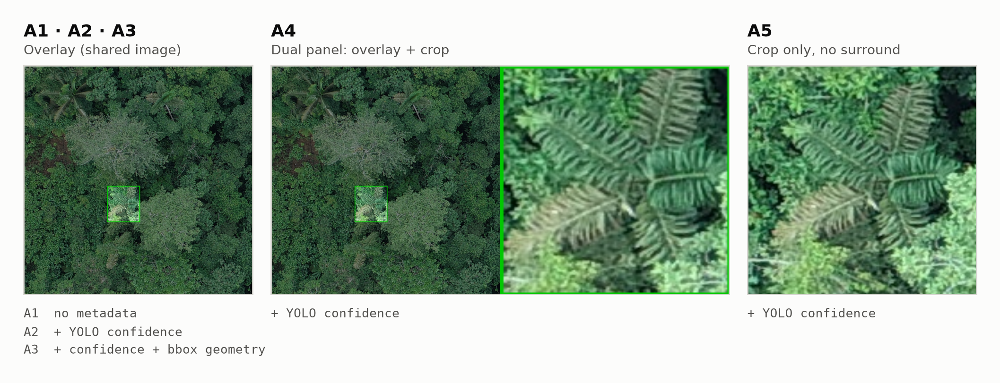
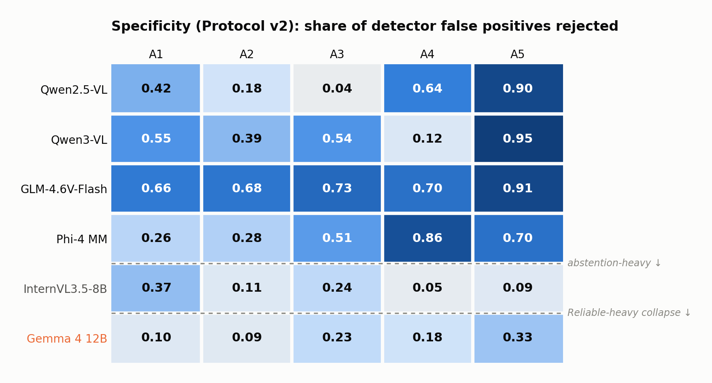
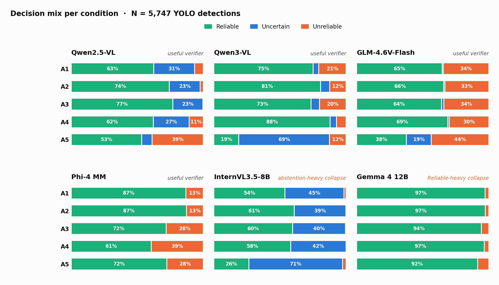
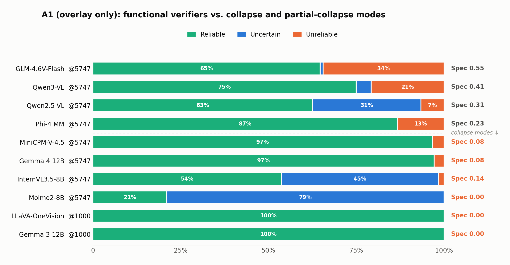
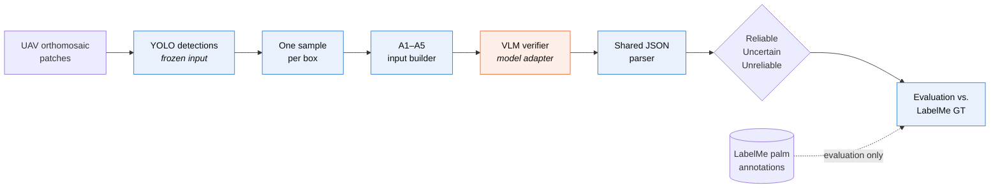

<div align="center">

# Wild Palm VLM Verification

**Can a vision-language model check a detector's work?**

Open-weight VLMs as **second-stage verifiers** for YOLO wild-palm detections in UAV orthomosaics,<br/>
evaluated under five controlled visual-context ablations (**A1–A5**).

<sub>CS Honors Thesis · <b>Annie Luo</b> · Mentor: <b>Fan Yang</b> · Wake Forest University · 2026</sub>

<br/>


[**Results**](#results) · [**Method**](#method) · [**Ablations**](#the-a1a5-ablations) · [**Models**](#model-status) · [**Reproduce**](#reproduce) · [**Docs**](#documentation)

</div>

<br/>

<picture>
  <source media="(prefers-color-scheme: dark)" srcset="docs/assets/readme/ablation_inputs_dark.png">
  
</picture>

<sub>What the verifier sees. One target box, rendered with this repo's own builders (<code>verification_overlay.py</code>, <code>ablation_verification_images.py</code>) on a bundled sample patch. <b>Illustration only:</b> this target box is a LabelMe <code>palm</code> annotation, because no YOLO candidate is tracked in this repository; in every experiment the target is a frozen YOLO detection. <!-- TODO: regenerate with a real YOLO candidate (see YOLO_CANDIDATE in scripts/visualization/make_readme_figures.py). --></sub>

---

## Overview

> [!IMPORTANT]
> This repository **does not detect palms**. YOLO detections are **frozen inputs**. The VLM only **verifies** each box, and LabelMe ground truth is used **for evaluation only**. It is never shown to the model.

Every YOLO box gets one closed-set verdict:

| Verdict | Role | Meaning |
|---|---|---|
| **Reliable** | accept | The box contains a palm |
| **Uncertain** | abstain | Defer to human review |
| **Unreliable** | reject | Likely a detector false positive |

**Research question:** can modern VLMs *reject detector false positives while keeping true palms*, and how does the visual context they receive (**A1–A5**) change that?

### Key findings

1. **Eleven checkpoints tested; six completed full A1–A5 at N = 5,747.** Four are useful verifiers (Qwen2.5-VL, Qwen3-VL, GLM-4.6V-Flash, Phi-4 Multimodal). Two completed but collapsed: InternVL3.5-8B-HF (abstention-heavy) and Gemma 4 12B IT (Reliable-heavy).
2. **Context changes behavior a lot, even within one model.** Qwen2.5-VL's specificity is **0.02 under A3** and **0.72 under A5**; Qwen3-VL abstains on 3,948 boxes under A5 while reaching specificity **0.81**.
3. **Collapse and partial collapse are common.** LLaVA-OneVision and Gemma 3 answered *Reliable* for **100%** of A1@1000 samples. MiniCPM-V-4.5 (97%) and Gemma 4 (91.5–97.4% across A1–A5) are Reliable-heavy; Molmo2-8B (79% on A1) and InternVL3.5 (39–71% across A1–A5) are abstention-heavy.
4. **Accuracy and F1 on their own mislead here.** Always answering "Reliable" already scores **0.815** accuracy. Gemma 4's accuracy (0.814–0.825) sits at that prior; Molmo2 reaches **F1 = 0.96** with **specificity = 0**; InternVL3.5 reaches F1 0.92–0.95 with specificity ≤ 0.144. We report specificity and the full decision mix alongside them.

---

## Results

### Full-scale comparison: N = 5,747, all five conditions

<picture>
  <source media="(prefers-color-scheme: dark)" srcset="docs/assets/readme/specificity_dark.png">
  
</picture>

Specificity is the share of detector false positives (GT−) that the verifier rejects. Higher is better, and the always-Reliable baseline scores **0**. Every useful verifier reaches its highest specificity on a **crop-based condition (A4 or A5)**, usually at a cost in sensitivity. None has a single best condition for everything: each ablation trades sensitivity against specificity differently. The two collapsed models never exceed **0.24** in any condition.

<picture>
  <source media="(prefers-color-scheme: dark)" srcset="docs/assets/readme/decision_mix_dark.png">
  
</picture>

The six models behave very differently:

- **Qwen2.5-VL** uses all three verdicts.
- **Qwen3-VL** abstains heavily under A5 (crop only).
- **GLM-4.6V-Flash** rejects often, which gives it the most consistent specificity.
- **Phi-4** **never** answers Uncertain and works as a binary verifier.
- **InternVL3.5-8B-HF** abstains on 39–71% of boxes and rejects at most 2.7%: an abstention-heavy collapse.
- **Gemma 4 12B IT** answers Reliable on 91.5–97.4% of boxes and never answers Uncertain: a Reliable-heavy collapse.

<details>
<summary><b>Full metrics table: 6 models × 5 conditions</b></summary>

<br/>

Binary metrics exclude *Uncertain* (see [Evaluation](#evaluation)). BalAcc = (Sens + Spec) / 2.

| Model | Cond. | Acc | Prec | Sens | Spec | BalAcc | F1 | R / U / Ur |
|---|:-:|--:|--:|--:|--:|--:|--:|--:|
| **Qwen2.5-VL** | A1 | 0.851 | 0.895 | 0.938 | 0.306 | 0.622 | 0.916 | 3593 / 1775 / 379 |
| | A2 | 0.866 | 0.880 | 0.980 | 0.105 | 0.542 | 0.927 | 4268 / 1344 / 135 |
| | A3 | 0.874 | 0.876 | 0.998 | **0.018** | 0.508 | 0.933 | 4416 / 1313 / 18 |
| | A4 | 0.833 | 0.907 | 0.898 | 0.433 | 0.666 | 0.903 | 3570 / 1557 / 620 |
| | A5 | 0.660 | 0.911 | 0.647 | **0.720** | 0.683 | 0.757 | 3065 / 455 / 2227 |
| **Qwen3-VL** | A1 | 0.752 | 0.864 | 0.827 | 0.414 | 0.621 | 0.845 | 4309 / 246 / 1192 |
| | A2 | 0.792 | 0.856 | 0.900 | 0.286 | 0.593 | 0.877 | 4636 / 401 / 710 |
| | A3 | 0.753 | 0.865 | 0.828 | 0.413 | 0.621 | 0.846 | 4221 / 367 / 1159 |
| | A4 | 0.789 | 0.829 | 0.934 | 0.128 | 0.531 | 0.879 | 5051 / 276 / 420 |
| | A5 | 0.715 | 0.943 | 0.694 | **0.812** | 0.753 | 0.799 | 1081 / 3948 / 718 |
| **GLM-4.6V-Flash** | A1 | 0.671 | 0.873 | 0.698 | 0.549 | 0.624 | 0.776 | 3719 / 50 / 1978 |
| | A2 | 0.685 | 0.877 | 0.714 | 0.555 | 0.634 | 0.787 | 3783 / 57 / 1907 |
| | A3 | 0.688 | 0.887 | 0.709 | 0.591 | 0.650 | 0.788 | 3696 / 100 / 1951 |
| | A4 | 0.719 | 0.884 | 0.754 | 0.559 | 0.657 | 0.814 | 3960 / 64 / 1723 |
| | A5 | 0.545 | 0.920 | 0.505 | **0.761** | 0.633 | 0.652 | 2163 / 1082 / 2502 |
| **Phi-4 Multimodal** | A1 | 0.766 | 0.835 | 0.889 | 0.226 | 0.557 | 0.861 | 4985 / 0 / 762 |
| | A2 | 0.774 | 0.838 | 0.896 | 0.234 | 0.565 | 0.866 | 5012 / 0 / 735 |
| | A3 | 0.696 | 0.855 | 0.754 | 0.437 | 0.596 | 0.802 | 4132 / 0 / 1615 |
| | A4 | 0.670 | 0.900 | 0.669 | **0.673** | 0.671 | 0.768 | 3481 / 0 / 2266 |
| | A5 | 0.734 | 0.879 | 0.781 | 0.527 | 0.654 | 0.827 | 4160 / 0 / 1587 |
| **InternVL3.5-8B-HF** ⚠ | A1 | 0.890 | 0.900 | 0.986 | 0.144 | 0.565 | 0.941 | 3085 / 2570 / 92 |
| | A2 | 0.905 | 0.905 | 0.999 | 0.026 | 0.513 | 0.950 | 3497 / 2239 / 11 |
| | A3 | 0.906 | 0.908 | 0.998 | 0.065 | 0.531 | 0.951 | 3420 / 2298 / 29 |
| | A4 | 0.907 | 0.906 | 1.000 | 0.016 | 0.508 | 0.951 | 3343 / 2399 / 5 |
| | A5 | 0.848 | 0.923 | 0.911 | 0.127 | 0.519 | 0.917 | 1515 / 4078 / 154 |
| **Gemma 4 12B IT** ⚠ | A1 | 0.816 | 0.825 | 0.983 | 0.078 | 0.530 | 0.897 | 5583 / 0 / 164 |
| | A2 | 0.814 | 0.823 | 0.983 | 0.068 | 0.525 | 0.896 | 5595 / 0 / 152 |
| | A3 | 0.820 | 0.837 | 0.969 | 0.166 | 0.567 | 0.898 | 5424 / 0 / 323 |
| | A4 | 0.825 | 0.832 | 0.985 | 0.121 | 0.553 | 0.902 | 5547 / 0 / 200 |
| | A5 | 0.818 | 0.846 | 0.950 | 0.236 | 0.593 | 0.895 | 5261 / 0 / 486 |

<sub>⚠ Collapsed at full scale. InternVL3.5's high Acc / F1 are computed only on the non-Uncertain subset, in which almost no box is rejected. Gemma 4's accuracy equals the always-Reliable prior (0.815) within ±0.011.</sub>

Source of truth: [`docs/FULL_SCALE_MODEL_COMPARISON.md`](docs/FULL_SCALE_MODEL_COMPARISON.md) and `outputs/evaluation/<model>/<experiment>/A*/A*_metrics.json`.

</details>

### VLMs exhibit distinct verification failure modes

<picture>
  <source media="(prefers-color-scheme: dark)" srcset="docs/assets/readme/a1_behavior_dark.png">
  
</picture>

| Failure mode | What it looks like | Examples |
|---|---|---|
| **Single-class collapse** | Every answer is *Reliable*. Accuracy equals the class prior and specificity is 0 | LLaVA-OneVision, Gemma 3: 1000 / 0 / 0 at A1 @ 1,000 |
| **Reliable-heavy partial collapse** | Nearly always *Reliable* and rarely rejects anything | MiniCPM-V-4.5 A1: 5557 / 0 / 190, Spec 0.078 · Gemma 4 A1–A5: Spec 0.068–0.236 |
| **Abstention-heavy partial collapse** | Mostly *Uncertain* and almost never *Unreliable* | Molmo2-8B A1: 1209 / 4537 / 1, Spec 0 · InternVL3.5 A1–A5: Uncertain 39–71%, Spec 0.016–0.144 |
| **Structured-output failure** | Replies that don't parse as the required JSON | InternVL3-8B: 13 of 100 unparsable in qualification |

We record observed **behavior**, not unproven causes.

> [!WARNING]
> **High F1 on an abstention-heavy model does not indicate strong verification.** Molmo2's F1 of 0.962 is computed on only the **~21%** of samples that received a Reliable or Unreliable verdict, and among those it rejected just **one** box. InternVL3.5's F1 of 0.92–0.95 has the same problem. Always read F1 together with the decision mix, or with decision coverage = (R + Ur) / N, a post-hoc descriptor that the frozen evaluator does not output.

### InternVL3 → InternVL3.5

| | InternVL3-8B-Instruct | InternVL3.5-8B-HF |
|---|:-:|:-:|
| Balanced-100 gate | Failed | Passed |
| Parse success | 87% | 100% |
| Specificity / BalAcc (balanced-100) | 0.00 / 0.50 | 0.20 / 0.60 |
| Full A1–A5 @ 5,747 | Not run | **Complete**: abstention-heavy collapse |

<sub>Both the model version and the inference API changed between the two runs, so the qualification improvement cannot be attributed to the version alone. InternVL3.5 went from the balanced-100 gate directly to full scale (A1 @ 1,000 skipped). Details: <a href="docs/INTERNVL3_5_HF_QUALIFICATION.md"><code>docs/INTERNVL3_5_HF_QUALIFICATION.md</code></a>.</sub>

---

## Method


```mermaid
flowchart LR
    A["UAV orthomosaic<br/>patches"] --> B["YOLO detections<br/><i>frozen input</i>"]
    B --> C["One sample<br/>per box"]
    C --> D["A1–A5<br/>input builder"]
    D --> E["VLM verifier<br/><i>model adapter</i>"]
    E --> F["Shared JSON<br/>parser"]
    F --> G{"Reliable<br/>Uncertain<br/>Unreliable"}
    G --> H["Evaluation vs.<br/>LabelMe GT"]
    GT[("LabelMe palm<br/>annotations")] -. evaluation only .-> H

    classDef frozen fill:#e8f1fc,stroke:#2a78d6,color:#0b0b0b
    classDef model fill:#fdeee7,stroke:#eb6834,color:#0b0b0b
    class B,C,D,F,H frozen
    class E model
```

<sub><b>Blue:</b> frozen and shared by every model (detections, dataset, A1–A5 inputs, parser, evaluator) · <b>Orange:</b> model-specific (adapter, config, checkpoint)</sub>

Every compared model sees **the same 5,747 boxes, the same prompts, the same parser and the same evaluator**. Only the adapter changes, and it wraps each model's native processor and chat template.

---

## The A1–A5 ablations

Five frozen conditions vary **only what the VLM sees**. The boxes, matching rule and metrics stay fixed.

| | Condition | Image input | Extra prompt metadata |
|:-:|---|---|---|
| **A1** | Overlay only | Full patch, dimmed outside the box (×0.55), green target box | — |
| **A2** | Overlay + confidence | Same overlay as A1 | YOLO confidence |
| **A3** | Overlay + confidence + geometry | Same overlay as A1 | Confidence + bbox area, width, height, aspect ratio, center |
| **A4** | Dual panel | Overlay (left) + enlarged box crop (right) | YOLO confidence |
| **A5** | Crop only | Enlarged box crop with 15 px padding, no surround | YOLO confidence |

Design rationale: [`docs/ABLATION_STUDY.md`](docs/ABLATION_STUDY.md) · Prompts: [`src/prompts/ablation_verification_prompts.py`](src/prompts/ablation_verification_prompts.py)

---

## Evaluation

<table>
<tr>
<td width="50%" valign="top">

**Dataset**

| | |
|---|--:|
| YOLO detections (N, conf ≥ 0.5) | **5,747** |
| Matched to GT (GT+) | 4,685 |
| Unmatched (GT−) | 1,062 |
| Always-Reliable accuracy | **0.815** |

<sub>The A1 qualification slice (N = 1,000; GT+ 928 / GT− 72) has a prior of 0.928. Don't compare it directly with full-set numbers.</sub>

</td>
<td width="50%" valign="top">

**Scoring**

| Verdict | Binary role |
|---|---|
| Reliable | positive |
| Unreliable | negative |
| Uncertain | **excluded** |

<sub>TP = GT+ ∧ Reliable · FP = GT− ∧ Reliable · FN = GT+ ∧ Unreliable · TN = GT− ∧ Unreliable. An *Uncertain* verdict is never counted as FN or TN.</sub>

</td>
</tr>
</table>

- **Matching:** within each patch, YOLO boxes are paired with LabelMe `palm` boxes by descending IoU, one-to-one and greedily. A pair counts as a match when **IoU ≥ 0.5**.
- **Metrics:** accuracy, precision, sensitivity (recall), specificity, F1 and balanced accuracy, plus the full R / U / Ur distribution over N.
- **Post-hoc coverage descriptors** (not produced by the frozen evaluator): **decision coverage** = (R + Ur) / N and **abstention rate** = U / N.

Full protocol: [`docs/EVALUATION_PROTOCOL.md`](docs/EVALUATION_PROTOCOL.md)

---

## Model status

*Run status* (what was executed) and *scientific outcome* (what it shows) are reported separately.

| Model | Furthest evaluation | Run status | Scientific outcome | Observed behavior |
|---|---|---|---|---|
| **Qwen2.5-VL-7B-Instruct** | Full A1–A5 @ 5,747 | Complete | Useful verifier | Uses all three verdicts; A5 is the most conservative |
| **Qwen3-VL-8B-Instruct** | Full A1–A5 @ 5,747 | Complete | Useful verifier | A5 abstains heavily, with Spec 0.81 |
| **GLM-4.6V-Flash** | Full A1–A5 @ 5,747 | Complete | Useful verifier | Rejects often; the most stable specificity |
| **Phi-4 Multimodal** | Full A1–A5 @ 5,747 | Complete | Useful verifier | Never answers Uncertain (binary verifier) |
| **InternVL3.5-8B-HF** | Full A1–A5 @ 5,747 | Complete | Abstention-heavy collapse | Uncertain 39–71%; Unreliable ≤ 2.7%; Spec 0.016–0.144 |
| **Gemma 4 12B IT** | Full A1–A5 @ 5,747 | Complete | Reliable-heavy collapse | Reliable 91.5–97.4%; Spec 0.068–0.236; skipped the normal qualification gates |
| **MiniCPM-V-4.5** | A1 @ 5,747 | A1 only | Reliable-heavy collapse | 5557 / 0 / 190; Spec 0.078 |
| **Molmo2-8B** | A1 @ 5,747 | A1 only | Abstention-heavy collapse | 1209 / 4537 / 1; Spec 0 |
| **LLaVA-OneVision** | A1 @ 1,000 | A1 only | Reliable-heavy collapse (single-class) | 100% Reliable |
| **Gemma 3 12B IT** | A1 @ 1,000 | A1 only | Reliable-heavy collapse (single-class) | 100% Reliable |
| **InternVL3-8B-Instruct** | Balanced-100 gate | Qualification failed / stopped | Technical failure | 13/100 parse failures; Spec 0 |

<sub>A2–A5 were intentionally <b>not run</b> for MiniCPM, Molmo2, LLaVA-OneVision and Gemma 3 after their A1 results. <b>Next candidate, not yet evaluated:</b> Llama-3.2-11B-Vision-Instruct. No experiment jobs are running (checked 2026-09-27). Registry keys, configs, job IDs and the canonical inventory: <a href="docs/EXPERIMENT_STATUS_CANONICAL.md"><code>docs/EXPERIMENT_STATUS_CANONICAL.md</code></a>.</sub>

> [!NOTE]
> **Gemma 4 did not follow the preferred qualification ladder.** It skipped Stage 0, the balanced-100 gate and A1 @ 1,000. Its only pre-check (the first 100 A1@1000 samples, 92 GT+ / 8 GT−) returned 95 / 0 / 5, which meets the "≥ 95% one class" stop criterion, yet full scale was launched anyway. The full-scale run is a valid observation but not a gated one. See [`docs/EXPERIMENT_STATUS_CANONICAL.md`](docs/EXPERIMENT_STATUS_CANONICAL.md) §6.

---

## Reproduce

The main launcher is **`scripts/submit_model_ablation.sh`**. It submits one Slurm job per condition through `jobs/run_verification.slurm`, and per-model environments and checkpoints are resolved in `jobs/lib/model_runtime.sh`. It **dry-runs by default**, and nothing is submitted until you pass `--submit`.

```bash
# Preview the sbatch commands (default: dry-run)
./scripts/submit_model_ablation.sh qwen3_vl \
  --conditions A1 --limit 1000 --experiment-id qwen3vl_A1_1000

# Full A1–A5 at N = 5,747
./scripts/submit_model_ablation.sh phi4_multimodal \
  --conditions A1,A2,A3,A4,A5 --limit 5747 --ablation-size 5747 \
  --experiment-id my_phi4_A1A5_5747 --time 24:00:00 \
  --submit
```

<details>
<summary><b>Single condition from the CLI, outputs and resume</b></summary>

```bash
python scripts/run_verification.py \
  --model qwen2_5_vl \
  --prompt-index outputs/verification_ablation_1000/A1_overlay_only/prompt_index.csv \
  --results-dir outputs/verification/qwen2_5_vl/my_run/A1 \
  --batch-size 4 \
  --resume
```

| | Path |
|---|---|
| Predictions | `outputs/verification/<model>/<experiment_id>/A1..A5/sample_*.json` |
| Metrics | `outputs/evaluation/<model>/<experiment_id>/A1..A5/A*_metrics.json` |

- Each job loads the model **once** and runs one condition.
- `--resume` / `RESUME=1` skips samples that are already done.
- Models whose dependency pins conflict (Phi-4, GLM, Qwen3-VL, InternVL3, InternVL3.5, MiniCPM, Molmo2, Gemma 4) run in isolated Python environments.
- The legacy Qwen2.5 production tree is `outputs/verification/qwen/20260708_0020/`.
- Cluster setup: [`docs/cluster_deployment.md`](docs/cluster_deployment.md)

</details>

<details>
<summary><b>Adding a new VLM</b></summary>

<br/>

Never change the A1–A5 semantics, the shared parser or the evaluator to suit one model.

1. Verifier: `src/lvm/<model>_verifier.py`, using the model's **native** processor and chat template
2. Adapter: `src/lvm/<model>_verification_adapter.py`
3. Config: `configs/models/<key>.yaml`
4. Registry: `register_adapter()` in `src/verification/registry.py`
5. Isolated environment, if needed, wired into `jobs/lib/model_runtime.sh`

**Preferred qualification ladder for new models:**

`Stage 0 (≈10 samples)` → `Stage 1 balanced-100 (parse ≥ 95%, Spec ≥ 0.20, BalAcc ≥ 0.55, < 95% single class)` → `A1 @ 1,000` → `full A1–A5 @ 5,747`

<sub>This ladder was not applied uniformly. The Qwen2.5-VL full run predates it; Qwen3-VL, Phi-4, MiniCPM and Molmo2 used sanity/smoke checks plus A1 @ 1,000; LLaVA and Gemma 3 were diagnosed at A1 @ 1,000; InternVL3.5 skipped A1 @ 1,000; Gemma 4 skipped all gates. Full record: <a href="docs/EXPERIMENT_STATUS_CANONICAL.md"><code>EXPERIMENT_STATUS_CANONICAL.md</code></a> §6.</sub>

</details>

---

## Repository layout

```
wild-palm-lvm-verification/
├── configs/models/          # one YAML per VLM
├── src/
│   ├── preprocessing/       # overlay (dim 0.55) + A4/A5 image builders
│   ├── prompts/             # frozen A1–A5 prompt templates
│   ├── verification/        # runner · registry · records · resume
│   ├── lvm/                 # model adapters/verifiers + shared parser
│   └── evaluation/          # greedy IoU matching
├── scripts/
│   ├── submit_model_ablation.sh
│   ├── run_verification.py
│   ├── evaluate_verification_against_groundtruth.py
│   └── visualization/make_readme_figures.py   # regenerates the figures above (no inference)
├── jobs/                    # Slurm jobs + model_runtime.sh
├── docs/                    # protocols, results, status
├── data/samples/            # 5 example patches + LabelMe JSON
└── outputs/                 # generated artifacts (not tracked)
```

Architecture and fairness contract: [`docs/ARCHITECTURE.md`](docs/ARCHITECTURE.md) · [`docs/FRAMEWORK_FREEZE.md`](docs/FRAMEWORK_FREEZE.md)

---

## Documentation

| Document | What's inside |
|---|---|
| [`EXPERIMENT_STATUS_CANONICAL.md`](docs/EXPERIMENT_STATUS_CANONICAL.md) | **Source of truth**: every run, job IDs, status, collapse labels, gate deviations |
| [`FULL_SCALE_MODEL_COMPARISON.md`](docs/FULL_SCALE_MODEL_COMPARISON.md) | Advisor-facing A1–A5 tables at N = 5,747 |
| [`MODEL_SELECTION_AND_COLLAPSE_ANALYSIS.md`](docs/MODEL_SELECTION_AND_COLLAPSE_ANALYSIS.md) | Collapse forensics and next-model rationale |
| [`INTERNVL3_5_HF_QUALIFICATION.md`](docs/INTERNVL3_5_HF_QUALIFICATION.md) | InternVL3 vs 3.5 controlled gate + InternVL3.5 full-scale outcome |
| [`INTERNVL3_QUALIFICATION.md`](docs/INTERNVL3_QUALIFICATION.md) | Why InternVL3 failed the gate |
| [`SUPPORTED_MODELS.md`](docs/SUPPORTED_MODELS.md) | Registry keys, adapters and configs per model |
| [`EVALUATION_PROTOCOL.md`](docs/EVALUATION_PROTOCOL.md) | GT matching and metric definitions |
| [`ABLATION_STUDY.md`](docs/ABLATION_STUDY.md) | A1–A5 design |
| [`QWEN_FULL_A1_A5_RESULTS.md`](docs/QWEN_FULL_A1_A5_RESULTS.md) | Detailed Qwen2.5-VL write-up |

---

<div align="center">

**Annie Luo** · CS Honors Thesis · Mentor **Fan Yang** · Wake Forest University · 2026

<sub>Released under the <a href="LICENSE">MIT License</a>.</sub>

</div>
