# Architecture

System architecture for the wild palm VLM verification framework (frozen July 2026).

Related documents: [`FRAMEWORK_FREEZE.md`](FRAMEWORK_FREEZE.md) · [`SUPPORTED_MODELS.md`](SUPPORTED_MODELS.md) · [`EVALUATION_PROTOCOL.md`](EVALUATION_PROTOCOL.md)

---

## Diagram 1 — Overall System

End-to-end flow from raw imagery through detection, verification, evaluation, and visualization.

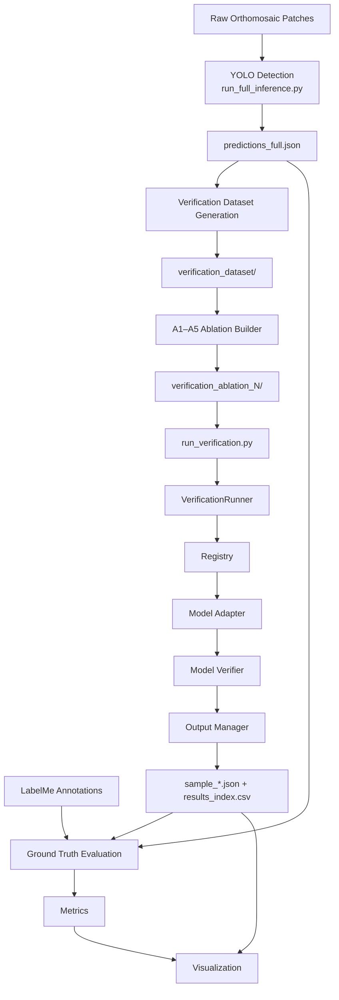

**Key separation:** YOLO produces detections. The verification framework judges them. LabelMe GT enters only at evaluation.

---

## Diagram 2 — Verification Framework

Frozen model-agnostic layer under `src/verification/`.

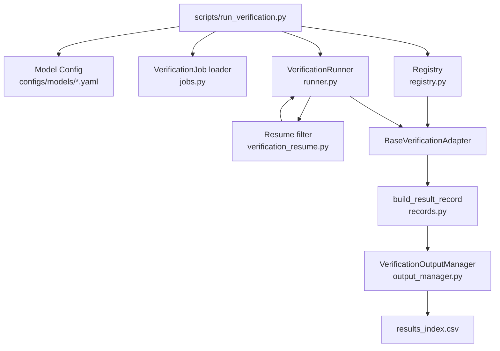

| Component | Frozen? | Role |
|-----------|---------|------|
| VerificationRunner | Yes | Orchestration, resume, persistence |
| VerificationJob | Yes | `(sample_id, image_path, prompt_path)` |
| BaseVerificationAdapter | Yes | `verify(job) → VerificationOutcome` |
| Registry | Yes | `create_adapter(model, **kwargs)` |
| OutputManager | Yes | JSON + CSV index |
| build_result_record | Yes | Canonical output schema |

---

## Diagram 3 — Inference Pipeline

Per-sample path from job to persisted result.

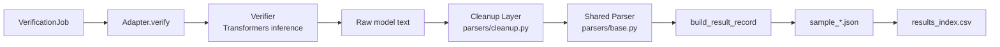

**Parser pipeline (frozen):**

```
normalize_raw_response() → parse_json_response() → normalize_decision()
```

Allowed decisions: `Reliable`, `Uncertain`, `Unreliable`.

---

## Diagram 4 — Evaluation Pipeline

Quantitative assessment against LabelMe ground truth.

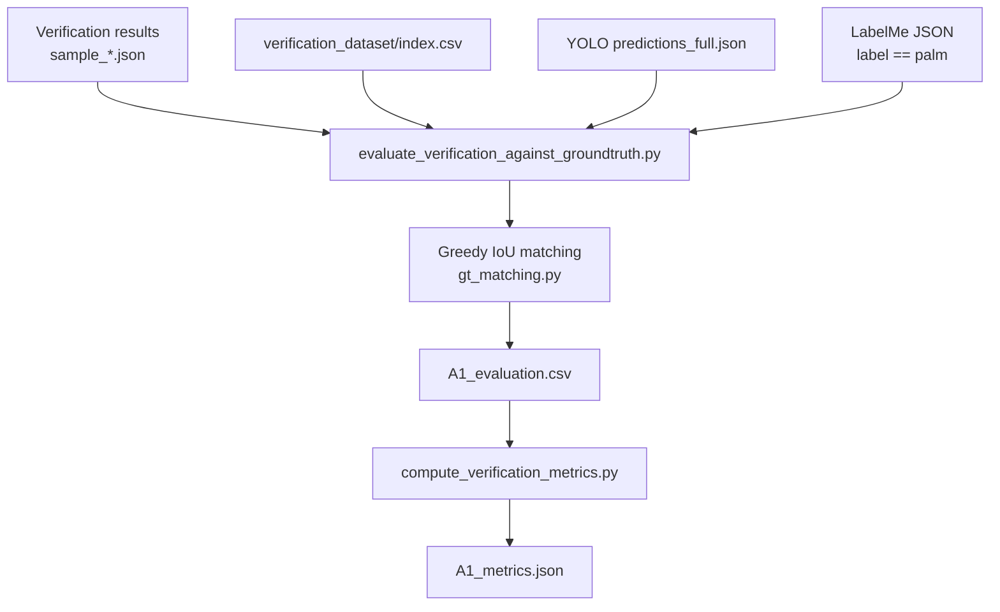

**Matching rules (frozen):**

- Per-image greedy one-to-one assignment
- Sort candidate pairs by descending IoU
- Accept match when IoU ≥ 0.5
- Matched detection → GT positive; unmatched → GT negative
- Uncertain predictions excluded from binary Precision / Recall / F1

---

## Diagram 5 — Multi-Model Architecture

How new VLMs plug into the frozen framework.

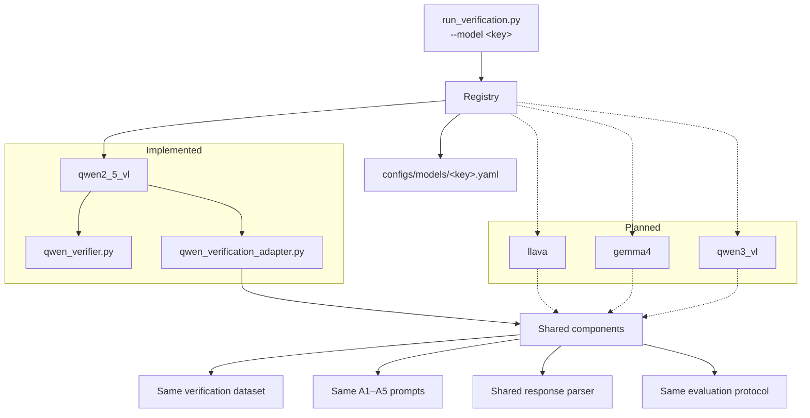

**Per-model output isolation:**

```
outputs/verification/<registry_key>/<experiment_id>/A1/
outputs/evaluation/<registry_key>/<experiment_id>/A1/
```

Legacy: `outputs/verification/qwen/` (pre-freeze) remains readable.

---

## Pipeline Diagrams

Publication-quality views of each major pipeline stage.

### 1. Dataset Generation Pipeline

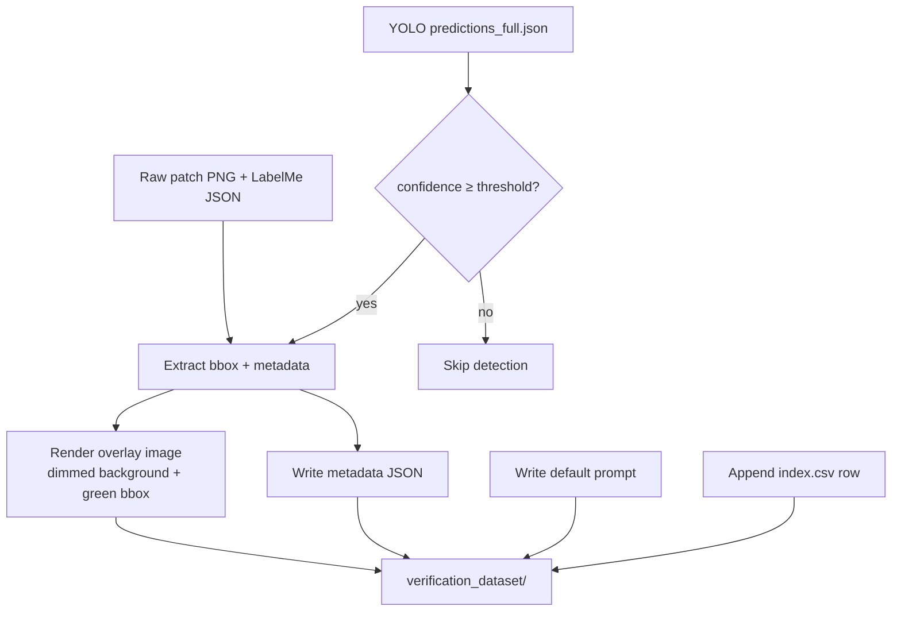

**Output:** One verification sample per accepted YOLO detection — overlay image, metadata, prompt, and index entry.

---

### 2. Prompt Generation Pipeline

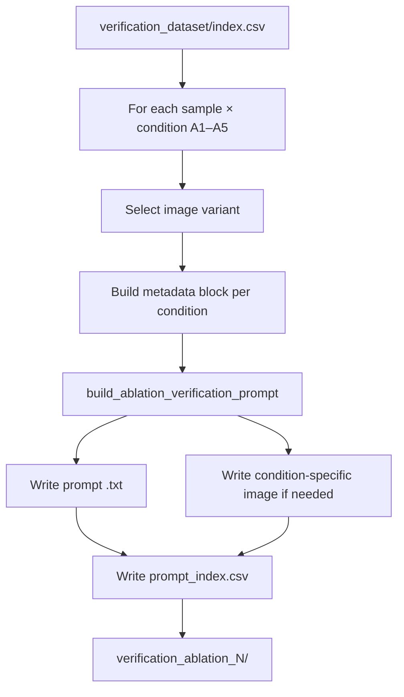

**Fairness:** Same semantic prompt template across conditions; only image input and metadata sections vary.

---

### 3. Verification Inference Pipeline

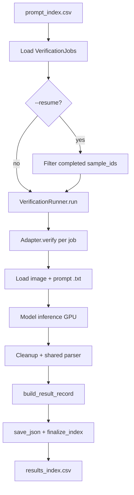

**Batching:** `RunnerConfig.batch_size` groups progress logging; adapters may batch internally.

---

### 4. Output Pipeline

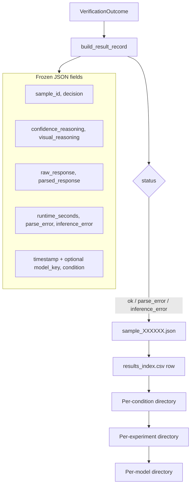

**Evaluation reads only `decision`.** All other fields support audit, visualization, and debugging.

---

### 5. Evaluation Pipeline

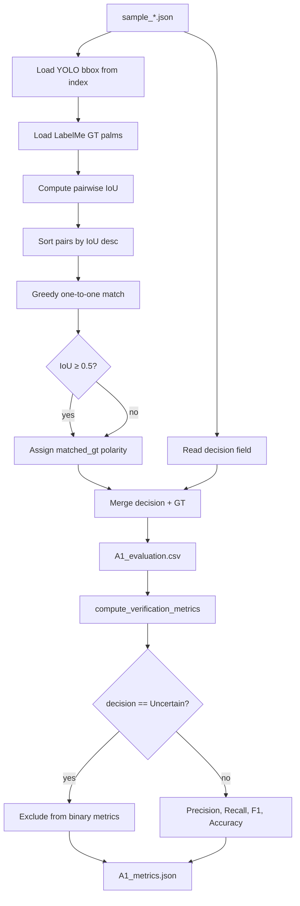

---

### 6. Cross-Model Framework

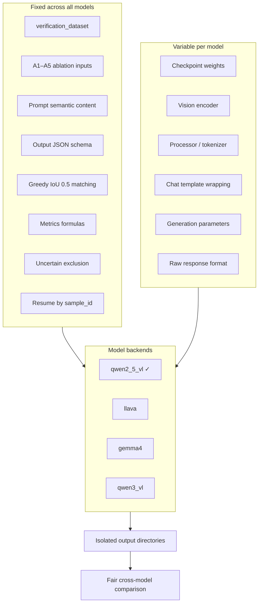

---

### 7. Repository Layer Diagram

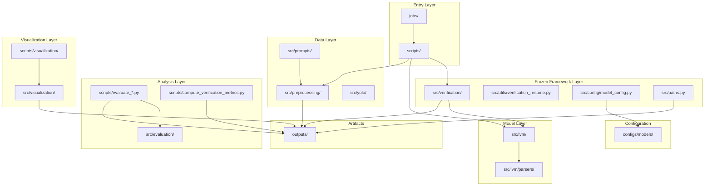

---

## Ablation orchestration (cluster)

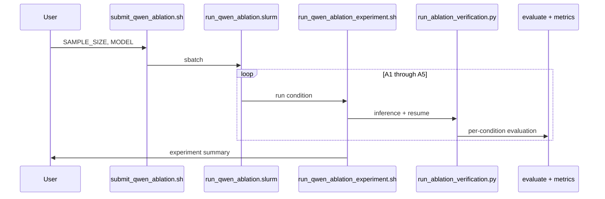

---

*Last updated: July 2026 (architecture freeze)*
