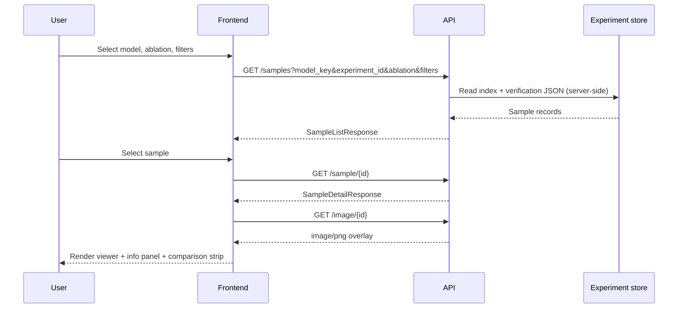
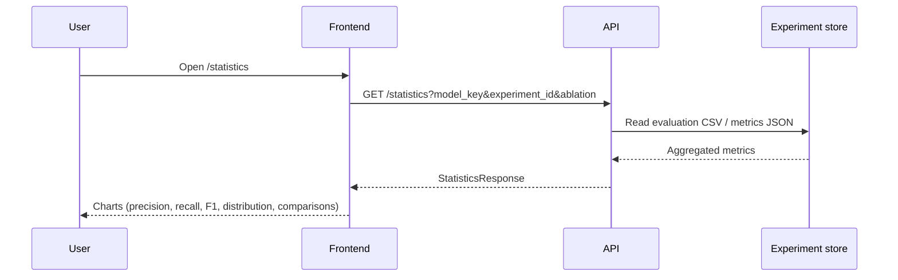

# Wild Palm Verification Demo — Design Specification

This document defines the software architecture and product design for the **Wild Palm Verification Demo**: a standalone web application for presenting LVM verification experiment results to academic conference reviewers, researchers, and remote sensing practitioners.

The demo is **completely decoupled** from the frozen verification pipeline (`src/`, `scripts/`, `configs/`). It consumes **already-generated** experiment artifacts through a dedicated backend API. It does not run model inference, modify experiments, or alter production outputs.

Operational quick-start lives in [`demo/README.md`](../demo/README.md). API contracts are summarized in [`demo/backend/API.md`](../demo/backend/API.md).

---

## 1. Purpose and scope

### 1.1 Goals

- Present verification outcomes in a **polished, conference-ready** interactive demonstration.
- Enable **qualitative review** of individual detections (orthomosaic overlays, reasoning, ground-truth alignment).
- Enable **quantitative comparison** across models, prompt ablations, and decision categories.
- Support **side-by-side VLM comparison** on the same sample without requiring reviewers to navigate filesystem paths or JSON files.

### 1.2 Non-goals

- Running or extending the verification pipeline.
- Writing to experiment outputs or triggering new inference jobs.
- Replacing formal evaluation scripts, metrics computation, or thesis reproducibility tooling.
- Real-time streaming inference or live YOLO detection.

### 1.3 Target audience

| Audience | Primary needs |
|----------|----------------|
| Conference reviewers | Quick grasp of method quality, failure modes, and model differences |
| Researchers | Drill-down into samples, prompts, and metric trade-offs |
| Remote sensing practitioners | Visual grounding of detections in orthomosaic context |

---

## 2. System architecture

The demo follows a **three-tier logical architecture**: browser client, API server, and read-only experiment store.

```
┌─────────────────────────────────────────────────────────────────┐
│                        Browser (Frontend)                        │
│   Next.js · React · TypeScript · TailwindCSS                    │
│   • Sample explorer dashboard                                    │
│   • Statistics dashboard                                         │
│   • Never accesses outputs/ directly                             │
└────────────────────────────┬────────────────────────────────────┘
                             │ HTTPS / REST (JSON + image/png)
                             ▼
┌─────────────────────────────────────────────────────────────────┐
│                     Demo API (Backend)                           │
│   FastAPI · Pydantic · Uvicorn                                   │
│   • REST-only gateway to experiment artifacts                    │
│   • No imports from verification pipeline                      │
│   • Read-only filesystem access (future)                         │
└────────────────────────────┬────────────────────────────────────┘
                             │ Server-side reads only
                             ▼
┌─────────────────────────────────────────────────────────────────┐
│              Experiment artifact store (external)                │
│   outputs/verification/<model>/<experiment_id>/                  │
│   outputs/evaluation/<model>/<experiment_id>/                    │
│   outputs/verification_ablation_<N>/  (overlay images)           │
│   Precomputed by frozen pipeline — demo does not regenerate      │
└─────────────────────────────────────────────────────────────────┘
```

### 2.1 Architectural principles

| Principle | Rationale |
|-----------|-----------|
| **Pipeline isolation** | Demo releases must not risk breaking frozen thesis experiments. |
| **Backend as sole data gateway** | Ensures consistent URLs, caching, and access control; frontend stays portable. |
| **Schema-first contracts** | Shared types between frontend and backend reduce drift during iterative UI work. |
| **Read-only serving** | Demo is for presentation and exploration, not experimentation execution. |
| **Progressive enhancement** | UI scaffolds with mock data first; live data replaces mocks without layout changes. |

### 2.2 Relationship to the verification framework

The main repository produces verification JSON, evaluation CSVs, metrics summaries, and ablation overlay images. The demo **reads** those artifacts (via the backend) and **visualizes** them. Evaluation logic, prompt builders, adapters, and runners remain in the frozen pipeline and are not duplicated in the demo.

---

## 3. Folder structure

```
demo/
├── README.md                 # Developer setup (frontend + backend)
├── .gitignore
│
├── shared/                   # Cross-language contracts
│   ├── models.py             # Pydantic response models
│   ├── types.ts              # TypeScript interfaces (mirror)
│   └── schemas/              # Optional JSON Schema documentation
│
├── backend/                  # FastAPI service
│   ├── API.md                # Endpoint reference
│   ├── requirements.txt
│   ├── .env.example
│   └── app/
│       ├── main.py           # Application entry, CORS
│       ├── config.py         # Environment configuration
│       ├── api/
│       │   ├── router.py
│       │   ├── deps.py       # Shared query parameters
│       │   └── routes/       # One module per resource group
│       └── services/         # Data access & aggregation (future)
│
└── frontend/                 # Next.js application
    ├── package.json
    ├── tailwind.config.ts    # Theme tokens wired to Tailwind
    └── src/
        ├── app/              # Routes (App Router)
        │   ├── page.tsx      # Sample explorer
        │   ├── statistics/   # Metrics dashboard
        │   ├── layout.tsx
        │   └── globals.css   # CSS variables & utilities
        ├── components/       # UI by feature domain
        │   ├── dashboard/
        │   ├── sidebar/
        │   ├── info-panel/
        │   ├── viewer/
        │   ├── comparison/
        │   └── statistics/
        ├── theme/              # Design tokens & semantic styles
        └── lib/
            ├── api.ts          # HTTP client (future)
            └── mock/           # Static fixtures during scaffold phase
```

The repository root `docs/DEMO_DESIGN.md` (this file) is the **canonical design specification**. Per-folder READMEs cover local conventions only.

---

## 4. Frontend

### 4.1 Application surfaces

The frontend exposes two primary views:

| Route | Purpose |
|-------|---------|
| `/` | **Sample explorer** — orthomosaic viewer, filters, per-sample metadata, multi-model comparison strip |
| `/statistics` | **Statistics dashboard** — aggregate metrics, decision distribution, confusion matrix, model and prompt comparisons |

Both views share the same visual language and will eventually consume the same backend catalog (`model_key`, `experiment_id`, `ablation`).

### 4.2 Layout model (sample explorer)

The sample explorer uses a **scientific visualization dashboard** layout:

```
┌──────────────────────────────────────────────────────────────────┐
│ Header — title, experiment context, navigation to statistics      │
├──────────┬─────────────────────────────────────┬─────────────────┤
│ Sidebar  │ Main viewer                          │ Information     │
│ (filters)│ (orthomosaic + bbox overlay)         │ panel           │
│          ├─────────────────────────────────────┤ (sample metadata)│
│          │ Model comparison strip (horizontal)  │                 │
└──────────┴─────────────────────────────────────┴─────────────────┘
```

On narrow viewports, the information panel stacks below the viewer; the comparison strip remains horizontally scrollable.

### 4.3 Feature domains (component packages)

| Package | Responsibility |
|---------|----------------|
| `dashboard/` | Shell layout, header, composition of sidebar + viewer + info panel |
| `sidebar/` | Model, prompt/ablation, confidence, decision filters; sample search |
| `viewer/` | Orthomosaic canvas, bounding-box layers, selection & hover scaffolding |
| `info-panel/` | YOLO confidence, ground truth, prediction, reasoning, model metadata |
| `comparison/` | Side-by-side VLM prediction cards for one sample |
| `statistics/` | Chart placeholders and dashboard grid for aggregate metrics |
| `theme/` | Color tokens, decision semantics, reusable panel utilities |

### 4.4 Data access rule

The browser **must not** read files under `outputs/` or any cluster path. All experiment data flows through the backend API. During the scaffold phase, the UI uses **mock JSON and static fixtures** with shapes identical to the final API responses.

---

## 5. Backend

### 5.1 Role

The backend is a **read-only presentation service**. It:

- Indexes available models and experiment runs.
- Serves paginated sample lists with filters.
- Returns sample detail including reasoning text and bounding boxes.
- Streams ablation overlay images as `image/png`.
- Aggregates evaluation metrics for the statistics dashboard.

It does **not** load VLM weights, call adapters, or invoke verification runners.

### 5.2 Configuration (conceptual)

Environment variables govern listen address, CORS origins, and (future) the root path to experiment outputs on the server filesystem. The demo backend maintains its own configuration namespace — separate from pipeline `configs/`.

### 5.3 Service layer (future)

A dedicated service layer will map API requests to filesystem paths under `outputs/`, parse verification JSON and evaluation CSVs, and cache hot paths (model catalog, statistics summaries). Mock services exist today to validate response schemas before wiring live data.

### 5.4 Error model

Errors return structured JSON (`detail` message) with appropriate HTTP status codes. Unknown model, experiment, or sample identifiers yield `404`. Invalid query parameters yield `422`.

---

## 6. API

### 6.1 Style

- **REST** over HTTP/JSON.
- Versioned prefix: `/api/v1`.
- Binary resources (overlay images) returned with explicit `Content-Type`.
- OpenAPI documentation exposed for reviewers and integrators.

### 6.2 Resource groups

| Endpoint | Description |
|----------|-------------|
| `GET /health` | Liveness probe |
| `GET /models` | Catalog of VLMs and experiment runs |
| `GET /statistics` | Aggregate metrics for one model × experiment × ablation |
| `GET /samples` | Paginated, filterable sample index |
| `GET /sample/{sample_id}` | Full sample detail |
| `GET /image/{sample_id}` | Ablation overlay image |

### 6.3 Experiment scoping

Most endpoints accept query parameters:

- `model_key` — registry identifier (e.g. `qwen2_5_vl`, `llava`)
- `experiment_id` — run timestamp or label under `outputs/verification/<model>/`
- `ablation` — prompt/input condition code (`A1`–`A5`)

This triple defines the **experiment context** shared across the UI.

### 6.4 Shared schemas

Request and response shapes are defined once in `demo/shared/`:

- Python: Pydantic models for backend validation and OpenAPI generation.
- TypeScript: interfaces for frontend type-checking.

Key entities include model catalog entries, ablation statistics, sample summaries, sample detail (with reasoning and bboxes), and health/error envelopes. JSON Schema files may mirror these for documentation.

### 6.5 Future extensions (design-only)

Potential additions, not yet specified in detail:

- `GET /comparison/{sample_id}` — multi-model predictions for one sample in a single payload.
- `GET /experiments` — flat experiment index across models.
- ETag / cache headers for immutable overlay images.

---

## 7. Data flow

### 7.1 Sample exploration flow



### 7.2 Statistics flow



### 7.3 Multi-model comparison flow

For a fixed `sample_id`, the frontend requests sample detail (and optionally comparison payloads) **per model** or via a dedicated comparison endpoint. Ground truth is identical across models; predictions and reasoning differ. The comparison strip renders one card per VLM with aligned fields for reviewer scanning.

### 7.4 Mock phase vs. live phase

| Phase | Frontend data source | Backend data source |
|-------|---------------------|---------------------|
| **Scaffold (current)** | `lib/mock/*.ts`, `*.json` | In-memory mock fixtures |
| **Live (future)** | API client → backend | Read-only `outputs/` parsing |

UI components do not change shape between phases; only the data provider switches from mock to fetched.

---

## 8. Future deployment

### 8.1 Intended deployment topology

For conference demos and lab sharing:

```
[Reviewer browser] ──► [Static frontend host or Node server]
                              │
                              └──► [Demo API container / VM]
                                        │
                                        └──► [Read-only mount: experiment outputs]
```

### 8.2 Deployment options

| Option | Use case |
|--------|----------|
| **Local dual-process** | Development: `uvicorn` + `next dev` on localhost |
| **Single VM** | Workshop demo: nginx serves built frontend, proxies `/api` to FastAPI |
| **Container pair** | Reproducible demo bundle: frontend image + API image + volume mount for `outputs/` |
| **Static export + remote API** | Frontend on CDN/GitHub Pages; API on lab server (CORS configured) |

### 8.3 Data packaging for offline demo

For venues with unreliable network access, bundle a **snapshot subset** of outputs (one experiment, selected samples) on the demo server filesystem. The API catalog reflects only what is mounted — no pipeline rerun required.

### 8.4 Security posture (design intent)

- Demo API is **read-only**; no mutation endpoints.
- No credentials embedded in the frontend.
- Optional HTTP basic auth or VPN fronting for unpublished results.
- CORS restricted to known frontend origins in production.

Authentication is **out of scope** for the initial conference prototype unless hosting unpublished data on the public internet.

---

## 9. Technology choices

| Layer | Choice | Rationale |
|-------|--------|-----------|
| Frontend framework | **Next.js (App Router)** | File-based routing, SSR for fast first paint, ecosystem fit for React demos |
| UI library | **React 19 + TypeScript** | Type-safe components; aligns with modern frontend hiring and tooling |
| Styling | **Tailwind CSS + design tokens** | Consistent scientific theme; rapid layout iteration without heavy CSS files |
| Backend framework | **FastAPI** | Automatic OpenAPI, Pydantic validation, lightweight Python service |
| API validation | **Pydantic v2** | Shared models with pipeline-adjacent Python tooling on cluster |
| Shared contracts | **demo/shared/** | Single source of truth for API shapes across languages |
| Charts (initial) | **CSS/SVG placeholders** | No chart-library lock-in until metrics requirements stabilize |
| Charts (future) | Recharts or similar (TBD) | Swap placeholder components when interactivity needs grow |

**Explicitly not used in the demo:** VLM inference stacks, Slurm, pipeline adapters, direct filesystem access from the browser.

---

## 10. UI philosophy

### 10.1 Design intent

The demo should feel like a **peer-reviewed research instrument**, not a marketing landing page.

- **Professional** — restrained typography, tabular figures, monospace for IDs and metrics.
- **Minimal** — no decorative chrome; every panel earns its space.
- **Scientific** — decisions, IoU, and confusion counts visible; uncertainty treated as first-class.
- **Static** — no flashy animations; motion distracts in conference lighting and screen recordings.

### 10.2 Color semantics

| Token | Meaning |
|-------|---------|
| Forest green | Primary brand; Reliable / correct / GT-positive emphasis |
| Slate gray | Neutrals, structure, viewer chrome |
| White | Panel surfaces |
| Orange (warning) | Uncertain decisions, ambiguous cases |
| Red (error) | Unreliable decisions, incorrect detections |
| Blue (selection) | Active sample, highlighted model card, selected bbox |

Decision colors are **semantic**, not decorative — the same mapping appears in badges, charts, and (future) viewer overlays.

### 10.3 Typography and density

- Sans-serif for prose and labels; monospace for `sample_id`, file names, bboxes, and metric values.
- Tabular number features for aligned statistics.
- Uppercase tracked labels for panel headers (conventional scientific figure captions).

---

## 11. Component hierarchy

### 11.1 Sample explorer

```
DashboardShell
├── Header
├── Sidebar
│   ├── ModelSelector
│   ├── PromptSelector          (ablation A1–A5)
│   ├── ConfidenceFilter
│   ├── DecisionFilter
│   └── SampleSearch
├── MainViewer
│   ├── OrthomosaicViewer
│   │   ├── SelectionState       (provider)
│   │   ├── ImageLayer           (overlay PNG)
│   │   ├── BoundingBoxLayer
│   │   │   └── BoundingBox × N
│   │   └── HoverTooltip
│   └── ModelComparisonPanel
│       └── ModelComparisonCard × N
└── InformationPanel
    ├── YoloConfidenceCard
    ├── GroundTruthCard
    ├── PredictionCard
    ├── ReasoningCard
    └── ModelMetadataCard
```

### 11.2 Statistics dashboard

```
StatisticsDashboard
├── Experiment header strip
├── MetricBarChart              (Precision, Recall, F1, Accuracy)
├── DecisionDistributionChart
├── ConfusionMatrixChart
├── GroupedComparisonChart      (models)
└── GroupedComparisonChart      (prompts / ablations)
```

### 11.3 Shared primitives

- `ChartCard`, `InfoCard` — titled panel wrappers.
- `DecisionBadge`, `ComparisonField`, `GroundTruthBlock` — repeated semantic rows.
- Theme utilities (`wp-panel`, `wp-link`, `wp-label`) — consistent spacing and borders.

---

## 12. State management

### 12.1 Design approach

State management stays **local and explicit** — appropriate for a read-only demo without complex collaborative editing.

| State category | Scope | Examples |
|----------------|-------|----------|
| **Experiment context** | App / page | `model_key`, `experiment_id`, `ablation` |
| **Filter state** | Sidebar | confidence range, decision filter, search query |
| **Selection state** | Viewer | selected bbox id, hovered bbox id |
| **Sample selection** | Dashboard | active `sample_id`, driving viewer + info panel |
| **Server data** | Page / hooks (future) | samples list, detail, statistics, images |

No global Redux-style store is required for v1. React component state, context providers (e.g. viewer selection), and URL query parameters (future) suffice.

### 12.2 URL as shareable state (future)

Encoding `model_key`, `experiment_id`, `ablation`, and `sample_id` in the query string enables **linkable demo moments** during presentations (`/sample?...`) without additional backend support.

### 12.3 Cache strategy (future)

- Model catalog and statistics: short TTL or immutable cache keyed by experiment id.
- Overlay images: aggressive browser cache; filenames are content-addressed by sample.
- Sample lists: revalidate on filter change only.

---

## 13. Interaction design

### 13.1 Primary user journeys

**Journey A — Review a true positive**

1. Open sample explorer with default experiment context.
2. Filter or search for high-confidence, GT-matched Reliable samples.
3. Inspect orthomosaic overlay and YOLO/GT bbox alignment.
4. Read visual reasoning in the information panel.
5. Scroll comparison strip to see agreement across VLMs.

**Journey B — Investigate a failure mode**

1. Filter Unreliable or unmatched samples.
2. Compare model cards where one VLM disagrees with another.
3. Cross-check confusion matrix on the statistics page for systematic FP/FN rates.

**Journey C — Compare prompt ablations**

1. Navigate to statistics dashboard.
2. Review prompt comparison chart (A1–A5).
3. Return to sample explorer; switch prompt selector to see reasoning differences on the same detection.

### 13.2 Viewer interactions (planned)

| Interaction | Behavior |
|-------------|----------|
| **Pan / zoom** | Navigate large orthomosaic patches; transform applied to scene layer |
| **Hover bbox** | Tooltip with role, coordinates, auxiliary metadata |
| **Click bbox** | Select detection; highlight in viewer and sync info panel |
| **Keyboard** | Optional arrow keys to move between samples in list |

Interactions remain **subtle** — no animated transitions beyond immediate hover/selection feedback.

### 13.3 Filter interactions

Sidebar filters narrow the sample index **before** detail fetch. Changing model or ablation resets sample selection and reloads comparison cards. Filters should provide immediate visual feedback but may debounce search input to limit API calls.

### 13.4 Responsive behavior

- Desktop: three-column explorer (sidebar | viewer | info).
- Tablet: info panel below viewer; comparison strip horizontal scroll.
- Statistics: two-column chart grid collapses to single column.

Conference presentations assume **landscape desktop or projector**; mobile is supported but not optimized for primary review workflows.

### 13.5 Accessibility (design intent)

- Sufficient contrast for decision badges on light and dark panels.
- Tooltips and bbox labels exposed to screen readers where practical.
- No reliance on color alone — decision text always visible alongside color coding.

---

## 14. Development phases

| Phase | Deliverable |
|-------|-------------|
| **1 — Scaffold (complete)** | Layout, theme, mock data, API schema, placeholder charts |
| **2 — Live data** | Backend reads `outputs/`; frontend replaces mocks with API client |
| **3 — Interaction** | Viewer zoom/pan, selection sync, filter-driven navigation |
| **4 — Polish** | Shareable URLs, loading states, offline demo bundle, recording-friendly defaults |
| **5 — Deployment** | VM/container packaging for conference kiosk mode |

Each phase preserves pipeline isolation. Phase 2 is the critical gate for a **credible research demonstration**; phases 3–5 elevate presentation quality.

---

## 15. Success criteria for conference readiness

The demo is conference-ready when a reviewer can, **without repository access**:

1. Understand which VLMs and prompt conditions were evaluated.
2. See aggregate precision/recall/F1 and decision distributions for a chosen ablation.
3. Open representative success and failure samples with orthomosaic context.
4. Compare model predictions and reasoning on the **same** detection.
5. Trust that numbers match the thesis evaluation exports (API serves the same artifacts as `outputs/evaluation/`).

---

## 16. Related documents

| Document | Content |
|----------|---------|
| [`demo/README.md`](../demo/README.md) | Local setup and run instructions |
| [`demo/backend/API.md`](../demo/backend/API.md) | REST endpoint reference |
| [`demo/frontend/src/theme/README.md`](../demo/frontend/src/theme/README.md) | Color tokens and utilities |
| [`docs/ARCHITECTURE.md`](ARCHITECTURE.md) | Frozen verification pipeline (separate system) |
| [`docs/EVALUATION_PROTOCOL.md`](EVALUATION_PROTOCOL.md) | Metric definitions consumed by statistics views |

---

*This specification describes intended architecture and behavior. Scaffold-phase implementations may use mock data until Phase 2 live wiring is complete.*
