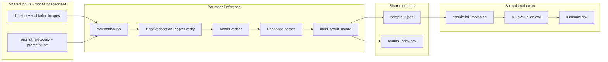

# Multi-VLM Integration Plan

**Document status:** Design only — no production code changes  
**Repository:** wild-palm-lvm-verification  
**Date:** July 2026  
**Scope:** LLaVA, Gemma 4, Qwen3-VL cross-model verification experiments

---

## 1. Executive Summary

The repository already implements a **model-agnostic verification framework** under `src/verification/` with a single production adapter for **Qwen2.5-VL** (`src/lvm/qwen_verification_adapter.py`). The active thesis pipeline is orchestrated by shell/Slurm scripts and produces per-sample JSON plus `results_index.csv`, then evaluates against LabelMe ground truth with fixed IoU matching and binary metrics that exclude **Uncertain** predictions.

**VERIFIED:** The framework boundary (`VerificationRunner`, `BaseVerificationAdapter`, `VerificationOutputManager`, `build_result_record`) is sufficient to add new VLMs without changing evaluation or metrics — provided each new adapter:

1. Reads pre-built ablation prompts from disk (`VerificationJob.prompt_path`)
2. Calls model-specific inference on `VerificationJob.image_path`
3. Parses output into the canonical `decision` field
4. Returns a `VerificationOutcome` built via `build_result_record()`

**PROPOSED:** Three new adapter families:

| Model family | Registry key (proposed) | Primary new files | Difficulty |
|--------------|-------------------------|-------------------|------------|
| LLaVA-NeXT | `llava` | `llava_verifier.py`, `llava_verification_adapter.py` | Medium |
| Gemma 4 | `gemma4` | `gemma4_verifier.py`, `gemma4_verification_adapter.py` | Medium–High |
| Qwen3-VL | `qwen3_vl` | `qwen3_vl_verifier.py`, `qwen3_vl_verification_adapter.py` | Low–Medium |

**PROPOSED integration order:** LLaVA → Gemma 4 → Qwen3-VL (see §16).

**Document status:** Design reference — framework freeze (July 2026) completed path generalization, multi-model configs, and registry slots. Remaining work: implement LLaVA, Gemma 4, and Qwen3-VL adapters.

**Superseded note:** The gap below was resolved at freeze. New outputs use `outputs/verification/<model_key>/`. Legacy `outputs/verification/qwen/` remains readable.

~~**VERIFIED gap:** Orchestration paths, visualization, and config loading are still **Qwen-branded** (`outputs/verification/qwen/`, `run_qwen_ablation_experiment.sh`, `get_active_model_path()`). These must be generalized before full cross-model Slurm runs, without altering existing Qwen2.5-VL behavior.~~

---

## 2. Current Architecture

### 2.1 Active pipeline trace

```
jobs/submit_qwen_ablation.sh
  → jobs/run_qwen_ablation.slurm
  → scripts/run_qwen_ablation_experiment.sh
  → scripts/run_ablation_verification.py
  → scripts/run_verification.py
  → src/verification/runner.py (VerificationRunner)
  → src/verification/registry.py (create_adapter)
  → src/lvm/qwen_verification_adapter.py (QwenVerificationAdapter)
  → src/lvm/qwen_verifier.py (QwenVerifier)
  → src/lvm/verification_response_parser.py (parse_verification_response)
  → src/verification/output_manager.py (VerificationOutputManager)
  → scripts/evaluate_verification_against_groundtruth.py
  → scripts/compute_verification_metrics.py
  → scripts/visualization/visualize_verification.py
```

| Step | File | Key symbol | Responsibility | Status |
|------|------|------------|----------------|--------|
| Submit | `jobs/submit_qwen_ablation.sh` | — | `sbatch` with env exports (`SAMPLE_SIZE`, `EXPERIMENT_ID`, `ABLATION`, `RESUME`) | VERIFIED |
| Slurm | `jobs/run_qwen_ablation.slurm` | — | L40S GPU, 96G RAM; mkdir `outputs/verification/qwen/<id>` | VERIFIED |
| Orchestrate | `scripts/run_qwen_ablation_experiment.sh` | — | Dataset prep → A1–A5 inference → eval → metrics per condition | VERIFIED |
| Ablation CLI | `scripts/run_ablation_verification.py` | `main()` | Subprocess to `run_verification.py` with `--prompt-index` | VERIFIED |
| Inference CLI | `scripts/run_verification.py` | `main()` | Load jobs, `create_adapter()`, `VerificationRunner.run()` | VERIFIED |
| Runner | `src/verification/runner.py` | `VerificationRunner` | Resume filter, job iteration, save JSON, finalize index | VERIFIED |
| Registry | `src/verification/registry.py` | `create_adapter(model, **kwargs)` | Maps registry key → factory; only `qwen` registered today | VERIFIED |
| Adapter | `src/lvm/qwen_verification_adapter.py` | `QwenVerificationAdapter.verify()` | Read prompt, call verifier, parse, `build_result_record()` | VERIFIED |
| Verifier | `src/lvm/qwen_verifier.py` | `QwenVerifier.generate_response_debugged()` | Transformers load + chat template + generate | VERIFIED |
| Parser | `src/lvm/verification_response_parser.py` | `parse_verification_response()` | JSON extract + decision normalization | VERIFIED |
| Output | `src/verification/output_manager.py` | `VerificationOutputManager` | `sample_*.json`, `results_index.csv` | VERIFIED |
| GT eval | `scripts/evaluate_verification_against_groundtruth.py` | `load_verification_labels()` | Reads `decision` from JSON; greedy IoU matching | VERIFIED |
| Metrics | `scripts/compute_verification_metrics.py` | `compute_metrics()` | TP/FP/FN/TN; excludes Uncertain | VERIFIED |
| Viz | `scripts/visualization/visualize_verification.py` | — | Uses `src/visualization/experiment_data.py` | VERIFIED |

### 2.2 Component responsibilities

#### VerificationRunner — `src/verification/runner.py`

| Aspect | Detail | Status |
|--------|--------|--------|
| Input | `list[VerificationJob]`, `RunnerConfig` | VERIFIED |
| Resume | `apply_resume()` → `load_completed_sample_ids()` | VERIFIED |
| Loop | Calls `adapter.verify(job)` **one job at a time**; `batch_size` only groups log banners | VERIFIED |
| Output | `output_manager.save_json()` + `finalize_index()` | VERIFIED |
| Status values | `ok`, `parse_error`, `inference_error`, `skipped` (index CSV) | VERIFIED |

#### Model registry — `src/verification/registry.py`

| Function | Behavior | Status |
|----------|----------|--------|
| `register_adapter(name, factory)` | Lowercase key storage | VERIFIED |
| `create_adapter(model, **kwargs)` | First arg = registry key; `**kwargs` forwarded to factory (e.g. `model_name=<checkpoint path>`) | VERIFIED |
| `get_registered_models()` | Used by `--model` choices in `run_verification.py` | VERIFIED |
| Builtin | `_register_builtin_adapters()` registers `qwen` → `build_qwen_adapter` | VERIFIED |

#### BaseVerificationAdapter — `src/verification/base_adapter.py`

| Method / type | Contract | Status |
|---------------|----------|--------|
| `model_label` (property) | Human-readable name for logging | VERIFIED |
| `verify(job: VerificationJob) → VerificationOutcome` | Single-sample inference | VERIFIED |
| `VerificationOutcome` | `record: dict`, `status: str` | VERIFIED |

#### Verification job loading — `src/verification/jobs.py`

| Function | Behavior | Status |
|----------|----------|--------|
| `VerificationJob` | `sample_id`, `image_path`, `prompt_path` | VERIFIED |
| `load_verification_jobs()` | Reads `prompt_index.csv` or `index.csv` + inferred prompt paths | VERIFIED |
| `validate_jobs()` | Ensures image and prompt files exist | VERIFIED |

**VERIFIED:** Prompts are **not** built at inference time. Ablation prompts are pre-generated by `scripts/pipeline/build_ablation_verification_prompts.py` using `src/prompts/ablation_verification_prompts.py`.

#### Prompt builders — `src/prompts/`

| Module | Role | Status |
|--------|------|--------|
| `ablation_verification_prompts.py` | A1–A5 semantic templates; `build_ablation_verification_prompt()` | VERIFIED |
| `ablation_verification_prompt_builder.py` | Writes condition folders + `prompt_index.csv` | VERIFIED |
| `verification_prompt.py` | Default (non-ablation) prompts | VERIFIED |
| `verification_prompt_builder.py` | Default prompt files for full dataset | VERIFIED |

#### Model-specific verifier — `src/lvm/qwen_verifier.py`

| Method | Inputs | Outputs | Status |
|--------|--------|---------|--------|
| `generate_response_debugged()` | `sample_id`, `image_path`, `prompt_path`, `prompt`, `max_new_tokens` | Raw model text `str` | VERIFIED |
| Lifecycle | Model loaded once in `__init__` via `_load_model()` | — | VERIFIED |
| Generation | `do_sample=False`, deterministic greedy decode | — | VERIFIED |
| Dependencies | `transformers`, `qwen-vl-utils`, `PIL` | — | VERIFIED |

#### Response parser — `src/lvm/verification_response_parser.py`

| Function | Output fields | Status |
|----------|---------------|--------|
| `parse_verification_response(raw_text)` | `decision`, `confidence_reasoning`, `visual_reasoning` | VERIFIED |
| Uses | `src/lvm/response_schema.parse_json_response()` for fence/object extraction | VERIFIED |

**VERIFIED:** Evaluation reads only top-level `decision` (`evaluate_verification_against_groundtruth.py:load_verification_labels()`).

#### Result record builder — `src/verification/records.py`

| Function | Fields written | Status |
|----------|----------------|--------|
| `build_result_record()` | `sample_id`, `raw_response`, `parsed_response`, `decision`, `confidence_reasoning`, `visual_reasoning`, `runtime_seconds`, `parse_error`, `inference_error` | VERIFIED |

#### Output manager — `src/verification/output_manager.py`

| Method | Behavior | Status |
|--------|----------|--------|
| `save_json(sample_id, record)` | `results_dir/sample_XXXXXX.json` | VERIFIED |
| `finalize_index(new_rows, resume=)` | Merge/backfill/write `results_index.csv` | VERIFIED |

#### Resume mechanism — `src/utils/verification_resume.py`

| Function | Resume key | Status |
|----------|------------|--------|
| `load_completed_sample_ids(results_dir)` | Any `sample_*.json` stem + `results_index.csv` sample_ids | VERIFIED |
| `RESULTS_INDEX_FILENAME` | `"results_index.csv"` | VERIFIED |
| Index columns | `sample_id`, `result_path`, `status` | VERIFIED |

**VERIFIED:** Resume is keyed by **`sample_id` only** within a results directory. Separate model runs must use separate output directories.

#### GT matching — `src/evaluation/gt_matching.py`

| Parameter | Value | Status |
|-----------|-------|--------|
| Algorithm | Greedy one-to-one by descending IoU | VERIFIED |
| Threshold | 0.5 (overridable in eval script) | VERIFIED |
| Used by | `evaluate_verification_against_groundtruth.py` | VERIFIED |

#### Metric computation — `scripts/compute_verification_metrics.py`

| Rule | Detail | Status |
|------|--------|--------|
| Positive label | `Reliable` | VERIFIED |
| Negative label | `Unreliable` | VERIFIED |
| Excluded | `Uncertain` and empty labels | VERIFIED |
| GT polarity | `matched_gt` from evaluation CSV | VERIFIED |

#### Visualization — `src/visualization/experiment_data.py`

| Aspect | Detail | Status |
|--------|--------|--------|
| Paths | Hardcoded `QWEN_VERIFICATION_ROOT`, `QWEN_EVALUATION_ROOT` | VERIFIED |
| Reads | `decision`, `confidence_reasoning`, `visual_reasoning` from JSON | VERIFIED |

### 2.3 Data flow diagram



---

## 3. Model-Independent Contract

These components **must not change** when adding LLaVA, Gemma 4, or Qwen3-VL.

| Component | Location | Why fixed | Status |
|-----------|----------|-----------|--------|
| Verification dataset | `outputs/verification_dataset/` | Same YOLO detections for all models | VERIFIED |
| Sample IDs | `sample_XXXXXX` from `verification_dataset.py:sample_id_label()` | Resume + eval join key | VERIFIED |
| A1–A5 definitions | `src/prompts/ablation_verification_prompts.py:ABLATION_CONDITIONS` | Controlled ablation variable | VERIFIED |
| Ablation image variants | `src/preprocessing/ablation_verification_images.py` | Same pixels per condition | VERIFIED |
| Task instructions | Shared sections in `ablation_verification_prompts.py` | Semantic task equivalence | VERIFIED |
| Output labels | `Reliable`, `Uncertain`, `Unreliable` | Evaluation protocol | VERIFIED |
| JSON prompt template | `JSON_RESPONSE_TEMPLATE` in ablation prompts | Parser target schema | VERIFIED |
| `results_index.csv` schema | `verification_resume.py:RESULTS_INDEX_COLUMNS` | Resume compatibility | VERIFIED |
| Resume key | `sample_id` within one results directory | No duplicate inference | VERIFIED |
| Eval IoU threshold | 0.5 default in eval script | Fair GT polarity | VERIFIED |
| Uncertain exclusion | `compute_verification_metrics.py` | Protocol compliance | VERIFIED |
| TP/FP/FN/TN definitions | `compute_metrics()` | Comparable metrics | VERIFIED |
| Failed output treatment | Empty `decision` → excluded from binary metrics; errors retained in JSON | Auditable failures | VERIFIED |

**Fair comparison principle:** All models receive identical **files** (image path + prompt text). Model-specific chat templates may wrap that text differently, but the **semantic task** (verify highlighted YOLO detection; return JSON with `decision`) stays constant. Document any unavoidable decoding differences (sampling, thinking tokens) in experiment metadata.

---

## 4. Current Framework Gaps

### 4.1 Abstraction audit

| Layer | Sufficient for new VLMs? | Notes | Status |
|-------|--------------------------|-------|--------|
| `BaseVerificationAdapter` | Yes | Single `verify(job)` entry point | VERIFIED |
| `VerificationRunner` | Yes | Model-agnostic | VERIFIED |
| `build_result_record()` | Yes | Canonical JSON schema | VERIFIED |
| `parse_verification_response()` | Mostly | Name says "Qwen" but logic is schema-generic | VERIFIED |
| `model_config.py` | No | Only `active_model` path; no per-model YAML loader | VERIFIED |
| `registry.py` | Yes | Extensible via `register_adapter()` | VERIFIED |
| Orchestration scripts | No | Qwen-specific paths and names | VERIFIED |

### 4.2 Qwen-specific leaks (required refactors — do not change yet)

| Leak | File | Impact | Refactor | Status |
|------|------|--------|----------|--------|
| Hardcoded output roots | `src/paths.py` — `QWEN_VERIFICATION_ROOT`, `QWEN_EVALUATION_ROOT` | Non-Qwen results need parallel layout | Add `verification_root(model_key)` helper | VERIFIED |
| Qwen-only experiment script | `scripts/run_qwen_ablation_experiment.sh` | Cannot run LLaVA/Gemma without copy | Generalize to `run_model_ablation_experiment.sh` | VERIFIED |
| Slurm job name/path | `jobs/run_qwen_ablation.slurm` | mkdir only `verification/qwen/` | Parameterize `MODEL` env var | VERIFIED |
| No `--model` forward | `scripts/run_ablation_verification.py` | Subprocess never passes `--model` | Add `--model` flag forward | VERIFIED |
| Config resolution | `run_verification.py:resolve_model_path()` | Always reads `active_model` from single YAML | Load config by `--model` + `--config` | VERIFIED |
| Viz context | `src/visualization/experiment_data.py:build_experiment_context()` | Assumes Qwen paths | Accept `model_key` parameter | VERIFIED |
| Adapter `model_label` | `QwenVerificationAdapter.model_label` → `"Qwen2.5-VL"` | Logging only | Per-adapter property | VERIFIED |
| Factory kwarg name | `build_qwen_adapter(model_name=...)` | Checkpoint path called `model_name` | Document convention; optional rename to `model_path` | VERIFIED |
| Legacy verifier stack | `src/lvm/base_verifier.py`, `validate_lvm_response()` | Old per-palm schema with `classification`/`confidence` float | Not used by production adapter path | VERIFIED |
| Runner "batch" | `RunnerConfig.batch_size` | Does not batch model calls | Optional future optimization only | VERIFIED |
| Resume backfill status | `backfill_results_index_from_json()` sets `status: "ok"` always | May mask parse errors on resume | Validate JSON before marking complete | VERIFIED |

### 4.3 Adapter method contract (current Qwen reference)

| Method | Inputs | Outputs | Exceptions | Status |
|--------|--------|---------|------------|--------|
| `verify(job)` | `VerificationJob` | `VerificationOutcome(record, status)` | Caught → `inference_error` record | VERIFIED |
| Status `ok` | Parse succeeded | — | — | VERIFIED |
| Status `parse_error` | Inference OK, parse failed | `parse_error` field set | — | VERIFIED |
| Status `inference_error` | Model/load/GPU failure | `inference_error` traceback | — | VERIFIED |
| Raw response | Always stored when inference completes | `raw_response` string | — | VERIFIED |
| Prompt ownership | Read from disk (`job.prompt_path`) | Adapter does not rebuild ablation prompt | VERIFIED |
| Parser ownership | Adapter calls parser after generation | Could move to shared post-processor | VERIFIED |
| Device lifecycle | Model loaded in verifier `__init__`, reused across jobs | — | VERIFIED |

---

## 5. LLaVA Integration Design

### 5.1 Proposed files

| File | Purpose | Status |
|------|---------|--------|
| `src/lvm/llava_verifier.py` | Transformers load + generate | PROPOSED |
| `src/lvm/llava_verification_adapter.py` | `BaseVerificationAdapter` implementation | PROPOSED |
| `configs/models/llava.yaml` | Model-specific settings | PROPOSED |

### 5.2 Adapter

| Item | Design | Status |
|------|--------|--------|
| Class | `LlavaVerificationAdapter` | PROPOSED |
| Registry key | `llava` | PROPOSED |
| Factory | `build_llava_adapter(model_name=..., batch_size=..., device_map=..., max_new_tokens=...)` | PROPOSED |
| `verify(job)` | Mirror `QwenVerificationAdapter.verify()` structure | PROPOSED |
| Job conversion | Read `job.prompt_path` text; load `job.image_path` as PIL RGB | PROPOSED |
| Result | `build_result_record()` — same fields as Qwen | PROPOSED |

### 5.3 Image preprocessing

| Topic | Design | Status |
|-------|--------|--------|
| Loading | PIL `Image.open()` → RGB | PROPOSED |
| Processor | `LlavaNextProcessor` (VERIFIED in Transformers docs for LLaVA-NeXT / v1.6) | VERIFIED (Transformers) |
| Ablation images | Pass PNG files unchanged; processor handles resize/pad | PROPOSED |
| A4 dual-panel / A5 crop | Single image path per job — no change from Qwen | VERIFIED |
| Risks | LLaVA-NeXT supports multi-aspect but may downscale; thin green bbox lines may lose contrast after resize | PROPOSED |
| Checkpoint (cluster) | Start with `llava-hf/llava-v1.6-mistral-7b-hf` (~7B) for L40S feasibility | PROPOSED |

### 5.4 Prompt format

| Topic | Design | Status |
|-------|--------|--------|
| Chat template | `processor.apply_chat_template(conversation, add_generation_prompt=True)` | VERIFIED (Transformers) |
| Message structure | `[{"role":"user","content":[{"type":"image"},{"type":"text","text": <prompt file>}]}]` | PROPOSED |
| System role | Embed task instructions inside user text (matches current Qwen pattern — no separate system message in Qwen path) | VERIFIED |
| Semantic prompt | **Unchanged** ablation `.txt` file content | PROPOSED |
| Wrapper | LLaVA chat template adds model-specific tokens only | PROPOSED |

### 5.5 Generation

| Parameter | Proposed value | Notes | Status |
|-----------|----------------|-------|--------|
| Model class | `LlavaNextForConditionalGeneration` | VERIFIED (Transformers docs) |
| Processor | `LlavaNextProcessor` | VERIFIED |
| `max_new_tokens` | 512 (match Qwen default) | PROPOSED |
| `do_sample` | `False` | Match Qwen deterministic setting | VERIFIED (Qwen) / PROPOSED (LLaVA) |
| `temperature` | N/A when greedy | PROPOSED |
| `dtype` | `torch.float16` or `bfloat16` | PROPOSED — smoke test on L40S |
| `device_map` | `"auto"` | PROPOSED |
| Decode trim | Trim input token length from output before decode | PROPOSED (mirror Qwen pattern) |

### 5.6 Output and parsing

| Topic | Design | Status |
|-------|--------|--------|
| Expected output | Free text ending with JSON object | PROPOSED |
| Shared parser | Reuse `parse_verification_response()` + `parse_json_response()` | PROPOSED |
| Likely failures | Markdown fences, preamble ("Here is the JSON:"), Mistral-style chattiness | PROPOSED |
| Normalizer | Thin `llava_response_cleanup.py` optional — strip assistant prefix before shared parser | PROPOSED |
| Invalid outputs | `parse_error` set; **do not** invent `decision` | VERIFIED (current Qwen behavior) |

### 5.7 Configuration (`configs/models/llava.yaml`)

```yaml
registry_key: llava
model_label: "LLaVA-NeXT"
model_id: llava-hf/llava-v1.6-mistral-7b-hf
revision: null
dtype: float16
device_map: auto
max_new_tokens: 512
do_sample: false
temperature: null
top_p: null
trust_remote_code: false
processor:
  patch_size: null  # use checkpoint default
generation:
  attn_implementation: sdpa
```

Status: PROPOSED

---

## 6. Gemma 4 Integration Design

### 6.1 Proposed files

| File | Purpose | Status |
|------|---------|--------|
| `src/lvm/gemma4_verifier.py` | Transformers load + generate | PROPOSED |
| `src/lvm/gemma4_verification_adapter.py` | Adapter | PROPOSED |
| `configs/models/gemma4.yaml` | Model-specific settings | PROPOSED |

### 6.2 Adapter

| Item | Design | Status |
|------|--------|--------|
| Class | `Gemma4VerificationAdapter` | PROPOSED |
| Registry key | `gemma4` | PROPOSED |
| Shared behavior | Same `verify()` → `build_result_record()` pipeline as Qwen | PROPOSED |
| Model-specific | Gemma 4 message content format + optional thinking disable | PROPOSED |

**UNKNOWN (until implementation):** Exact checkpoint for cluster — candidates include `google/gemma-4-E2B-it`, `google/gemma-4-E4B-it`, `google/gemma-4-12B-it` per Hugging Face/Google docs. E2B/E4B likely best for 48GB L40S.

### 6.3 Image preprocessing

| Topic | Design | Status |
|-------|--------|--------|
| Model class | `AutoModelForImageTextToText` or documented Gemma4 class | VERIFIED (Transformers Gemma4 docs) |
| Processor | `AutoProcessor.from_pretrained()` / `Gemma4Processor` | VERIFIED (Transformers) |
| PIL/RGB | Required | PROPOSED |
| Aspect ratio | Gemma 4 preserves variable aspect ratio (per Google model card) | VERIFIED (Google docs) — favorable for ablation overlays |
| Message format | `[{"type":"image","url": path}, {"type":"text","text": prompt}]` in user content | VERIFIED (Transformers examples) |
| Fine structures | Configurable image token budget may affect small frond visibility — document chosen budget | PROPOSED |

### 6.4 Prompt format

| Topic | Design | Status |
|-------|--------|--------|
| Chat template | `processor.apply_chat_template(messages, add_generation_prompt=True, return_dict=True, return_tensors="pt")` | VERIFIED (Transformers) |
| Image/text order | Image before text (match Transformers examples) | PROPOSED |
| System role | Include role instructions in user text unless template supports system cleanly | PROPOSED |
| JSON instruction | Keep identical closing instruction from ablation prompt files | PROPOSED |
| Thinking mode | **Disable thinking** for comparable JSON-only output (Gemma 4 supports configurable thinking) | PROPOSED — requires manual confirmation |

### 6.5 Generation

| Parameter | Proposed | Status |
|-----------|----------|--------|
| `max_new_tokens` | 512 | PROPOSED |
| `do_sample` | `False` for parity with Qwen | PROPOSED |
| `dtype` | `bfloat16` or `auto` | PROPOSED |
| Quantization | 4-bit via `bitsandbytes` if 12B/26B/31B exceeds VRAM | PROPOSED |
| Transformers version | Likely **newer than pinned cluster install** — may require `pip install -U transformers` | UNKNOWN — smoke test required |
| `trust_remote_code` | Default `false`; enable only if checkpoint requires | PROPOSED |

### 6.6 Output and parsing

| Pattern | Handling | Status |
|---------|----------|--------|
| Markdown fences | `parse_json_response()` already handles | VERIFIED |
| Thinking blocks before JSON | Gemma4-specific stripper before shared parser | PROPOSED |
| Refusal/safety | Empty or non-JSON → `parse_error` | PROPOSED |
| Schema validation | `normalize_decision()` in shared parser | VERIFIED |

### 6.7 Configuration (`configs/models/gemma4.yaml`)

```yaml
registry_key: gemma4
model_label: "Gemma 4"
model_id: google/gemma-4-E4B-it
revision: null
dtype: bfloat16
device_map: auto
max_new_tokens: 512
do_sample: false
trust_remote_code: false
thinking:
  enabled: false
quantization: null  # e.g. 4bit if needed
processor:
  padding_side: left
generation:
  attn_implementation: sdpa
```

Status: PROPOSED

---

## 7. Qwen3-VL Integration Design

### 7.1 Proposed files

| File | Purpose | Status |
|------|---------|--------|
| `src/lvm/qwen3_vl_verifier.py` | Qwen3-VL Transformers backend | PROPOSED |
| `src/lvm/qwen3_vl_verification_adapter.py` | Separate adapter class | PROPOSED |
| `configs/models/qwen3_vl.yaml` | Qwen3-specific settings | PROPOSED |

### 7.2 Reuse analysis

| Component | Reuse Qwen2.5 code? | Recommendation | Status |
|-----------|---------------------|----------------|--------|
| Adapter structure | Copy pattern, not inherit | Separate `Qwen3VlVerificationAdapter` mirroring `QwenVerificationAdapter.verify()` | PROPOSED |
| Verifier | Partial | New class — model class differs (`Qwen3VLForConditionalGeneration`) | VERIFIED (Transformers) |
| Message format | Similar | Same list-of-dicts image+text pattern | VERIFIED (Transformers) |
| `qwen-vl-utils` | Possibly | Qwen3 docs mention vision utils; verify at implementation | UNKNOWN |
| Parser | Yes | Shared `parse_verification_response()` | PROPOSED |
| Registry | Separate key | `qwen3_vl` distinct from `qwen` | PROPOSED |

**PROPOSED:** Keep `qwen` registry key as **Qwen2.5-VL alias** for backward compatibility. Add explicit `qwen2_5_vl` alias registering same factory.

### 7.3 Image preprocessing

| Topic | Design | Status |
|-------|--------|--------|
| Model class | `Qwen3VLForConditionalGeneration` | VERIFIED (Transformers) |
| Processor | `AutoProcessor.from_pretrained()` | VERIFIED |
| Pixel limits | Qwen3 may differ from 2.5 — configure `min_pixels`/`max_pixels` if exposed | UNKNOWN — verify against checkpoint |
| Image ordering | Image before text in user content | PROPOSED (match Qwen2.5) |

### 7.4 Prompt format

| Topic | Design | Status |
|-------|--------|--------|
| Chat template | `processor.apply_chat_template(..., tokenize=True, return_dict=True)` | VERIFIED (Transformers Qwen3 examples) |
| Thinking variants | Use **Instruct** checkpoint, not Thinking, for thesis parity | PROPOSED |
| Reasoning separation | If thinking tokens appear, strip before JSON parse | PROPOSED |
| Semantic prompt | Same ablation `.txt` files | PROPOSED |

### 7.5 Generation

| Parameter | Proposed | Status |
|-----------|----------|--------|
| `max_new_tokens` | 512 | PROPOSED |
| `do_sample` | `False` | PROPOSED |
| `dtype` | `auto` | PROPOSED |
| `attn_implementation` | `sdpa` or `flash_attention_2` | PROPOSED |
| Transformers | May require ≥4.57 or install from source per HF model cards | VERIFIED (Qwen3 HF cards) |

### 7.6 Output and parsing

| Concern | Mitigation | Status |
|---------|------------|--------|
| Thinking tokens in output | Use Instruct model; optional regex strip of thinking blocks | PROPOSED |
| JSON extraction | Shared parser | PROPOSED |
| Raw response retention | Always in `raw_response` field | VERIFIED |

### 7.7 Configuration (`configs/models/qwen3_vl.yaml`)

```yaml
registry_key: qwen3_vl
model_label: "Qwen3-VL"
model_id: Qwen/Qwen3-VL-8B-Instruct
revision: null
dtype: auto
device_map: auto
max_new_tokens: 512
do_sample: false
trust_remote_code: false
vision:
  min_pixels: null
  max_pixels: null
generation:
  attn_implementation: sdpa
```

Status: PROPOSED — checkpoint size requires manual confirmation for L40S.

---

## 8. Shared Parser and Schema Design

### 8.1 Normalized output contract (current code)

**VERIFIED** fields written by `build_result_record()` (`src/verification/records.py`):

| Field | Type | Evaluation depends? | Notes |
|-------|------|---------------------|-------|
| `sample_id` | str | Yes (join key) | Required |
| `raw_response` | str | No (audit) | Required for failure analysis |
| `parsed_response` | dict \| null | No | Subset of parsed fields |
| `decision` | str | **Yes** | `Reliable` / `Uncertain` / `Unreliable` / empty |
| `confidence_reasoning` | str | No (viz) | From JSON |
| `visual_reasoning` | str | No (viz) | From JSON |
| `runtime_seconds` | float | No | Benchmarking |
| `parse_error` | str | No | Non-empty → status `parse_error` |
| `inference_error` | str | No | Non-empty → status `inference_error` |

**VERIFIED** fields in `results_index.csv` (`verification_resume.py`):

| Field | Purpose |
|-------|---------|
| `sample_id` | Resume key |
| `result_path` | Relative JSON path |
| `status` | `ok`, `parse_error`, `inference_error`, `skipped` |

**Not in current JSON** (user-listed but absent today):

| Field | Present? | Recommendation |
|-------|----------|----------------|
| `palm_id` | No | Not required — verification is per YOLO detection (`sample_id`), not LabelMe palm group |
| `condition` | No | Encoded in output directory (`A1/…`); optional metadata field PROPOSED for audit only |
| `model_name` / `model_id` | No | PROPOSED optional top-level fields for cross-model provenance; evaluation does not need them |
| `confidence` (numeric) | No | Legacy schema only; current protocol uses categorical `decision` |
| `prompt` / `image_path` | No | Recoverable from ablation inputs; optional duplication PROPOSED for audit |
| `timestamp` | No | Optional PROPOSED |

**Backward compatibility:** Adding optional fields to JSON is safe — evaluation reads only `decision`. Existing Qwen2.5 results remain valid.

### 8.2 Parser architecture recommendation

**Recommendation: Design B** — One shared JSON/schema parser plus small model-specific text normalizers.

| Design | Verdict | Reason |
|--------|---------|--------|
| A. Fully shared | Insufficient alone | Thinking blocks, LLaVA chattiness, Gemma fences differ |
| **B. Shared + normalizer** | **Recommended** | Reuses `parse_json_response()` + `normalize_decision()` |
| C. Separate parser per model | Avoid | Duplicates schema logic |

**Proposed layout:**

```
src/lvm/response_schema.py          # parse_json_response (existing)
src/lvm/verification_response_parser.py  # normalize_decision (existing)
src/lvm/parsers/
    base.py                         # parse_verification_response(raw) orchestrator
    llava_cleanup.py                # strip assistant prefix
    gemma4_cleanup.py               # strip thinking blocks
    qwen3_cleanup.py                # strip thinking if Instruct leaks tokens
```

### 8.3 Malformed output policy

| Case | Handling | Status |
|------|----------|--------|
| Markdown fences | Extract inner JSON | VERIFIED (`parse_json_response`) |
| Text before/after JSON | First `{...}` object | VERIFIED |
| Single quotes | Fail parse → `parse_error` | VERIFIED |
| Malformed JSON | `parse_error`; empty `decision` | VERIFIED |
| Missing `decision` | `parse_error` | VERIFIED |
| Invalid label | `normalize_decision()` raises → `parse_error` | VERIFIED |
| Numeric confidence in JSON | Ignored — not in current schema | VERIFIED |
| Multiple JSON objects | First valid dict wins | VERIFIED |
| Reasoning text outside JSON | Stored only in `raw_response` | VERIFIED |
| Refusal / empty / truncated | `parse_error` or empty `decision`; counted in metrics as unevaluated | PROPOSED |

**Never** silently map invalid output to Reliable/Unreliable.

---

## 9. Configuration Design

### 9.1 Current system — `src/config/model_config.py`

| Function | Behavior | Status |
|----------|----------|--------|
| `load_model_config(path)` | Load YAML dict | VERIFIED |
| `get_active_model_path(path)` | Return `active_model` string | VERIFIED |

**VERIFIED:** Placeholder configs exist: `configs/qwen.yaml`, `configs/llava.yaml`, `configs/internvl.yaml` — not wired into `run_verification.py`.

### 9.2 Proposed backward-compatible structure

```
configs/
  model.yaml                 # keep — default active Qwen2.5 path (unchanged)
  models/
    qwen2_5_vl.yaml
    llava.yaml
    gemma4.yaml
    qwen3_vl.yaml
```

**PROPOSED CLI:**

```bash
python scripts/run_verification.py \
  --model llava \
  --model-config configs/models/llava.yaml \
  --prompt-index outputs/verification_ablation_1000/A1_overlay_only/prompt_index.csv \
  --results-dir outputs/verification/llava/20260711_1200/A1
```

**PROPOSED:** `get_active_model_path()` remains for `--model qwen` when `--model-config configs/model.yaml` (no breaking change).

### 9.3 Shared vs model-specific settings

| Shared (all models) | Model-specific |
|---------------------|----------------|
| `registry_key`, `model_label`, `model_id`, `revision` | Processor class/options |
| `dtype`, `device_map`, `max_new_tokens` | Image pixel/token limits |
| `do_sample`, `temperature`, `top_p`, `seed` | Chat template overrides |
| Output/resume behavior (runner-level) | `trust_remote_code` |
| | `attn_implementation`, quantization |
| | Thinking controls (Gemma 4, Qwen3) |
| | Stop tokens |

### 9.4 Example configs

See §5.7, §6.7, §7.7 plus:

**`configs/models/qwen2_5_vl.yaml`** (PROPOSED):

```yaml
registry_key: qwen
model_label: "Qwen2.5-VL"
model_id: null  # fall back to configs/model.yaml active_model
dtype: auto
device_map: auto
max_new_tokens: 512
do_sample: false
dependencies:
  - qwen-vl-utils
```

---

## 10. Registry and CLI Design

### 10.1 Proposed registry entries

| Registry key | Adapter factory | Model | Status |
|--------------|-----------------|-------|--------|
| `qwen` | `build_qwen_adapter` | Qwen2.5-VL (existing) | VERIFIED |
| `qwen2_5_vl` | `build_qwen_adapter` (alias) | Same factory | PROPOSED |
| `llava` | `build_llava_adapter` | LLaVA-NeXT | PROPOSED |
| `gemma4` | `build_gemma4_adapter` | Gemma 4 IT | PROPOSED |
| `qwen3_vl` | `build_qwen3_vl_adapter` | Qwen3-VL Instruct | PROPOSED |

**Error behavior (existing):** `create_adapter()` raises `ValueError` listing registered models — VERIFIED.

### 10.2 Output directory convention

**VERIFIED current:**

```
outputs/verification/qwen/<experiment_id>/A1/
outputs/evaluation/qwen/<experiment_id>/A1/
```

**PROPOSED generalization:**

```
outputs/verification/<model_key>/<experiment_id>/A1/
outputs/evaluation/<model_key>/<experiment_id>/A1/
outputs/visualization/<model_key>/<experiment_id>/
```

Existing Qwen paths unchanged when `model_key=qwen`.

### 10.3 CLI extensions (PROPOSED)

| Flag | Purpose |
|------|---------|
| `--model` | Already exists; extend choices |
| `--model-config` | Per-model YAML (already exists; wire to loader) |
| `--model-path` | Override `model_id` in config |

**VERIFIED gap:** `run_ablation_verification.py` must forward `--model` and `--model-config`.

---

## 11. Experiment Orchestration

### 11.1 Required capabilities

| Capability | Current support | Gap |
|------------|-----------------|-----|
| One model, one ablation | `run_verification.py` | OK |
| One model, A1–A5 | `run_qwen_ablation_experiment.sh` | Qwen-only paths |
| Resume interrupted run | `--resume`, `submit_qwen_A5_resume.sh` | Qwen-only |
| Same A1–A5 across all models | None | PROPOSED orchestrator |
| Separated results by model + run ID | Partial (`qwen/` subdir) | Generalize path helper |
| Per-model evaluation | Works if pointed at results dir | OK |
| Cross-model summary | None | PROPOSED `compare_model_metrics.py` |

### 11.2 Proposed scripts (design only)

| Script | Purpose |
|--------|---------|
| `scripts/run_model_ablation_experiment.sh` | Generalize `run_qwen_ablation_experiment.sh` with `MODEL` env |
| `jobs/run_model_ablation.slurm` | Single Slurm file; `MODEL=llava` etc. |
| `jobs/submit_model_ablation.sh` | `bash jobs/submit_model_ablation.sh --model gemma4 --conditions A1,A2,A3,A4,A5` |
| `scripts/compare_model_metrics.py` | Merge `summary.csv` from multiple models into one table |

**Example (PROPOSED):**

```bash
MODEL=gemma4 SAMPLE_SIZE=1000 bash jobs/submit_model_ablation.sh

python scripts/run_verification.py \
  --model llava \
  --model-config configs/models/llava.yaml \
  --prompt-index outputs/verification_ablation_1000/A3_overlay_confidence_geometry/prompt_index.csv \
  --results-dir outputs/verification/llava/20260711_1200/A3 \
  --resume
```

**PROPOSED:** One Slurm template with model-specific overrides only when VRAM differs (e.g. 34B LLaVA may need more memory or quantization).

---

## 12. Reproducibility and Fairness Controls

### 12.1 Must control (experimental variables)

| Control | Implementation | Status |
|---------|----------------|--------|
| Identical image files | Same `prompt_index.csv` paths | VERIFIED |
| Identical ablation definitions | Shared prompt builder | VERIFIED |
| Semantically identical task | Same `.txt` prompt bodies | VERIFIED |
| Identical label definitions | `DECISION_DEFINITIONS` in ablation prompts | VERIFIED |
| Deterministic decoding | `do_sample=False` where supported | VERIFIED (Qwen) / PROPOSED (others) |
| Same GT matching | Shared eval script | VERIFIED |
| Same Uncertain exclusion | Shared metrics script | VERIFIED |
| Same sample set | Same `index.csv` subset | VERIFIED |
| Same failure treatment | `parse_error` / empty decision excluded | VERIFIED |

### 12.2 Cannot eliminate (document only)

| Difference | Documentation requirement |
|------------|---------------------------|
| Vision encoder architecture | Record model family + checkpoint |
| Chat template tokenization | Record template version |
| Image resize / token budget | Record processor settings |
| Thinking mode (Gemma 4 / Qwen3 Thinking) | Use Instruct checkpoints; document |
| Numeric precision (fp16 vs bf16) | Record in config YAML |

---

## 13. Cluster Feasibility

**VERIFIED cluster assumptions** (`jobs/run_qwen_ablation.slurm`):

| Resource | Value |
|----------|-------|
| GPU | 1× NVIDIA L40S (48 GB VRAM) |
| CPU RAM | 96 GB |
| Node | `lovelace` |
| Dependencies | `requirements_cluster.txt` — torch, transformers, qwen-vl-utils |

### 13.1 Per-model feasibility

| Model | Checkpoint (proposed) | VRAM demand | L40S suitable? | Transformers | Other deps | Status |
|-------|----------------------|-------------|----------------|--------------|------------|--------|
| Qwen2.5-VL-7B | Current production | ~16–24 GB (estimate) | Yes | Current cluster pin | `qwen-vl-utils` | VERIFIED working |
| LLaVA-NeXT 7B | `llava-v1.6-mistral-7b-hf` | ~14–20 GB (estimate) | Likely yes | Standard transformers | PIL | PROPOSED |
| LLaVA-NeXT 34B | `llava-v1.6-34b-hf` | >48 GB fp16 (estimate) | Unlikely without quant | Standard | bitsandbytes? | PROPOSED |
| Gemma 4 E2B/E4B | `google/gemma-4-E4B-it` | ~8–16 GB effective (estimate per Google PLE) | Likely yes | **Newer transformers** | TBD | UNKNOWN |
| Gemma 4 12B Unified | `google/gemma-4-12B-it` | ~20–30 GB (estimate) | Borderline | Newer transformers | TBD | UNKNOWN |
| Qwen3-VL 8B Instruct | `Qwen/Qwen3-VL-8B-Instruct` | Similar to Qwen2.5 7B (estimate) | Likely yes | ≥4.57 or git install | possibly `qwen-vl-utils` | UNKNOWN |

### 13.2 Smoke job checklist (each model)

1. Load model on L40S — log VRAM via `nvidia-smi`
2. Run one A1 sample through full adapter path
3. Verify JSON written + `decision` parsed
4. Rerun with `--resume` — confirm skip
5. Run evaluation on that single result — confirm CSV row

---

## 14. Testing Plan

### Level 1: Static and import tests

| Test | Target | Status |
|------|--------|--------|
| Registry loads all adapters | `get_registered_models()` | PROPOSED |
| `create_adapter("llava", ...)` import | No TypeError | PROPOSED |
| Config YAML validates required keys | New loader | PROPOSED |
| `python scripts/run_verification.py --help` | Lists new `--model` choices | PROPOSED |
| `bash -n` on new shell scripts | Syntax | PROPOSED |

### Level 2: Mocked unit tests

| Test | Target |
|------|--------|
| Job → model input conversion | Each verifier (mock Transformers) |
| Prompt file read unchanged | Adapter |
| `parse_verification_response()` | Golden malformed outputs |
| `build_result_record()` | Schema stability |
| Resume key | `load_completed_sample_ids()` |

### Level 3: One-sample smoke tests (cluster)

Per model: load → infer A1 → parse → write → resume → no duplicate.

### Level 4: Cross-model regression

Same `sample_id`:

| Assert | |
|--------|--|
| Same `image_path` resolved | |
| Same prompt file bytes | |
| Same output JSON schema keys | |
| Evaluation accepts all outputs | |
| Parse failures visible in metrics as low evaluated count | |

---

## 15. Implementation Roadmap

### Phase 0 — Stabilize shared interfaces

| Item | Detail |
|------|--------|
| Files added | `src/lvm/parsers/base.py`, tests for parser |
| Files modified | Optional: rename parser module; add config loader |
| Tests | Parser golden files; registry import test |
| Completion | All existing Qwen tests pass unchanged |
| Complexity | **Low** |
| Risk | Breaking Qwen alias if registry renamed carelessly |

### Phase 1 — LLaVA

| Item | Detail |
|------|--------|
| Files added | `llava_verifier.py`, `llava_verification_adapter.py`, `configs/models/llava.yaml` |
| Files modified | `registry.py`, `run_ablation_verification.py` (--model forward), optional path helper |
| Tests | L1 + L2 + one-sample L40S smoke |
| Completion | A1 pilot (≥10 samples) + eval + metrics |
| Complexity | **Medium** |
| Risk | Chat template + resize affecting thin overlays |

### Phase 2 — Gemma 4

| Item | Detail |
|------|--------|
| Files added | `gemma4_verifier.py`, `gemma4_verification_adapter.py`, `configs/models/gemma4.yaml`, thinking stripper |
| Files modified | `requirements_cluster.txt` (transformers pin), registry |
| Tests | VRAM smoke + parser tests for thinking blocks |
| Completion | A1 pilot + documented processor settings |
| Complexity | **Medium–High** |
| Risk | Transformers version mismatch on cluster |

### Phase 3 — Qwen3-VL

| Item | Detail |
|------|--------|
| Files added | `qwen3_vl_verifier.py`, `qwen3_vl_verification_adapter.py`, `configs/models/qwen3_vl.yaml` |
| Files modified | registry; optional `qwen2_5_vl` alias |
| Tests | Side-by-side Qwen2.5 vs Qwen3 on same 10 samples |
| Completion | A1–A5 pilot; document any decision distribution shift |
| Complexity | **Low–Medium** |
| Risk | Thinking variant contamination if wrong checkpoint |

### Phase 4 — Full cross-model experiments

| Item | Detail |
|------|--------|
| Files added | `run_model_ablation_experiment.sh`, `compare_model_metrics.py` |
| Files modified | Slurm templates, visualization context |
| Completion | Full sample size all models; cross-model summary table + figures |
| Complexity | **Medium** |
| Risk | Scheduler time; storage under `outputs/` |

---

## 16. Recommended Integration Order

| Order | Model | Rationale |
|-------|-------|-----------|
| **1** | **LLaVA** | First **architecture-diverse** backend (non-Qwen vision-language stack); validates adapter boundary, parser Design B, and config wiring |
| **2** | **Gemma 4** | Second diverse architecture; tests Google multimodal template + thinking disable + newer Transformers |
| **3** | **Qwen3-VL** | Successor comparison against existing Qwen2.5 baseline; lowest integration risk but should come **after** framework proven with foreign architectures |

**Thesis value:** LLaVA + Gemma 4 demonstrate generalization; Qwen3-VL isolates generational improvement within Qwen family.

---

## 17. Risks and Open Questions

| ID | Question | Status | Decision needed |
|----|----------|--------|-----------------|
| R1 | Exact Gemma 4 checkpoint for L40S (E2B vs E4B vs 12B)? | UNKNOWN | Manual — VRAM smoke |
| R2 | Qwen3-VL 8B vs larger? | UNKNOWN | Manual |
| R3 | LLaVA 7B vs 13B/34B? | PROPOSED 7B first | Manual |
| R4 | Upgrade cluster `transformers` pin for Gemma 4 / Qwen3? | UNKNOWN | Manual — may affect Qwen2.5 |
| R5 | Add optional `model_id` to result JSON? | PROPOSED | Manual — audit convenience |
| R6 | Rename registry `qwen` → keep as alias? | PROPOSED keep | Manual |
| R7 | Generalize visualization before or after Phase 4? | PROPOSED after first new model smoke | Manual |
| R8 | Should `run_ablation_verification.py` default `--model` from env? | PROPOSED yes for Slurm | Manual |

---

## 18. Final Recommendation

1. **Do not modify** Qwen2.5-VL adapter behavior during Phase 0–1.
2. Implement **Design B parser** (shared schema + per-model normalizer).
3. Add registry entries with **`qwen` preserved** as Qwen2.5 alias; use explicit keys for new models.
4. Generalize output paths to `outputs/verification/<model_key>/` before full Slurm multi-model runs.
5. Integrate in order: **LLaVA → Gemma 4 → Qwen3-VL**.
6. Run identical A1–A5 inputs with deterministic decoding and document any template differences in experiment YAML metadata.
7. Use separate results directories per model; never mix `sample_*.json` from different VLMs in one folder.

---

*This document is design-only. No production source code was modified.*
