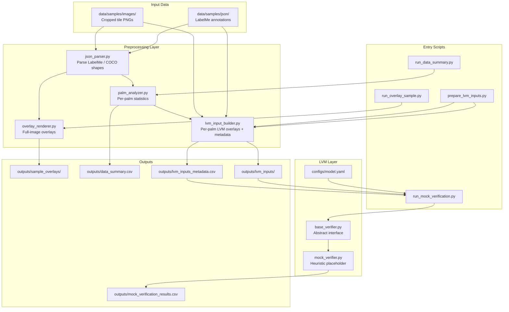

# Phase 2 Plan: Real LVM Evaluation

**Project:** Large Vision Model-Assisted Verification for Wild Palm Detection in Orthomosaic Imagery  
**Status:** Preprocessing and mock verification pipeline complete  
**Goal of Phase 2:** Replace the mock verifier with real open-source vision-language models and evaluate three-class palm verification quality against human-reviewed ground truth.

---

## 1. Current Architecture

The pipeline today is modular and runs end-to-end on cropped sample tiles (`912×912` px) with LabelMe-style JSON annotations. Each palm instance is grouped by `group_id` and contains a rotated bbox (`palm`), a center point, and one or more endpoint points (`end`).



### Module Summary

| Module | Location | Role |
|--------|----------|------|
| JSON parsing | `src/preprocessing/json_parser.py` | Load LabelMe JSON; classify shapes as point / bbox / polygon |
| Overlay rendering | `src/preprocessing/overlay_renderer.py` | Visual QA overlays for full tiles |
| Palm analysis | `src/preprocessing/palm_analyzer.py` | Extract per-palm bbox, center, endpoints, distances |
| LVM input builder | `src/preprocessing/lvm_input_builder.py` | One overlay image per palm with visible ID (`palm_01`, …) |
| Verifier interface | `src/lvm/base_verifier.py` | `verify_image(image_path, metadata) → dict` contract |
| Mock verifier | `src/lvm/mock_verifier.py` | Heuristic rules; no model inference |
| Model config | `configs/model.yaml` | `model_type`, `model_name`, future model list |

### Current Data Flow

```
Tile image + JSON
    → parse & group palms by group_id
    → build per-palm overlay (bbox + center + endpoints + palm_id)
    → write lvm_inputs_metadata.csv
    → MockVerifier.apply(metadata heuristics)
    → mock_verification_results.csv
```

**Sample scale today:** 5 images, 15 palm instances, 2-class mock labels (`reliable` / `uncertain` only).

---

## 2. Missing Components Before Real LVM Evaluation

The preprocessing scaffold is in place. The following components are required before meaningful experiments can be run.

### 2.1 Model Integration

| Component | Description | Priority |
|-----------|-------------|----------|
| Real VLM adapter | Implement `LLaVAVerifier`, `QwenVLVerifier`, etc. extending `BaseVerifier` | **Critical** |
| Prompt template | Standardized verification prompt with palm context (bbox, endpoints, task definition) | **Critical** |
| Response parser | Map free-text VLM output → `{label, score, explanation}` | **Critical** |
| Model loader / config | Extend `configs/model.yaml` with checkpoint paths, dtype, device, max tokens | **High** |
| Inference script | `run_lvm_verification.py` replacing or extending mock runner | **High** |

### 2.2 Ground Truth & Labels

| Component | Description | Priority |
|-----------|-------------|----------|
| Human verification labels | Expert labels for each palm: `reliable`, `uncertain`, `unreliable` | **Critical** |
| Labeling guidelines | Written criteria defining the three classes (see Section 4) | **Critical** |
| Inter-rater agreement set | Subset labeled by 2+ reviewers for Cohen's κ / Fleiss' κ | **High** |
| Negative / edge-case set | Weeds, shadows, partial crowns, mis-detections | **High** |

The current LabelMe JSON reflects **detection geometry**, not **verification quality**. Phase 2 needs a separate ground-truth file (CSV or JSON) with human verification judgments.

### 2.3 Evaluation Infrastructure

| Component | Description | Priority |
|-----------|-------------|----------|
| Evaluation module | `src/evaluation/metrics.py` — accuracy, precision, recall, F1, confusion matrix | **Critical** |
| Evaluation script | `scripts/run_evaluation.py` — compare predictions vs. ground truth | **Critical** |
| Results aggregation | Per-model, per-prompt, per-subset comparison tables | **High** |
| Error analysis notebook | Qualitative review of false reliable / false unreliable cases | **Medium** |

### 2.4 Input & Prompt Experiments

| Component | Description | Priority |
|-----------|-------------|----------|
| Raw crop vs. overlay ablation | Test whether drawn annotations help or hurt VLM judgment | **High** |
| Metadata-in-prompt ablation | Include / exclude numeric metadata (endpoint count, bbox area) in text prompt | **High** |
| Multi-model comparison runner | Batch runner over model list with shared inputs | **Medium** |

### 2.5 Operational Requirements

| Component | Description | Priority |
|-----------|-------------|----------|
| GPU inference path | Optional but recommended for LLaVA / Qwen-VL at scale | **Medium** |
| Reproducibility logging | Save prompt, raw model response, timestamp, model version per palm | **High** |
| Larger evaluation dataset | Move beyond 15 palms to statistically meaningful sample (≥ 100–200 instances) | **Critical** |

---

## 3. Recommended Open-Source Vision-Language Models

Models are ranked for suitability to **aerial / geospatial palm verification** on cropped orthomosaic tiles. All are open-source and can be integrated behind `BaseVerifier` without OpenAI API dependency.

### Tier 1 — Primary Candidates

| Model | Strengths | Considerations | Suggested Use |
|-------|-----------|----------------|---------------|
| **LLaVA-1.6 (Vicuna-7B / 13B)** | Mature ecosystem, strong general VQA, easy Hugging Face integration | Not RS-specific; may need careful prompting for aerial imagery | Baseline general-purpose VLM |
| **Qwen2-VL-7B-Instruct** | Strong recent open VLM, good instruction following, flexible resolution | Requires ~16 GB VRAM for 7B; CPU inference very slow | Primary comparison model |
| **GeoChat** | Designed for remote sensing / geospatial VQA | Smaller community; checkpoint availability should be verified | RS-specialized baseline |

### Tier 2 — Secondary / Ablation Models

| Model | Strengths | Considerations |
|-------|-----------|----------------|
| **LLaVA-NeXT** | Improved resolution handling for detail-rich crops | Heavier than LLaVA-1.5 |
| **MiniCPM-V** | Lightweight; runs on modest hardware | Lower capacity; useful as low-resource baseline |
| **InternVL2-8B** | Competitive open VLM benchmarks | Less RS-specific documentation |
| **CogVLM2** | Strong grounding capabilities | Heavier deployment requirements |

### Tier 3 — Future / Optional

| Model | Notes |
|-------|-------|
| **SkySenseGPT / RemoteCLIP + LLM** | RS-focused pipelines; more integration effort |
| **GPT-4o (API)** | Upper-bound reference only — out of scope for open-source thesis path |

### Recommended Evaluation Order

1. **Mock verifier** (done) — pipeline sanity check  
2. **Qwen2-VL-7B-Instruct** — best balance of quality and reproducibility  
3. **LLaVA-1.6-7B** — widely cited baseline for comparison  
4. **GeoChat** — test RS-domain advantage  
5. **MiniCPM-V** — low-resource fallback if GPU access is limited  

---

## 4. Proposed Experiment Design

### 4.1 Verification Task Definition

The LVM does **not** detect palms from scratch. It **verifies** an existing detection by reviewing a per-palm input image (overlay or crop) and assigning one of three labels:

| Label | Definition | Example Cases |
|-------|------------|---------------|
| **Reliable** | Clear wild palm crown; bbox and center/endpoints are consistent with visible structure | Well-formed crown, ≥ 3 endpoints aligned with fronds |
| **Uncertain** | Possible palm but ambiguous — occlusion, edge of tile, young palm, partial crown, or weak endpoint support | 1–2 endpoints, small bbox, mixed vegetation |
| **Unreliable** | Not a valid palm detection — weed, shadow, soil patch, duplicate, or grossly wrong bbox | Weed labeled as palm, empty bbox region |

These definitions should be finalized in a one-page **labeling guide** before human annotation begins.

### 4.2 Ground Truth Collection

1. Select **100–200 palm instances** stratified by:
   - endpoint count (1, 2, 3, 4+)
   - bbox area (small / medium / large)
   - image source tile
2. Two trained reviewers independently label each palm.
3. Adjudicate disagreements with a third reviewer or consensus rule.
4. Store labels in `data/evaluation/ground_truth/verification_labels.csv`.

**Suggested columns:** `image_name`, `palm_id`, `label`, `reviewer_id`, `notes`

### 4.3 Model Input Conditions (Ablation)

Run each VLM under at least three input conditions:

| Condition | Input | Purpose |
|-----------|-------|---------|
| **A — Overlay** | Current `lvm_inputs/` with drawn bbox, center, endpoints, palm_id | Default thesis condition |
| **B — Raw crop** | Bbox crop only, no drawn annotations | Test whether overlays help |
| **C — Overlay + metadata prompt** | Overlay image + text prompt with endpoint count and bbox area | Test multimodal + structured context |

### 4.4 Prompt Design

Use a fixed prompt template for reproducibility:

```
You are verifying wild palm detections in aerial orthomosaic imagery.

The image shows one candidate palm detection with:
- Palm ID: {palm_id}
- Bounding box area: {bbox_area} pixels²
- Endpoint count: {endpoints_count}

Task: Classify this detection as exactly one of:
- reliable   (clear valid wild palm)
- uncertain  (ambiguous or weak evidence)
- unreliable (clearly not a valid palm)

Respond in JSON:
{"label": "...", "score": 0.0-1.0, "explanation": "..."}
```

All models receive the same prompt template; only the adapter layer changes.

### 4.5 Experimental Runs

| Experiment | Models | Input Condition | Output |
|------------|--------|-----------------|--------|
| E1 — Pipeline validation | Mock | Overlay | Confirm end-to-end (done) |
| E2 — Baseline VLM | Qwen2-VL, LLaVA | Overlay (A) | Primary results table |
| E3 — RS specialist | GeoChat | Overlay (A) | RS vs. general comparison |
| E4 — Input ablation | Best model from E2 | A vs. B vs. C | Input sensitivity analysis |
| E5 — Human agreement | — | — | Inter-rater κ on ground truth subset |

### 4.6 Hypotheses

1. **H1:** Open-source VLMs can distinguish reliable from unreliable palm detections above chance (> 33% for 3-class random baseline).
2. **H2:** Including drawn overlays (condition A) improves verification vs. raw crops alone (condition B).
3. **H3:** RS-specialized models (GeoChat) outperform general VLMs on uncertain aerial palm cases.
4. **H4:** LVM verification agreement with human reviewers exceeds a predefined threshold (e.g., κ ≥ 0.6 for reliable vs. rest).

---

## 5. Suggested Metrics

### 5.1 Classification Metrics (Primary)

Computed per model and per experimental condition against human ground truth.

| Metric | Formula / Notes | Why It Matters |
|--------|-----------------|----------------|
| **Accuracy** | Correct predictions / total | Overall performance summary |
| **Precision (per class)** | TP / (TP + FP) for reliable, uncertain, unreliable | Cost of false approvals |
| **Recall (per class)** | TP / (TP + FN) | How many valid/invalid palms are caught |
| **F1 (per class)** | Harmonic mean of precision and recall | Balance metric for imbalanced classes |
| **Macro-F1** | Mean F1 across three classes | Treats all classes equally |
| **Weighted-F1** | F1 weighted by class support | Reflects dataset class distribution |

### 5.2 Agreement with Human Reviewers

| Metric | Use |
|--------|-----|
| **Cohen's κ (binary)** | Reliable vs. not-reliable; two reviewers |
| **Cohen's κ (3-class)** | Full label agreement between model and adjudicated human label |
| **Fleiss' κ** | Multi-rater human agreement before model evaluation |
| **Percent agreement** | Simple inter-rater baseline |

**Reporting suggestion:** Report human–human κ first, then model–human κ. Model performance is only meaningful if humans agree on a substantial subset.

### 5.3 Operational Metrics

| Metric | Description |
|--------|-------------|
| **Inference time per palm** | Latency for scalability discussion |
| **VRAM / model size** | Practical deployment constraints |
| **Parse failure rate** | How often VLM output fails JSON / label extraction |

### 5.4 Confusion Matrix

Always report a 3×3 confusion matrix:

```
                    Predicted
                 Rel   Unc   Unrel
Actual Rel        ·     ·      ·
       Unc        ·     ·      ·
       Unrel      ·     ·      ·
```

Pay special attention to **reliable → unreliable** (false rejection) and **unreliable → reliable** (false approval) errors — these have different operational consequences in an orthomosaic counting workflow.

### 5.5 Thesis Reporting Table (Template)

| Model | Input | Accuracy | Macro-F1 | κ (3-class) | Prec (Rel) | Rec (Rel) | Prec (Unrel) | Rec (Unrel) |
|-------|-------|----------|----------|-------------|------------|-----------|--------------|-------------|
| Mock | Overlay | — | — | — | — | — | — | — |
| Qwen2-VL-7B | Overlay | | | | | | | |
| LLaVA-1.6-7B | Overlay | | | | | | | |
| GeoChat | Overlay | | | | | | | |

---

## 6. Suggested Directory Structure for Evaluation Datasets

```
wild-palm-lvm-verification/
├── configs/
│   ├── model.yaml                  # model_type, checkpoint, device settings
│   └── prompts/
│       └── verification_v1.txt     # fixed prompt template
│
├── data/
│   ├── samples/                    # existing development samples (5 tiles)
│   │   ├── images/
│   │   └── json/
│   │
│   └── evaluation/                 # Phase 2 evaluation datasets
│       ├── images/                 # held-out tile crops (not used in dev)
│       ├── annotations/            # LabelMe JSON (detection geometry)
│       ├── ground_truth/
│       │   ├── verification_labels.csv      # adjudicated human labels
│       │   ├── reviewer_a_labels.csv        # raw rater 1
│       │   ├── reviewer_b_labels.csv        # raw rater 2
│       │   └── labeling_guidelines.md       # class definitions
│       └── splits/
│           ├── train_tiles.txt     # optional: tile IDs for prompt tuning
│           ├── val_tiles.txt
│           └── test_tiles.txt      # held-out test set for final numbers
│
├── docs/
│   └── phase2_plan.md              # this document
│
├── outputs/
│   ├── sample_overlays/            # Phase 1 QA overlays
│   ├── data_summary.csv            # Phase 1 statistics
│   ├── lvm_inputs/                 # per-palm LVM input images
│   ├── lvm_inputs_metadata.csv
│   ├── mock_verification_results.csv
│   │
│   └── evaluation/                 # Phase 2 experiment outputs
│       ├── qwen2_vl/
│       │   ├── predictions.csv
│       │   └── raw_responses/      # full model text per palm
│       ├── llava/
│       │   ├── predictions.csv
│       │   └── raw_responses/
│       ├── geochat/
│       │   ├── predictions.csv
│       │   └── raw_responses/
│       └── reports/
│           ├── metrics_summary.csv
│           ├── confusion_matrices/
│           └── error_analysis.md
│
├── scripts/
│   ├── prepare_lvm_inputs.py       # existing
│   ├── run_mock_verification.py    # existing
│   ├── run_lvm_verification.py     # Phase 2: real model runner
│   └── run_evaluation.py           # Phase 2: metrics vs. ground truth
│
└── src/
    ├── preprocessing/              # existing modules
    ├── lvm/
    │   ├── base_verifier.py
    │   ├── mock_verifier.py
    │   ├── qwen_vl_verifier.py     # Phase 2
    │   ├── llava_verifier.py       # Phase 2
    │   └── geochat_verifier.py     # Phase 2
    └── evaluation/                 # Phase 2
        ├── metrics.py
        └── report.py
```

### Dataset Split Guidelines

- **Split by tile, not by palm.** All palms from the same orthomosaic tile should stay in the same split to avoid data leakage.
- **Stratify uncertain cases.** Ensure the test set contains enough `uncertain` and `unreliable` examples; these are the hardest and most thesis-relevant classes.
- **Keep samples/ separate from evaluation/.** The current 5-tile sample set remains for development; evaluation numbers come only from held-out data.

---

## 7. Recommended Next Steps (Ordered)

1. **Write labeling guidelines** — finalize Reliable / Uncertain / Unreliable definitions (Section 4.1).
2. **Expand dataset** — annotate 100–200 palms across ≥ 20 tiles into `data/evaluation/`.
3. **Implement `QwenVLVerifier`** — first real model behind `BaseVerifier`.
4. **Add `run_lvm_verification.py`** — batch inference with prompt template and raw response logging.
5. **Implement `src/evaluation/metrics.py`** — accuracy, precision, recall, κ, confusion matrix.
6. **Run E2 baseline experiment** — Qwen2-VL + LLaVA on overlay inputs.
7. **Run E4 ablation** — overlay vs. crop vs. overlay+metadata on best model.
8. **Write error analysis** — qualitative review of misclassified palms for thesis discussion section.

---

## 8. Phase 1 → Phase 2 Gap Summary

| Area | Phase 1 (Done) | Phase 2 (Next) |
|------|----------------|----------------|
| Verification labels | 2-class mock heuristic | 3-class human ground truth |
| Model | MockVerifier | Qwen2-VL, LLaVA, GeoChat |
| Dataset size | 15 palms / 5 tiles | 100–200+ palms / 20+ tiles |
| Evaluation | None | Accuracy, precision, recall, κ |
| Outputs | CSV predictions | Metrics tables + confusion matrices + error analysis |

The current pipeline provides a solid, modular foundation. Phase 2 focuses on **ground truth creation**, **real VLM integration**, and **quantitative evaluation** — the core experimental contribution of the thesis.
